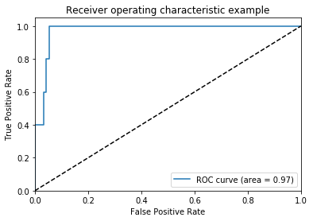
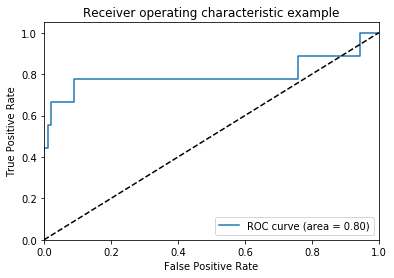
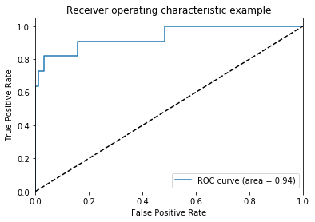
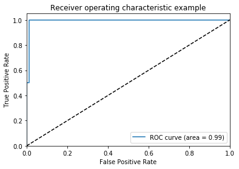
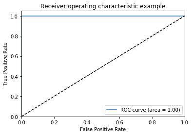
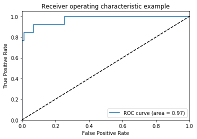
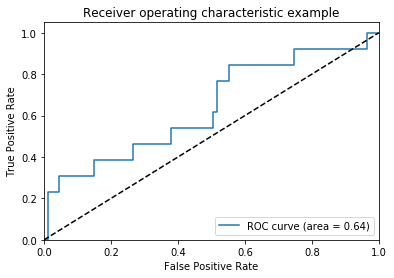

### -*- coding: utf-8 -*-
MusicTaggerCRNN model for <font color='red'>Keras</font>.
### Reference:
- [Music-auto_tagging-keras](https://github.com/keunwoochoi/music-auto_tagging-keras)


```python
from keras import backend as K
from keras.layers import Input, Dense
from keras.models import Model
from keras.layers import Dense, Dropout, Reshape, Permute
from keras.layers.convolutional import Convolution2D
from keras.layers.convolutional import MaxPooling2D, ZeroPadding2D
from keras.layers.normalization import BatchNormalization
from keras.layers.advanced_activations import ELU
from keras.layers.recurrent import GRU
from keras.utils.data_utils import get_file
```

    Using Theano backend.
    WARNING (theano.tensor.blas): Using NumPy C-API based implementation for BLAS functions.


```python
TH_WEIGHTS_PATH = 'https://github.com/keunwoochoi/music-auto_tagging-keras/blob/master/data/music_tagger_crnn_weights_theano.h5'
TF_WEIGHTS_PATH = 'https://github.com/keunwoochoi/music-auto_tagging-keras/blob/master/data/music_tagger_crnn_weights_tensorflow.h5'
```

# MusicTaggerCRNN


   Instantiate the MusicTaggerCRNN architecture, optionally loading weights pre-trained on Million Song Dataset. Note that when using TensorFlow, for best performance you should set image_dim_ordering="tf" in your Keras config at ~/.keras/keras.json.
    
   The model and the weights are compatible with both TensorFlow and Theano. The dimension ordering convention used by the model is the one specified in your Keras config file.
    
    
For preparing mel-spectrogram input, see [audio_conv_utils.py] in [applications](https://github.com/fchollet/keras/tree/master/keras/applications).
    You will need to install [Librosa](http://librosa.github.io/librosa/)
    to use it. 


## Arguments

   weights: one of `None` (random initialization)
       or "msd" (pre-training on ImageNet).
   input_tensor: optional Keras tensor (i.e. output of `layers.Input()`)
       to use as image input for the model.
   include_top: whether to include the 1 fully-connected
       layer (output layer) at the top of the network.
       If False, the network outputs 32-dim features.
            
## Returns

   A Keras model instance.


```python

```


```python
def MusicTaggerCRNN(weights='msd', input_tensor=None,
                    include_top=True):
    '''Instantiate the MusicTaggerCRNN architecture,
    optionally loading weights pre-trained
    on Million Song Dataset. Note that when using TensorFlow,
    for best performance you should set
    `image_dim_ordering="tf"` in your Keras config
    at ~/.keras/keras.json.
    The model and the weights are compatible with both
    TensorFlow and Theano. The dimension ordering
    convention used by the model is the one
    specified in your Keras config file.
    For preparing mel-spectrogram input, see
    `audio_conv_utils.py` in [applications](https://github.com/fchollet/keras/tree/master/keras/applications).
    You will need to install [Librosa](http://librosa.github.io/librosa/)
    to use it.
    # Arguments
        weights: one of `None` (random initialization)
            or "msd" (pre-training on ImageNet).
        input_tensor: optional Keras tensor (i.e. output of `layers.Input()`)
            to use as image input for the model.
        include_top: whether to include the 1 fully-connected
            layer (output layer) at the top of the network.
            If False, the network outputs 32-dim features.
    # Returns
        A Keras model instance.
    '''
    if weights not in {'msd', None}:
        raise ValueError('The `weights` argument should be either '
                         '`None` (random initialization) or `msd` '
                         '(pre-training on Million Song Dataset).')

    # Determine proper input shape
    if keras.backend.image_data_format() == 'channels_first':
        input_shape = (1, 96, 1366)
    else:
        input_shape = (96, 1366, 1)

    if input_tensor is None:
        melgram_input = Input(shape=input_shape)
    else:
        if not K.is_keras_tensor(input_tensor):
            melgram_input = Input(tensor=input_tensor, shape=input_shape)
        else:
            melgram_input = input_tensor

    # Determine input axis
    if keras.backend.image_data_format() == 'channels_first':
        channel_axis = 1
        freq_axis = 2
        time_axis = 3
    else:
        channel_axis = 3
        freq_axis = 1
        time_axis = 2

    # Input block
    x = ZeroPadding2D(padding=(0, 37))(melgram_input)
    x = BatchNormalization(axis=freq_axis, name='bn_0_freq')(x)

    # Conv block 1
    x = Convolution2D(64, 3, 3, border_mode='same', name='conv1')(x)
    x = BatchNormalization(axis=channel_axis, mode=0, name='bn1')(x)
    x = ELU()(x)
    x = MaxPooling2D(pool_size=(2, 2), strides=(2, 2), name='pool1')(x)
    x = Dropout(0.1, name='dropout1')(x)

    # Conv block 2
    x = Convolution2D(128, 3, 3, border_mode='same', name='conv2')(x)
    x = BatchNormalization(axis=channel_axis, mode=0, name='bn2')(x)
    x = ELU()(x)
    x = MaxPooling2D(pool_size=(3, 3), strides=(3, 3), name='pool2')(x)
    x = Dropout(0.1, name='dropout2')(x)

    # Conv block 3
    x = Convolution2D(128, 3, 3, border_mode='same', name='conv3')(x)
    x = BatchNormalization(axis=channel_axis, mode=0, name='bn3')(x)
    x = ELU()(x)
    x = MaxPooling2D(pool_size=(4, 4), strides=(4, 4), name='pool3')(x)
    x = Dropout(0.1, name='dropout3')(x)

    # Conv block 4
    x = Convolution2D(128, 3, 3, border_mode='same', name='conv4')(x)
    x = BatchNormalization(axis=channel_axis, mode=0, name='bn4')(x)
    x = ELU()(x)
    x = MaxPooling2D(pool_size=(4, 4), strides=(4, 4), name='pool4')(x)
    x = Dropout(0.1, name='dropout4')(x)

    # reshaping
    if keras.backend.image_data_format() == 'channels_first':
        x = Permute((3, 1, 2))(x)
    x = Reshape((15, 128))(x)

    # GRU block 1, 2, output
    x = GRU(32, return_sequences=True, name='gru1')(x)
    x = GRU(32, return_sequences=False, name='gru2')(x)
    x = Dropout(0.3)(x)
    if include_top:
        x = Dense(10, activation='sigmoid', name='output')(x)

    # Create model
    model = Model(melgram_input, x)
    if weights is None:
        return model
    else: 
        # Load input
        if keras.backend.image_data_format() == 'channels_last':
            raise RuntimeError("Please set keras.backend.image_data_format() == 'channels_first'."
                               "You can set it at ~/.keras/keras.json")
    
        model.load_weights('data/music_tagger_crnn_weights_%s.h5' % K._BACKEND,
                           by_name=True)
        return model
```


```python
from IPython.display import Image
Image(filename='tf_th_keras_v2.png')
```


```python
import keras

if keras.backend.image_data_format() == 'channels_last':
    print("here backend is tensorflow" , keras.backend.image_data_format())
elif keras.backend.image_data_format() == 'channels_first':
    print("here backend is theano" , keras.backend.image_data_format())

#print(K.image_dim_ordering())
```

    here backend is theano channels_first


TRY TO MAKE A MODEL <font color='green'>USER-FRIENDLY</font> IN NEAR FUTURE.


```python
model = MusicTaggerCRNN(weights=None)
```

    /home/user/anaconda3/lib/python3.7/site-packages/ipykernel_launcher.py:62: UserWarning: Update your `Conv2D` call to the Keras 2 API: `Conv2D(64, (3, 3), name="conv1", padding="same")`
    /home/user/anaconda3/lib/python3.7/site-packages/ipykernel_launcher.py:63: UserWarning: Update your `BatchNormalization` call to the Keras 2 API: `BatchNormalization(axis=1, name="bn1")`
    /home/user/anaconda3/lib/python3.7/site-packages/ipykernel_launcher.py:69: UserWarning: Update your `Conv2D` call to the Keras 2 API: `Conv2D(128, (3, 3), name="conv2", padding="same")`
    /home/user/anaconda3/lib/python3.7/site-packages/ipykernel_launcher.py:70: UserWarning: Update your `BatchNormalization` call to the Keras 2 API: `BatchNormalization(axis=1, name="bn2")`
    /home/user/anaconda3/lib/python3.7/site-packages/ipykernel_launcher.py:76: UserWarning: Update your `Conv2D` call to the Keras 2 API: `Conv2D(128, (3, 3), name="conv3", padding="same")`
    /home/user/anaconda3/lib/python3.7/site-packages/ipykernel_launcher.py:77: UserWarning: Update your `BatchNormalization` call to the Keras 2 API: `BatchNormalization(axis=1, name="bn3")`
    /home/user/anaconda3/lib/python3.7/site-packages/ipykernel_launcher.py:83: UserWarning: Update your `Conv2D` call to the Keras 2 API: `Conv2D(128, (3, 3), name="conv4", padding="same")`
    /home/user/anaconda3/lib/python3.7/site-packages/ipykernel_launcher.py:84: UserWarning: Update your `BatchNormalization` call to the Keras 2 API: `BatchNormalization(axis=1, name="bn4")`


```python
model.summary()
```

    _________________________________________________________________
    Layer (type)                 Output Shape              Param #   
    =================================================================
    input_1 (InputLayer)         (None, 1, 96, 1366)       0         
    _________________________________________________________________
    zero_padding2d_1 (ZeroPaddin (None, 1, 96, 1440)       0         
    _________________________________________________________________
    bn_0_freq (BatchNormalizatio (None, 1, 96, 1440)       384       
    _________________________________________________________________
    conv1 (Conv2D)               (None, 64, 96, 1440)      640       
    _________________________________________________________________
    bn1 (BatchNormalization)     (None, 64, 96, 1440)      256       
    _________________________________________________________________
    elu_1 (ELU)                  (None, 64, 96, 1440)      0         
    _________________________________________________________________
    pool1 (MaxPooling2D)         (None, 64, 48, 720)       0         
    _________________________________________________________________
    dropout1 (Dropout)           (None, 64, 48, 720)       0         
    _________________________________________________________________
    conv2 (Conv2D)               (None, 128, 48, 720)      73856     
    _________________________________________________________________
    bn2 (BatchNormalization)     (None, 128, 48, 720)      512       
    _________________________________________________________________
    elu_2 (ELU)                  (None, 128, 48, 720)      0         
    _________________________________________________________________
    pool2 (MaxPooling2D)         (None, 128, 16, 240)      0         
    _________________________________________________________________
    dropout2 (Dropout)           (None, 128, 16, 240)      0         
    _________________________________________________________________
    conv3 (Conv2D)               (None, 128, 16, 240)      147584    
    _________________________________________________________________
    bn3 (BatchNormalization)     (None, 128, 16, 240)      512       
    _________________________________________________________________
    elu_3 (ELU)                  (None, 128, 16, 240)      0         
    _________________________________________________________________
    pool3 (MaxPooling2D)         (None, 128, 4, 60)        0         
    _________________________________________________________________
    dropout3 (Dropout)           (None, 128, 4, 60)        0         
    _________________________________________________________________
    conv4 (Conv2D)               (None, 128, 4, 60)        147584    
    _________________________________________________________________
    bn4 (BatchNormalization)     (None, 128, 4, 60)        512       
    _________________________________________________________________
    elu_4 (ELU)                  (None, 128, 4, 60)        0         
    _________________________________________________________________
    pool4 (MaxPooling2D)         (None, 128, 1, 15)        0         
    _________________________________________________________________
    dropout4 (Dropout)           (None, 128, 1, 15)        0         
    _________________________________________________________________
    permute_1 (Permute)          (None, 15, 128, 1)        0         
    _________________________________________________________________
    reshape_1 (Reshape)          (None, 15, 128)           0         
    _________________________________________________________________
    gru1 (GRU)                   (None, 15, 32)            15456     
    _________________________________________________________________
    gru2 (GRU)                   (None, 32)                6240      
    _________________________________________________________________
    dropout_1 (Dropout)          (None, 32)                0         
    _________________________________________________________________
    output (Dense)               (None, 10)                330       
    =================================================================
    Total params: 393,866
    Trainable params: 392,778
    Non-trainable params: 1,088
    _________________________________________________________________


### Compiling the model


```python
#compile model using accuracy to measure model performance
model.compile(optimizer='adam', 
              loss='categorical_crossentropy', 
              metrics=['accuracy'])
```

### Load data


```python
import numpy as np
```


```python
concat_x = np.load('concat_x.npy')
concat_y = np.load('concat_y.npy')
```


```python
print(len(concat_x),'   ',(len(concat_y)) )
```

    1000     1000


```python
train_x = concat_x[0:750]
train_y = concat_y[0:750]
```


```python
valid_x = concat_x[750:900]
valid_y = concat_y[750:900]
```


```python
test_x = concat_x[900:1000]
test_y = concat_y[900:1000]
```

### Training the model
model = load_model('Crnn.h5')

```python
#train the model
model.fit(train_x, train_y, validation_data=(valid_x, valid_y), epochs=100 )
```

    /home/user/anaconda3/lib/python3.7/site-packages/theano/scan_module/scan_perform_ext.py:76: UserWarning: The file scan_perform.c is not available. This donot happen normally. You are probably in a strangesetup. This mean Theano can not use the cython code for scan. If youwant to remove this warning, use the Theano flag'cxx=' (set to an empty string) to disable all ccode generation.
      "The file scan_perform.c is not available. This do"
    /home/user/anaconda3/lib/python3.7/site-packages/theano/scan_module/scan_perform_ext.py:76: UserWarning: The file scan_perform.c is not available. This donot happen normally. You are probably in a strangesetup. This mean Theano can not use the cython code for scan. If youwant to remove this warning, use the Theano flag'cxx=' (set to an empty string) to disable all ccode generation.
      "The file scan_perform.c is not available. This do"
    /home/user/anaconda3/lib/python3.7/site-packages/theano/scan_module/scan_perform_ext.py:76: UserWarning: The file scan_perform.c is not available. This donot happen normally. You are probably in a strangesetup. This mean Theano can not use the cython code for scan. If youwant to remove this warning, use the Theano flag'cxx=' (set to an empty string) to disable all ccode generation.
      "The file scan_perform.c is not available. This do"
    /home/user/anaconda3/lib/python3.7/site-packages/theano/scan_module/scan_perform_ext.py:76: UserWarning: The file scan_perform.c is not available. This donot happen normally. You are probably in a strangesetup. This mean Theano can not use the cython code for scan. If youwant to remove this warning, use the Theano flag'cxx=' (set to an empty string) to disable all ccode generation.
      "The file scan_perform.c is not available. This do"
    /home/user/anaconda3/lib/python3.7/site-packages/theano/scan_module/scan_perform_ext.py:76: UserWarning: The file scan_perform.c is not available. This donot happen normally. You are probably in a strangesetup. This mean Theano can not use the cython code for scan. If youwant to remove this warning, use the Theano flag'cxx=' (set to an empty string) to disable all ccode generation.
      "The file scan_perform.c is not available. This do"
    /home/user/anaconda3/lib/python3.7/site-packages/theano/scan_module/scan_perform_ext.py:76: UserWarning: The file scan_perform.c is not available. This donot happen normally. You are probably in a strangesetup. This mean Theano can not use the cython code for scan. If youwant to remove this warning, use the Theano flag'cxx=' (set to an empty string) to disable all ccode generation.
      "The file scan_perform.c is not available. This do"


    Train on 750 samples, validate on 150 samples
    Epoch 1/100
    750/750 [==============================] - 1799s 2s/step - loss: 2.1933 - acc: 0.1973 - val_loss: 2.3841 - val_acc: 0.1400
    Epoch 2/100
    750/750 [==============================] - 1665s 2s/step - loss: 2.0126 - acc: 0.2933 - val_loss: 2.4359 - val_acc: 0.0800
    Epoch 3/100
    750/750 [==============================] - 1604s 2s/step - loss: 1.8839 - acc: 0.3627 - val_loss: 2.3967 - val_acc: 0.2000
    Epoch 4/100
    750/750 [==============================] - 1695s 2s/step - loss: 1.7833 - acc: 0.4013 - val_loss: 2.3202 - val_acc: 0.2200
    Epoch 5/100
    750/750 [==============================] - 1833s 2s/step - loss: 1.7110 - acc: 0.4480 - val_loss: 2.2484 - val_acc: 0.2067
    Epoch 6/100
    750/750 [==============================] - 1757s 2s/step - loss: 1.6084 - acc: 0.4813 - val_loss: 2.2146 - val_acc: 0.1400
    Epoch 7/100
    750/750 [==============================] - 1745s 2s/step - loss: 1.5714 - acc: 0.5093 - val_loss: 2.0782 - val_acc: 0.1733
    Epoch 8/100
    750/750 [==============================] - 1738s 2s/step - loss: 1.5080 - acc: 0.5040 - val_loss: 2.0033 - val_acc: 0.1600
    Epoch 9/100
    750/750 [==============================] - 1885s 3s/step - loss: 1.4300 - acc: 0.5613 - val_loss: 2.3458 - val_acc: 0.1200
    Epoch 10/100
    750/750 [==============================] - 1968s 3s/step - loss: 1.4092 - acc: 0.5547 - val_loss: 2.0262 - val_acc: 0.2600
    Epoch 11/100
    750/750 [==============================] - 1880s 3s/step - loss: 1.3326 - acc: 0.5933 - val_loss: 2.0969 - val_acc: 0.1467
    Epoch 12/100
    750/750 [==============================] - 1810s 2s/step - loss: 1.3031 - acc: 0.6067 - val_loss: 1.8273 - val_acc: 0.2867
    Epoch 13/100
    750/750 [==============================] - 1704s 2s/step - loss: 1.2550 - acc: 0.6187 - val_loss: 1.5882 - val_acc: 0.4000
    Epoch 14/100
    750/750 [==============================] - 1878s 3s/step - loss: 1.1868 - acc: 0.6507 - val_loss: 1.9893 - val_acc: 0.2667
    Epoch 15/100
    750/750 [==============================] - 1873s 2s/step - loss: 1.1490 - acc: 0.6680 - val_loss: 1.4716 - val_acc: 0.4467
    Epoch 16/100
    750/750 [==============================] - 1799s 2s/step - loss: 1.1048 - acc: 0.6960 - val_loss: 1.4734 - val_acc: 0.4467
    Epoch 17/100
    750/750 [==============================] - 1743s 2s/step - loss: 1.0815 - acc: 0.6747 - val_loss: 1.5317 - val_acc: 0.4200
    Epoch 18/100
    750/750 [==============================] - 1671s 2s/step - loss: 0.9805 - acc: 0.7240 - val_loss: 1.3571 - val_acc: 0.5533
    Epoch 19/100
    750/750 [==============================] - 1639s 2s/step - loss: 0.9648 - acc: 0.7360 - val_loss: 1.3697 - val_acc: 0.5333
    Epoch 20/100
    750/750 [==============================] - 1767s 2s/step - loss: 1.0508 - acc: 0.7013 - val_loss: 1.4474 - val_acc: 0.4533
    Epoch 21/100
    750/750 [==============================] - 1935s 3s/step - loss: 0.9213 - acc: 0.7427 - val_loss: 1.5051 - val_acc: 0.5133
    Epoch 22/100
    750/750 [==============================] - 1888s 3s/step - loss: 0.8786 - acc: 0.7760 - val_loss: 1.7859 - val_acc: 0.3533
    Epoch 23/100
    750/750 [==============================] - 1892s 3s/step - loss: 0.8349 - acc: 0.7653 - val_loss: 0.9273 - val_acc: 0.7267
    Epoch 24/100
    750/750 [==============================] - 1871s 2s/step - loss: 0.7964 - acc: 0.8053 - val_loss: 1.4493 - val_acc: 0.4867
    Epoch 25/100
    750/750 [==============================] - 1867s 2s/step - loss: 0.7665 - acc: 0.7920 - val_loss: 1.0321 - val_acc: 0.6800
    Epoch 26/100
    750/750 [==============================] - 1871s 2s/step - loss: 0.7595 - acc: 0.7987 - val_loss: 1.1891 - val_acc: 0.5600
    Epoch 27/100
    750/750 [==============================] - 1911s 3s/step - loss: 0.7862 - acc: 0.7787 - val_loss: 1.5462 - val_acc: 0.5400
    Epoch 28/100
    750/750 [==============================] - 1875s 2s/step - loss: 0.6879 - acc: 0.8160 - val_loss: 1.2719 - val_acc: 0.5600
    Epoch 29/100
    750/750 [==============================] - 1865s 2s/step - loss: 0.6387 - acc: 0.8533 - val_loss: 0.9033 - val_acc: 0.7000
    Epoch 30/100
    750/750 [==============================] - 1879s 3s/step - loss: 0.5848 - acc: 0.8787 - val_loss: 0.9018 - val_acc: 0.6933
    Epoch 31/100
    750/750 [==============================] - 1918s 3s/step - loss: 0.6197 - acc: 0.8493 - val_loss: 1.1950 - val_acc: 0.5867
    Epoch 32/100
    750/750 [==============================] - 1876s 3s/step - loss: 0.6180 - acc: 0.8307 - val_loss: 1.3436 - val_acc: 0.5733
    Epoch 33/100
    750/750 [==============================] - 1945s 3s/step - loss: 0.6004 - acc: 0.8413 - val_loss: 1.5164 - val_acc: 0.5333
    Epoch 34/100
    750/750 [==============================] - 1869s 2s/step - loss: 0.5678 - acc: 0.8573 - val_loss: 1.1294 - val_acc: 0.6267
    Epoch 35/100
    750/750 [==============================] - 1681s 2s/step - loss: 0.5169 - acc: 0.8760 - val_loss: 1.4504 - val_acc: 0.5467
    Epoch 36/100
    750/750 [==============================] - 1661s 2s/step - loss: 0.4950 - acc: 0.8880 - val_loss: 1.0563 - val_acc: 0.6600
    Epoch 37/100
    750/750 [==============================] - 1617s 2s/step - loss: 0.4759 - acc: 0.8840 - val_loss: 1.0292 - val_acc: 0.6933
    Epoch 38/100
    750/750 [==============================] - 1589s 2s/step - loss: 0.3888 - acc: 0.9160 - val_loss: 0.9272 - val_acc: 0.7267
    Epoch 39/100
    750/750 [==============================] - 1623s 2s/step - loss: 0.4078 - acc: 0.9093 - val_loss: 1.2559 - val_acc: 0.5867
    Epoch 40/100
    750/750 [==============================] - 1549s 2s/step - loss: 0.4407 - acc: 0.9000 - val_loss: 1.0742 - val_acc: 0.6400
    Epoch 41/100
    750/750 [==============================] - 1610s 2s/step - loss: 0.4207 - acc: 0.8987 - val_loss: 1.2891 - val_acc: 0.6133
    Epoch 42/100
    750/750 [==============================] - 1616s 2s/step - loss: 0.3844 - acc: 0.9093 - val_loss: 0.8637 - val_acc: 0.7133
    Epoch 43/100
    750/750 [==============================] - 1591s 2s/step - loss: 0.3332 - acc: 0.9360 - val_loss: 1.0053 - val_acc: 0.6933
    Epoch 44/100
    750/750 [==============================] - 1559s 2s/step - loss: 0.4485 - acc: 0.8920 - val_loss: 2.2456 - val_acc: 0.4000
    Epoch 45/100
    750/750 [==============================] - 1585s 2s/step - loss: 0.3686 - acc: 0.9187 - val_loss: 1.9255 - val_acc: 0.4200
    Epoch 46/100
    750/750 [==============================] - 1612s 2s/step - loss: 0.3648 - acc: 0.9080 - val_loss: 1.1365 - val_acc: 0.6733
    Epoch 47/100
    750/750 [==============================] - 1607s 2s/step - loss: 0.4538 - acc: 0.8853 - val_loss: 1.7797 - val_acc: 0.4867
    Epoch 48/100
    750/750 [==============================] - 1574s 2s/step - loss: 0.3623 - acc: 0.9080 - val_loss: 1.1286 - val_acc: 0.6467
    Epoch 49/100
    750/750 [==============================] - 1601s 2s/step - loss: 0.2940 - acc: 0.9373 - val_loss: 1.0847 - val_acc: 0.6400
    Epoch 50/100
    750/750 [==============================] - 1735s 2s/step - loss: 0.2512 - acc: 0.9520 - val_loss: 0.8984 - val_acc: 0.7000
    Epoch 51/100
    750/750 [==============================] - 1657s 2s/step - loss: 0.3143 - acc: 0.9307 - val_loss: 1.7326 - val_acc: 0.5267
    Epoch 52/100
    750/750 [==============================] - 1685s 2s/step - loss: 0.2938 - acc: 0.9373 - val_loss: 0.8613 - val_acc: 0.7733
    Epoch 53/100
    750/750 [==============================] - 1639s 2s/step - loss: 0.2619 - acc: 0.9413 - val_loss: 1.0532 - val_acc: 0.6933
    Epoch 54/100
    750/750 [==============================] - 1628s 2s/step - loss: 0.2060 - acc: 0.9640 - val_loss: 1.2005 - val_acc: 0.6933
    Epoch 55/100
    750/750 [==============================] - 1645s 2s/step - loss: 0.2314 - acc: 0.9560 - val_loss: 1.2542 - val_acc: 0.6267
    Epoch 56/100
    750/750 [==============================] - 1624s 2s/step - loss: 0.2229 - acc: 0.9507 - val_loss: 0.9439 - val_acc: 0.7200
    Epoch 57/100
    750/750 [==============================] - 1656s 2s/step - loss: 0.2221 - acc: 0.9627 - val_loss: 0.9540 - val_acc: 0.7000
    Epoch 58/100
    750/750 [==============================] - 1882s 3s/step - loss: 0.1834 - acc: 0.9667 - val_loss: 1.2176 - val_acc: 0.6533
    Epoch 59/100
    750/750 [==============================] - 1610s 2s/step - loss: 0.2302 - acc: 0.9480 - val_loss: 1.5939 - val_acc: 0.5667
    Epoch 60/100
    750/750 [==============================] - 1760s 2s/step - loss: 0.1758 - acc: 0.9680 - val_loss: 1.2726 - val_acc: 0.6333
    Epoch 61/100
    750/750 [==============================] - 1616s 2s/step - loss: 0.2515 - acc: 0.9440 - val_loss: 1.2402 - val_acc: 0.6467
    Epoch 62/100
    750/750 [==============================] - 1655s 2s/step - loss: 0.2506 - acc: 0.9440 - val_loss: 1.3895 - val_acc: 0.6000
    Epoch 63/100
    750/750 [==============================] - 1643s 2s/step - loss: 0.2603 - acc: 0.9347 - val_loss: 1.5650 - val_acc: 0.5733
    Epoch 64/100
    750/750 [==============================] - 1657s 2s/step - loss: 0.1934 - acc: 0.9600 - val_loss: 1.5602 - val_acc: 0.5800
    Epoch 65/100
    750/750 [==============================] - 1613s 2s/step - loss: 0.1853 - acc: 0.9640 - val_loss: 1.1154 - val_acc: 0.6600
    Epoch 66/100
    750/750 [==============================] - 1641s 2s/step - loss: 0.2010 - acc: 0.9587 - val_loss: 1.1747 - val_acc: 0.6800
    Epoch 67/100
    750/750 [==============================] - 1655s 2s/step - loss: 0.2079 - acc: 0.9533 - val_loss: 0.9231 - val_acc: 0.7467
    Epoch 68/100
    750/750 [==============================] - 1633s 2s/step - loss: 0.1709 - acc: 0.9640 - val_loss: 1.1621 - val_acc: 0.6800
    Epoch 69/100
    750/750 [==============================] - 2153s 3s/step - loss: 0.1504 - acc: 0.9707 - val_loss: 1.1876 - val_acc: 0.6733
    Epoch 70/100
    750/750 [==============================] - 1824s 2s/step - loss: 0.1600 - acc: 0.9680 - val_loss: 1.0627 - val_acc: 0.7000
    Epoch 71/100
    750/750 [==============================] - 1767s 2s/step - loss: 0.1165 - acc: 0.9853 - val_loss: 0.9429 - val_acc: 0.7400
    Epoch 72/100
    750/750 [==============================] - 1636s 2s/step - loss: 0.0990 - acc: 0.9880 - val_loss: 1.3357 - val_acc: 0.6867
    Epoch 73/100
    750/750 [==============================] - 1634s 2s/step - loss: 0.1079 - acc: 0.9840 - val_loss: 1.1210 - val_acc: 0.6867
    Epoch 74/100
    750/750 [==============================] - 1620s 2s/step - loss: 0.0999 - acc: 0.9880 - val_loss: 1.1563 - val_acc: 0.6867
    Epoch 75/100
    750/750 [==============================] - 1614s 2s/step - loss: 0.1218 - acc: 0.9787 - val_loss: 1.1664 - val_acc: 0.7067
    Epoch 76/100
    750/750 [==============================] - 1606s 2s/step - loss: 0.1315 - acc: 0.9760 - val_loss: 1.0226 - val_acc: 0.7267
    Epoch 77/100
    750/750 [==============================] - 1572s 2s/step - loss: 0.0928 - acc: 0.9920 - val_loss: 0.9551 - val_acc: 0.7533
    Epoch 78/100
    750/750 [==============================] - 1605s 2s/step - loss: 0.1059 - acc: 0.9853 - val_loss: 1.0223 - val_acc: 0.7267
    Epoch 79/100
    750/750 [==============================] - 1614s 2s/step - loss: 0.0916 - acc: 0.9853 - val_loss: 1.1442 - val_acc: 0.7067
    Epoch 80/100
    750/750 [==============================] - 1647s 2s/step - loss: 0.1242 - acc: 0.9827 - val_loss: 1.1886 - val_acc: 0.7067
    Epoch 81/100
    750/750 [==============================] - 1613s 2s/step - loss: 0.1035 - acc: 0.9853 - val_loss: 1.0706 - val_acc: 0.7067
    Epoch 82/100
    750/750 [==============================] - 1632s 2s/step - loss: 0.1610 - acc: 0.9547 - val_loss: 1.2175 - val_acc: 0.7067
    Epoch 83/100
    750/750 [==============================] - 1587s 2s/step - loss: 0.1354 - acc: 0.9707 - val_loss: 1.0064 - val_acc: 0.7467
    Epoch 84/100
    750/750 [==============================] - 1602s 2s/step - loss: 0.1450 - acc: 0.9707 - val_loss: 2.2998 - val_acc: 0.5067
    Epoch 85/100
    750/750 [==============================] - 1665s 2s/step - loss: 0.1266 - acc: 0.9800 - val_loss: 1.1229 - val_acc: 0.7067
    Epoch 86/100
    750/750 [==============================] - 1645s 2s/step - loss: 0.1308 - acc: 0.9707 - val_loss: 1.4784 - val_acc: 0.6667
    Epoch 87/100
    750/750 [==============================] - 1610s 2s/step - loss: 0.1621 - acc: 0.9600 - val_loss: 1.2832 - val_acc: 0.6800
    Epoch 88/100
    750/750 [==============================] - 1650s 2s/step - loss: 0.1609 - acc: 0.9640 - val_loss: 0.9147 - val_acc: 0.7800
    Epoch 89/100
    750/750 [==============================] - 1636s 2s/step - loss: 0.1345 - acc: 0.9733 - val_loss: 1.2586 - val_acc: 0.6867
    Epoch 90/100
    750/750 [==============================] - 1599s 2s/step - loss: 0.0736 - acc: 0.9907 - val_loss: 1.0334 - val_acc: 0.7400
    Epoch 91/100
    750/750 [==============================] - 1613s 2s/step - loss: 0.1475 - acc: 0.9653 - val_loss: 1.1502 - val_acc: 0.6933
    Epoch 92/100
    750/750 [==============================] - 1641s 2s/step - loss: 0.1296 - acc: 0.9773 - val_loss: 0.8863 - val_acc: 0.7600
    Epoch 93/100
    750/750 [==============================] - 1605s 2s/step - loss: 0.1265 - acc: 0.9720 - val_loss: 0.9318 - val_acc: 0.7533
    Epoch 94/100
    750/750 [==============================] - 1625s 2s/step - loss: 0.1064 - acc: 0.9773 - val_loss: 0.9804 - val_acc: 0.7667
    Epoch 95/100
    750/750 [==============================] - 1624s 2s/step - loss: 0.1334 - acc: 0.9680 - val_loss: 1.5955 - val_acc: 0.6133
    Epoch 96/100
    750/750 [==============================] - 1595s 2s/step - loss: 0.1119 - acc: 0.9773 - val_loss: 1.8538 - val_acc: 0.5933
    Epoch 97/100
    750/750 [==============================] - 1637s 2s/step - loss: 0.0944 - acc: 0.9853 - val_loss: 1.3623 - val_acc: 0.6733
    Epoch 98/100
    750/750 [==============================] - 1581s 2s/step - loss: 0.1595 - acc: 0.9667 - val_loss: 1.3223 - val_acc: 0.6800
    Epoch 99/100
    750/750 [==============================] - 1686s 2s/step - loss: 0.1339 - acc: 0.9707 - val_loss: 1.1598 - val_acc: 0.7267
    Epoch 100/100
    750/750 [==============================] - 1621s 2s/step - loss: 0.1088 - acc: 0.9773 - val_loss: 1.9199 - val_acc: 0.5733


    <keras.callbacks.History at 0x7f53d2c56fd0>


```python
from keras.models import load_model

model.save('Crnn_epoch_100.h5')  # creates a HDF5 file 'my_model.h5'
del model  # deletes the existing model

# returns a compiled model
# identical to the previous one
#model = load_model('k2c2.h5')
```

# Predicting


```python
model = load_model('Crnn_epoch_100.h5')
```

    /home/user/anaconda3/lib/python3.7/site-packages/theano/scan_module/scan_perform_ext.py:76: UserWarning: The file scan_perform.c is not available. This donot happen normally. You are probably in a strangesetup. This mean Theano can not use the cython code for scan. If youwant to remove this warning, use the Theano flag'cxx=' (set to an empty string) to disable all ccode generation.
      "The file scan_perform.c is not available. This do"
    /home/user/anaconda3/lib/python3.7/site-packages/theano/scan_module/scan_perform_ext.py:76: UserWarning: The file scan_perform.c is not available. This donot happen normally. You are probably in a strangesetup. This mean Theano can not use the cython code for scan. If youwant to remove this warning, use the Theano flag'cxx=' (set to an empty string) to disable all ccode generation.
      "The file scan_perform.c is not available. This do"
    /home/user/anaconda3/lib/python3.7/site-packages/theano/scan_module/scan_perform_ext.py:76: UserWarning: The file scan_perform.c is not available. This donot happen normally. You are probably in a strangesetup. This mean Theano can not use the cython code for scan. If youwant to remove this warning, use the Theano flag'cxx=' (set to an empty string) to disable all ccode generation.
      "The file scan_perform.c is not available. This do"
    /home/user/anaconda3/lib/python3.7/site-packages/theano/scan_module/scan_perform_ext.py:76: UserWarning: The file scan_perform.c is not available. This donot happen normally. You are probably in a strangesetup. This mean Theano can not use the cython code for scan. If youwant to remove this warning, use the Theano flag'cxx=' (set to an empty string) to disable all ccode generation.
      "The file scan_perform.c is not available. This do"


```python
output = model.predict(test_x)
```

    /home/user/anaconda3/lib/python3.7/site-packages/theano/scan_module/scan_perform_ext.py:76: UserWarning: The file scan_perform.c is not available. This donot happen normally. You are probably in a strangesetup. This mean Theano can not use the cython code for scan. If youwant to remove this warning, use the Theano flag'cxx=' (set to an empty string) to disable all ccode generation.
      "The file scan_perform.c is not available. This do"
    /home/user/anaconda3/lib/python3.7/site-packages/theano/scan_module/scan_perform_ext.py:76: UserWarning: The file scan_perform.c is not available. This donot happen normally. You are probably in a strangesetup. This mean Theano can not use the cython code for scan. If youwant to remove this warning, use the Theano flag'cxx=' (set to an empty string) to disable all ccode generation.
      "The file scan_perform.c is not available. This do"


```python
output_class = output.argmax(axis=-1)
```


```python
print(output[0])
```

    [6.63424730e-01 6.17397200e-06 5.29712939e-04 1.19025965e-04
     9.10579052e-04 3.23213928e-04 8.55626931e-05 5.42014197e-04
     8.93839053e-04 1.26665737e-03]


```python
print(test_y[0])
```

    [0 0 0 0 0 0 0 0 0 1]


```python
print(10000*output[0])
sum = 0
for i in output[0]:
    sum += i
print(sum)
```

    [6.6342471e+03 6.1739720e-02 5.2971292e+00 1.1902597e+00 9.1057901e+00
     3.2321393e+00 8.5562694e-01 5.4201422e+00 8.9383907e+00 1.2666574e+01]
    0.6681015094745817


```python
test_y_class = test_y.argmax(axis=-1)
```


```python
print(output_class)
```

    [0 0 0 7 7 5 5 1 2 7 7 7 1 0 4 8 0 0 0 7 1 5 6 1 5 9 9 8 2 8 1 0 4 7 4 4 7
     5 4 1 2 9 8 5 1 5 0 8 5 1 5 9 7 5 8 2 7 0 8 6 5 1 1 4 8 0 0 8 0 6 9 0 1 3
     0 8 8 3 2 5 8 6 7 0 1 5 7 8 1 0 2 8 7 2 9 9 5 0 7 7]


```python
print(test_y_class)
```

    [9 0 4 3 7 9 9 1 2 4 7 9 1 9 4 8 0 3 3 7 1 9 6 1 8 6 6 8 2 8 1 7 4 7 4 4 7
     5 4 1 2 6 8 5 1 5 3 3 5 1 5 9 7 5 8 9 7 4 8 6 9 1 1 4 8 7 2 8 9 6 6 0 3 3
     8 8 4 3 2 5 4 6 7 3 1 5 7 8 7 0 2 8 7 2 9 9 9 0 7 2]


```python
print(test_y[-1])
```

    [0 0 1 0 0 0 0 0 0 0]


```python
from sklearn import preprocessing
output_class_bin = preprocessing.label_binarize(output_class, classes=[0, 1, 2, 3,4,5,6,7,8,9])
```


```python
print(output_class_bin)
```

    [[1 0 0 0 0 0 0 0 0 0]
     [1 0 0 0 0 0 0 0 0 0]
     [1 0 0 0 0 0 0 0 0 0]
     [0 0 0 0 0 0 0 1 0 0]
     [0 0 0 0 0 0 0 1 0 0]
     [0 0 0 0 0 1 0 0 0 0]
     [0 0 0 0 0 1 0 0 0 0]
     [0 1 0 0 0 0 0 0 0 0]
     [0 0 1 0 0 0 0 0 0 0]
     [0 0 0 0 0 0 0 1 0 0]
     [0 0 0 0 0 0 0 1 0 0]
     [0 0 0 0 0 0 0 1 0 0]
     [0 1 0 0 0 0 0 0 0 0]
     [1 0 0 0 0 0 0 0 0 0]
     [0 0 0 0 1 0 0 0 0 0]
     [0 0 0 0 0 0 0 0 1 0]
     [1 0 0 0 0 0 0 0 0 0]
     [1 0 0 0 0 0 0 0 0 0]
     [1 0 0 0 0 0 0 0 0 0]
     [0 0 0 0 0 0 0 1 0 0]
     [0 1 0 0 0 0 0 0 0 0]
     [0 0 0 0 0 1 0 0 0 0]
     [0 0 0 0 0 0 1 0 0 0]
     [0 1 0 0 0 0 0 0 0 0]
     [0 0 0 0 0 1 0 0 0 0]
     [0 0 0 0 0 0 0 0 0 1]
     [0 0 0 0 0 0 0 0 0 1]
     [0 0 0 0 0 0 0 0 1 0]
     [0 0 1 0 0 0 0 0 0 0]
     [0 0 0 0 0 0 0 0 1 0]
     [0 1 0 0 0 0 0 0 0 0]
     [1 0 0 0 0 0 0 0 0 0]
     [0 0 0 0 1 0 0 0 0 0]
     [0 0 0 0 0 0 0 1 0 0]
     [0 0 0 0 1 0 0 0 0 0]
     [0 0 0 0 1 0 0 0 0 0]
     [0 0 0 0 0 0 0 1 0 0]
     [0 0 0 0 0 1 0 0 0 0]
     [0 0 0 0 1 0 0 0 0 0]
     [0 1 0 0 0 0 0 0 0 0]
     [0 0 1 0 0 0 0 0 0 0]
     [0 0 0 0 0 0 0 0 0 1]
     [0 0 0 0 0 0 0 0 1 0]
     [0 0 0 0 0 1 0 0 0 0]
     [0 1 0 0 0 0 0 0 0 0]
     [0 0 0 0 0 1 0 0 0 0]
     [1 0 0 0 0 0 0 0 0 0]
     [0 0 0 0 0 0 0 0 1 0]
     [0 0 0 0 0 1 0 0 0 0]
     [0 1 0 0 0 0 0 0 0 0]
     [0 0 0 0 0 1 0 0 0 0]
     [0 0 0 0 0 0 0 0 0 1]
     [0 0 0 0 0 0 0 1 0 0]
     [0 0 0 0 0 1 0 0 0 0]
     [0 0 0 0 0 0 0 0 1 0]
     [0 0 1 0 0 0 0 0 0 0]
     [0 0 0 0 0 0 0 1 0 0]
     [1 0 0 0 0 0 0 0 0 0]
     [0 0 0 0 0 0 0 0 1 0]
     [0 0 0 0 0 0 1 0 0 0]
     [0 0 0 0 0 1 0 0 0 0]
     [0 1 0 0 0 0 0 0 0 0]
     [0 1 0 0 0 0 0 0 0 0]
     [0 0 0 0 1 0 0 0 0 0]
     [0 0 0 0 0 0 0 0 1 0]
     [1 0 0 0 0 0 0 0 0 0]
     [1 0 0 0 0 0 0 0 0 0]
     [0 0 0 0 0 0 0 0 1 0]
     [1 0 0 0 0 0 0 0 0 0]
     [0 0 0 0 0 0 1 0 0 0]
     [0 0 0 0 0 0 0 0 0 1]
     [1 0 0 0 0 0 0 0 0 0]
     [0 1 0 0 0 0 0 0 0 0]
     [0 0 0 1 0 0 0 0 0 0]
     [1 0 0 0 0 0 0 0 0 0]
     [0 0 0 0 0 0 0 0 1 0]
     [0 0 0 0 0 0 0 0 1 0]
     [0 0 0 1 0 0 0 0 0 0]
     [0 0 1 0 0 0 0 0 0 0]
     [0 0 0 0 0 1 0 0 0 0]
     [0 0 0 0 0 0 0 0 1 0]
     [0 0 0 0 0 0 1 0 0 0]
     [0 0 0 0 0 0 0 1 0 0]
     [1 0 0 0 0 0 0 0 0 0]
     [0 1 0 0 0 0 0 0 0 0]
     [0 0 0 0 0 1 0 0 0 0]
     [0 0 0 0 0 0 0 1 0 0]
     [0 0 0 0 0 0 0 0 1 0]
     [0 1 0 0 0 0 0 0 0 0]
     [1 0 0 0 0 0 0 0 0 0]
     [0 0 1 0 0 0 0 0 0 0]
     [0 0 0 0 0 0 0 0 1 0]
     [0 0 0 0 0 0 0 1 0 0]
     [0 0 1 0 0 0 0 0 0 0]
     [0 0 0 0 0 0 0 0 0 1]
     [0 0 0 0 0 0 0 0 0 1]
     [0 0 0 0 0 1 0 0 0 0]
     [1 0 0 0 0 0 0 0 0 0]
     [0 0 0 0 0 0 0 1 0 0]
     [0 0 0 0 0 0 0 1 0 0]]


# auc-roc


```python
model = load_model('Crnn_epoch_100.h5')
```

    /home/user/anaconda3/lib/python3.7/site-packages/theano/scan_module/scan_perform_ext.py:76: UserWarning: The file scan_perform.c is not available. This donot happen normally. You are probably in a strangesetup. This mean Theano can not use the cython code for scan. If youwant to remove this warning, use the Theano flag'cxx=' (set to an empty string) to disable all ccode generation.
      "The file scan_perform.c is not available. This do"
    /home/user/anaconda3/lib/python3.7/site-packages/theano/scan_module/scan_perform_ext.py:76: UserWarning: The file scan_perform.c is not available. This donot happen normally. You are probably in a strangesetup. This mean Theano can not use the cython code for scan. If youwant to remove this warning, use the Theano flag'cxx=' (set to an empty string) to disable all ccode generation.
      "The file scan_perform.c is not available. This do"
    /home/user/anaconda3/lib/python3.7/site-packages/theano/scan_module/scan_perform_ext.py:76: UserWarning: The file scan_perform.c is not available. This donot happen normally. You are probably in a strangesetup. This mean Theano can not use the cython code for scan. If youwant to remove this warning, use the Theano flag'cxx=' (set to an empty string) to disable all ccode generation.
      "The file scan_perform.c is not available. This do"
    /home/user/anaconda3/lib/python3.7/site-packages/theano/scan_module/scan_perform_ext.py:76: UserWarning: The file scan_perform.c is not available. This donot happen normally. You are probably in a strangesetup. This mean Theano can not use the cython code for scan. If youwant to remove this warning, use the Theano flag'cxx=' (set to an empty string) to disable all ccode generation.
      "The file scan_perform.c is not available. This do"


# Computing AUROC and ROC curve values


```python
from sklearn.metrics import roc_curve, roc_auc_score
```

### **Calculate AUROC**
**ROC** is the receiver operating characteristic
**AUROC** is the area under the ROC curve


```python
k2c2_auc = roc_auc_score(test_y, output)
```


```python
k2c2_auc_bin = roc_auc_score(test_y, output_class_bin)
```

### Print AUROC scores


```python
print('K2C2: AUROC = %.3f' % (k2c2_auc))
```

    K2C2: AUROC = 0.920


```python
print('K2C2: AUROC = %.3f' % (k2c2_auc_bin))
```

    K2C2: AUROC = 0.826


### Calculate ROC curve


```python
print(test_y.shape)
```

    (100, 10)


```python
print(output.shape)
```

    (100, 10)


```python
print(output_class.shape)
```

    (100,)


```python
print( len(np.squeeze(output)))
```

    100


```python
k2c2_fpr, k2c2_tpr, _ = roc_curve(test_y[0], output[0])
```


```python
print(k2c2_fpr,k2c2_tpr)
```

    [0.         0.11111111 0.11111111 1.        ] [0. 0. 1. 1.]

k2c2_fpr = []
k2c2_tpr = []
for i in range(10):
    i_fpr, i_tpr, _ = roc_curve(test_y[:, i], output[:, i])
    k2c2_fpr.append(i_fpr)
    k2c2_tpr.append(i_tpr)

```python
from sklearn.metrics import roc_curve, auc
```


```python
n_classes = 10
# Compute ROC curve and ROC area for each class
fpr = dict()
tpr = dict()
roc_auc = dict()
for i in range(n_classes):
    fpr[i], tpr[i], _ = roc_curve(test_y[:, i], output[:, i])
    roc_auc[i] = auc(fpr[i], tpr[i])
```

### Plot the ROC curve


```python
import matplotlib.pyplot as plt
```


```python
# Plot of a ROC curve for a specific class
for i in range(n_classes):
    plt.figure()
    plt.plot(fpr[i], tpr[i], label='ROC curve (area = %0.2f)' % roc_auc[i])
    plt.plot([0, 1], [0, 1], 'k--')
    plt.xlim([0.0, 1.0])
    plt.ylim([0.0, 1.05])
    plt.xlabel('False Positive Rate')
    plt.ylabel('True Positive Rate')
    plt.title('Receiver operating characteristic example')
    plt.legend(loc="lower right")
    plt.show()
```























```python

```
