use thensorflow for this code


```python
import tensorflow as tf
import keras
```

    Using TensorFlow backend.


```python
from keras import backend as K
from keras.layers import Input, Dense
from keras.models import Model
from keras.layers import Dense, Dropout, Reshape, Permute
from keras.layers.convolutional import Convolution2D
from keras.layers.convolutional import MaxPooling2D, ZeroPadding2D
from keras.layers.normalization import BatchNormalization
from keras.layers.advanced_activations import ELU
from keras.layers.recurrent import GRU
from keras.utils.data_utils import get_file
```


```python
tf.__version__
```


    '1.15.3'


```python

import tensorflow as tf
import keras.backend.tensorflow_backend as tfback


print("tf.__version__ is", tf.__version__)
print("tf.keras.__version__ is:", tf.keras.__version__)

def _get_available_gpus():
    """Get a list of available gpu devices (formatted as strings).

    # Returns
        A list of available GPU devices.
    """
    #global _LOCAL_DEVICES
    if tfback._LOCAL_DEVICES is None:
        devices = tf.config.list_logical_devices()
        tfback._LOCAL_DEVICES = [x.name for x in devices]
    return [x for x in tfback._LOCAL_DEVICES if 'device:gpu' in x.lower()]

```

    tf.__version__ is 1.15.3
    tf.keras.__version__ is: 2.2.4-tf


from keras import backend as K
from keras.layers import Input, Dense
from keras.models import Model
from keras.layers import Dense, Dropout, Reshape, Permute
from keras.layers.convolutional import Convolution2D
from keras.layers.convolutional import MaxPooling2D, ZeroPadding2D
from keras.layers.normalization import BatchNormalization
from keras.layers.advanced_activations import ELU
from keras.layers.recurrent import GRU
from keras.utils.data_utils import get_file


```python
from tensorflow.keras.models import Sequential
```


```python
'''
MsE-CNN for Music Tagging in Keras
Nima Hamidi - April 2019
'''

from keras.models import Model
from keras.layers import Dense, Dropout, Flatten, Input, Conv2D, MaxPooling2D, BatchNormalization, ELU
from keras.layers.merge import Concatenate

'''-------------------
   Required functions
---------------------'''
def concat (L1, L2):
    L = Concatenate()([L1, L2])
    return L


'''-------------------------------------------
Multi-scale CNN for Music tagging
This model has been developped by Nima Hamidi
This is a keras base model for music Tagging based on a the paper
"Multi-scale CNN for Music Tagging, accepted at ML4MD at ICML"
--------------------------------------------'''
def MS_CNN_MusicTagger(weights='msd', input_tensor=None, include_top=True):

    input_shape = (96, 1366, 1)
    melgram_input = Input(shape=input_shape)
    channel_axis = 3
    freq_axis = 1
    time_axis = 2

    # Input block
    x = BatchNormalization(name='bn_0_freq', axis=1)(melgram_input)
    x_g = MaxPooling2D(pool_size=(2, 4), name='pool1_g')(x)

    # Conv block 1
    x = Conv2D(64, (3, 3), padding='same', name='conv1')(x)
    x = BatchNormalization(name='bn1', axis=3)(x)
    x = ELU()(x)
    x = MaxPooling2D(pool_size=(2, 4), name='pool1')(x)
    x_comb = concat(x_g, x)
    x_g = MaxPooling2D(pool_size=(2, 4), name='pool1_comb')(x_comb)

    # Conv block 2
    x = Conv2D(128, (3, 3), padding='same', name='conv2')(x)
    x = BatchNormalization(name='bn2', axis=3)(x)
    x = ELU()(x)
    x = MaxPooling2D(pool_size=(2, 4), name='pool2')(x)
    x_comb = concat(x_g, x)
    x_g = MaxPooling2D(pool_size=(2, 4), name='pool2_comb')(x_comb)

    # Conv block 3
    x = Conv2D(256, (3, 3), padding='same', name='conv3')(x)
    x = BatchNormalization(name='bn3', axis=3)(x)
    x = ELU()(x)
    x = MaxPooling2D(pool_size=(2, 4), name='pool3')(x)
    x_comb = concat(x_g, x)
    x_g = MaxPooling2D(pool_size=(3, 5), name='pool3_comb')(x_comb)
    # Conv block 4
    x = Conv2D(512, (3, 3), padding='same', name='conv4')(x)
    x = BatchNormalization(name='bn4', axis=3)(x)
    x = ELU()(x)
    x = MaxPooling2D(pool_size=(3, 5), name='pool4')(x)
    x_comb = concat(x_g, x)
    x_g = MaxPooling2D(pool_size=(4, 4), name='pool4_comb')(x_comb)

    # Conv block 5
    x = Conv2D(1024, (3, 3), padding='same', name='conv5')(x)
    x = BatchNormalization(name='bn5', axis=3)(x)
    x = ELU()(x)
    x = MaxPooling2D(pool_size=(4, 4), name='pool5')(x)
    x = concat(x_g, x)

    #########################################
    print(x.shape)
    # reshaping
    if keras.backend.image_data_format() == 'channels_first':
        x = Permute((3, 1, 2))(x)
    #x = Reshape((15, 128))(x)
    x = Reshape((1, 1985))(x)

    # GRU block 1, 2, output
    x = GRU(32, return_sequences=True, name='gru1')(x)
    x = GRU(32, return_sequences=False, name='gru2')(x)
    x = Dropout(0.3)(x)
    if include_top:
        x = Dense(10, activation='sigmoid', name='output')(x)
    #########################################

    # Create model
    model = Model(melgram_input, x)

    if weights is None:
        return model
    else:
        model.load_weights('data/MScnn_weights.h5',by_name=True)
        return model

if __name__ == "__main__":
    model = MS_CNN_MusicTagger(weights=None, input_tensor=None, include_top=True)
```

    WARNING:tensorflow:From /home/user/Music/gtzan4work/genres/mseCnn/lib/python3.7/site-packages/tensorflow_core/python/ops/resource_variable_ops.py:1630: calling BaseResourceVariable.__init__ (from tensorflow.python.ops.resource_variable_ops) with constraint is deprecated and will be removed in a future version.
    Instructions for updating:
    If using Keras pass *_constraint arguments to layers.
    WARNING:tensorflow:From /home/user/Music/gtzan4work/genres/mseCnn/lib/python3.7/site-packages/keras/backend/tensorflow_backend.py:4070: The name tf.nn.max_pool is deprecated. Please use tf.nn.max_pool2d instead.
    
    (?, 1, 1, 1985)


### -*- coding: utf-8 -*-
MusicTaggerCRNN model for <font color='red'>Keras</font>.
### Reference:
- [Music-auto_tagging-keras](https://github.com/keunwoochoi/music-auto_tagging-keras)


```python
TH_WEIGHTS_PATH = 'https://github.com/keunwoochoi/music-auto_tagging-keras/blob/master/data/music_tagger_crnn_weights_theano.h5'
TF_WEIGHTS_PATH = 'https://github.com/keunwoochoi/music-auto_tagging-keras/blob/master/data/music_tagger_crnn_weights_tensorflow.h5'
```

# MusicTaggerCRNN


   Instantiate the MusicTaggerCRNN architecture, optionally loading weights pre-trained on Million Song Dataset. Note that when using TensorFlow, for best performance you should set image_dim_ordering="tf" in your Keras config at ~/.keras/keras.json.
    
   The model and the weights are compatible with both TensorFlow and Theano. The dimension ordering convention used by the model is the one specified in your Keras config file.
    
    
For preparing mel-spectrogram input, see [audio_conv_utils.py] in [applications](https://github.com/fchollet/keras/tree/master/keras/applications).
    You will need to install [Librosa](http://librosa.github.io/librosa/)
    to use it. 


## Arguments

   weights: one of `None` (random initialization)
       or "msd" (pre-training on ImageNet).
   input_tensor: optional Keras tensor (i.e. output of `layers.Input()`)
       to use as image input for the model.
   include_top: whether to include the 1 fully-connected
       layer (output layer) at the top of the network.
       If False, the network outputs 32-dim features.
            
## Returns

   A Keras model instance.


```python

```


```python
def MusicTaggerCRNN(weights='msd', input_tensor=None,
                    include_top=True):
    '''Instantiate the MusicTaggerCRNN architecture,
    optionally loading weights pre-trained
    on Million Song Dataset. Note that when using TensorFlow,
    for best performance you should set
    `image_dim_ordering="tf"` in your Keras config
    at ~/.keras/keras.json.
    The model and the weights are compatible with both
    TensorFlow and Theano. The dimension ordering
    convention used by the model is the one
    specified in your Keras config file.
    For preparing mel-spectrogram input, see
    `audio_conv_utils.py` in [applications](https://github.com/fchollet/keras/tree/master/keras/applications).
    You will need to install [Librosa](http://librosa.github.io/librosa/)
    to use it.
    # Arguments
        weights: one of `None` (random initialization)
            or "msd" (pre-training on ImageNet).
        input_tensor: optional Keras tensor (i.e. output of `layers.Input()`)
            to use as image input for the model.
        include_top: whether to include the 1 fully-connected
            layer (output layer) at the top of the network.
            If False, the network outputs 32-dim features.
    # Returns
        A Keras model instance.
    '''
    if weights not in {'msd', None}:
        raise ValueError('The `weights` argument should be either '
                         '`None` (random initialization) or `msd` '
                         '(pre-training on Million Song Dataset).')

    # Determine proper input shape
    if keras.backend.image_data_format() == 'channels_first':
        input_shape = (1, 96, 1366)
    else:
        input_shape = (96, 1366, 1)

    if input_tensor is None:
        melgram_input = Input(shape=input_shape)
    else:
        if not K.is_keras_tensor(input_tensor):
            melgram_input = Input(tensor=input_tensor, shape=input_shape)
        else:
            melgram_input = input_tensor

    # Determine input axis
    if keras.backend.image_data_format() == 'channels_first':
        channel_axis = 1
        freq_axis = 2
        time_axis = 3
    else:
        channel_axis = 3
        freq_axis = 1
        time_axis = 2

    # Input block
    x = ZeroPadding2D(padding=(0, 37))(melgram_input)
    x = BatchNormalization(axis=freq_axis, name='bn_0_freq')(x)

    # Conv block 1
    x = Convolution2D(64, 3, 3, border_mode='same', name='conv1')(x)
    x = BatchNormalization(axis=channel_axis, mode=0, name='bn1')(x)
    x = ELU()(x)
    x = MaxPooling2D(pool_size=(2, 2), strides=(2, 2), name='pool1')(x)
    x = Dropout(0.1, name='dropout1')(x)

    # Conv block 2
    x = Convolution2D(128, 3, 3, border_mode='same', name='conv2')(x)
    x = BatchNormalization(axis=channel_axis, mode=0, name='bn2')(x)
    x = ELU()(x)
    x = MaxPooling2D(pool_size=(3, 3), strides=(3, 3), name='pool2')(x)
    x = Dropout(0.1, name='dropout2')(x)

    # Conv block 3
    x = Convolution2D(128, 3, 3, border_mode='same', name='conv3')(x)
    x = BatchNormalization(axis=channel_axis, mode=0, name='bn3')(x)
    x = ELU()(x)
    x = MaxPooling2D(pool_size=(4, 4), strides=(4, 4), name='pool3')(x)
    x = Dropout(0.1, name='dropout3')(x)

    # Conv block 4
    x = Convolution2D(128, 3, 3, border_mode='same', name='conv4')(x)
    x = BatchNormalization(axis=channel_axis, mode=0, name='bn4')(x)
    x = ELU()(x)
    x = MaxPooling2D(pool_size=(4, 4), strides=(4, 4), name='pool4')(x)
    x = Dropout(0.1, name='dropout4')(x)

    print(x.shape)
    # reshaping
    if keras.backend.image_data_format() == 'channels_first':
        x = Permute((3, 1, 2))(x)
    x = Reshape((15, 128))(x)

    # GRU block 1, 2, output
    x = GRU(32, return_sequences=True, name='gru1')(x)
    x = GRU(32, return_sequences=False, name='gru2')(x)
    x = Dropout(0.3)(x)
    if include_top:
        x = Dense(10, activation='sigmoid', name='output')(x)

    # Create model
    model = Model(melgram_input, x)
    if weights is None:
        return model
    else: 
        # Load input
        if keras.backend.image_data_format() == 'channels_last':
            raise RuntimeError("Please set keras.backend.image_data_format() == 'channels_first'."
                               "You can set it at ~/.keras/keras.json")
    
        model.load_weights('data/music_tagger_crnn_weights_%s.h5' % K._BACKEND,
                           by_name=True)
        return model
```


```python
MusicTaggerCRNN()
```


    ---------------------------------------------------------------------------

    NameError                                 Traceback (most recent call last)

    <ipython-input-7-7a7e937cf040> in <module>
    ----> 1 MusicTaggerCRNN()
    

    NameError: name 'MusicTaggerCRNN' is not defined


```python

```


```python
from IPython.display import Image
Image(filename='tf_th_keras_v2.png')
```


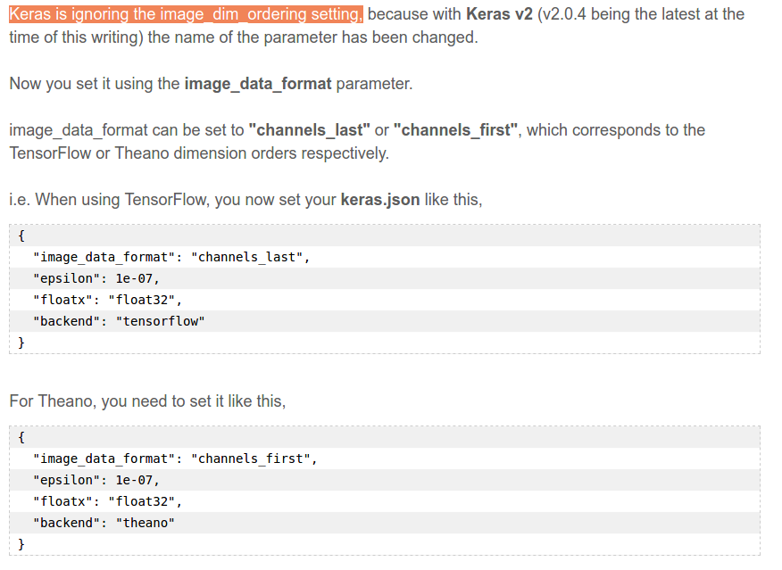


```python
import keras

if keras.backend.image_data_format() == 'channels_last':
    print("here backend is tensorflow" , keras.backend.image_data_format())
elif keras.backend.image_data_format() == 'channels_first':
    print("here backend is theano" , keras.backend.image_data_format())

#print(K.image_dim_ordering())
```

    here backend is tensorflow channels_last


TRY TO MAKE A MODEL <font color='green'>USER-FRIENDLY</font> IN NEAR FUTURE.

model = MusicTaggerCRNN(weights=None)


```python
model = MS_CNN_MusicTagger(weights=None, input_tensor=None, include_top=True)
```

    (?, 1, 1, 1985)


```python
!pip install pydot
```

    Requirement already satisfied: pydot in ./mseCnn/lib/python3.7/site-packages (1.4.1)
    Requirement already satisfied: pyparsing>=2.1.4 in ./mseCnn/lib/python3.7/site-packages (from pydot) (2.4.7)


```python
import pydot
```


```python
import getpass
import os

password = getpass.getpass()
command = "sudo -S apt-get install graphviz" #can be any command but don't forget -S as it enables input from stdin
os.system('echo %s | %s' % (password, command))
```

    ········


    256


```python

```


```python
dot_img_file = '/home/user/Music/gtzan4work/thesisIdea2.png'
tf.keras.utils.plot_model(model, to_file=dot_img_file, show_shapes=True)
```


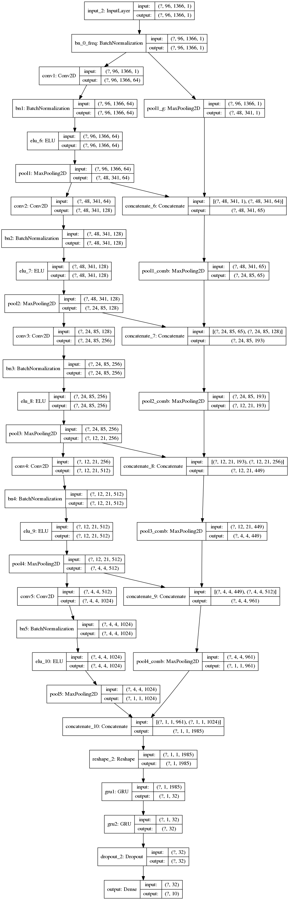


```python
model.summary()
```

    Model: "model_2"
    __________________________________________________________________________________________________
    Layer (type)                    Output Shape         Param #     Connected to                     
    ==================================================================================================
    input_2 (InputLayer)            (None, 96, 1366, 1)  0                                            
    __________________________________________________________________________________________________
    bn_0_freq (BatchNormalization)  (None, 96, 1366, 1)  384         input_2[0][0]                    
    __________________________________________________________________________________________________
    conv1 (Conv2D)                  (None, 96, 1366, 64) 640         bn_0_freq[0][0]                  
    __________________________________________________________________________________________________
    bn1 (BatchNormalization)        (None, 96, 1366, 64) 256         conv1[0][0]                      
    __________________________________________________________________________________________________
    elu_6 (ELU)                     (None, 96, 1366, 64) 0           bn1[0][0]                        
    __________________________________________________________________________________________________
    pool1 (MaxPooling2D)            (None, 48, 341, 64)  0           elu_6[0][0]                      
    __________________________________________________________________________________________________
    conv2 (Conv2D)                  (None, 48, 341, 128) 73856       pool1[0][0]                      
    __________________________________________________________________________________________________
    bn2 (BatchNormalization)        (None, 48, 341, 128) 512         conv2[0][0]                      
    __________________________________________________________________________________________________
    elu_7 (ELU)                     (None, 48, 341, 128) 0           bn2[0][0]                        
    __________________________________________________________________________________________________
    pool2 (MaxPooling2D)            (None, 24, 85, 128)  0           elu_7[0][0]                      
    __________________________________________________________________________________________________
    conv3 (Conv2D)                  (None, 24, 85, 256)  295168      pool2[0][0]                      
    __________________________________________________________________________________________________
    bn3 (BatchNormalization)        (None, 24, 85, 256)  1024        conv3[0][0]                      
    __________________________________________________________________________________________________
    elu_8 (ELU)                     (None, 24, 85, 256)  0           bn3[0][0]                        
    __________________________________________________________________________________________________
    pool1_g (MaxPooling2D)          (None, 48, 341, 1)   0           bn_0_freq[0][0]                  
    __________________________________________________________________________________________________
    pool3 (MaxPooling2D)            (None, 12, 21, 256)  0           elu_8[0][0]                      
    __________________________________________________________________________________________________
    concatenate_6 (Concatenate)     (None, 48, 341, 65)  0           pool1_g[0][0]                    
                                                                     pool1[0][0]                      
    __________________________________________________________________________________________________
    conv4 (Conv2D)                  (None, 12, 21, 512)  1180160     pool3[0][0]                      
    __________________________________________________________________________________________________
    pool1_comb (MaxPooling2D)       (None, 24, 85, 65)   0           concatenate_6[0][0]              
    __________________________________________________________________________________________________
    bn4 (BatchNormalization)        (None, 12, 21, 512)  2048        conv4[0][0]                      
    __________________________________________________________________________________________________
    concatenate_7 (Concatenate)     (None, 24, 85, 193)  0           pool1_comb[0][0]                 
                                                                     pool2[0][0]                      
    __________________________________________________________________________________________________
    elu_9 (ELU)                     (None, 12, 21, 512)  0           bn4[0][0]                        
    __________________________________________________________________________________________________
    pool2_comb (MaxPooling2D)       (None, 12, 21, 193)  0           concatenate_7[0][0]              
    __________________________________________________________________________________________________
    pool4 (MaxPooling2D)            (None, 4, 4, 512)    0           elu_9[0][0]                      
    __________________________________________________________________________________________________
    concatenate_8 (Concatenate)     (None, 12, 21, 449)  0           pool2_comb[0][0]                 
                                                                     pool3[0][0]                      
    __________________________________________________________________________________________________
    conv5 (Conv2D)                  (None, 4, 4, 1024)   4719616     pool4[0][0]                      
    __________________________________________________________________________________________________
    pool3_comb (MaxPooling2D)       (None, 4, 4, 449)    0           concatenate_8[0][0]              
    __________________________________________________________________________________________________
    bn5 (BatchNormalization)        (None, 4, 4, 1024)   4096        conv5[0][0]                      
    __________________________________________________________________________________________________
    concatenate_9 (Concatenate)     (None, 4, 4, 961)    0           pool3_comb[0][0]                 
                                                                     pool4[0][0]                      
    __________________________________________________________________________________________________
    elu_10 (ELU)                    (None, 4, 4, 1024)   0           bn5[0][0]                        
    __________________________________________________________________________________________________
    pool4_comb (MaxPooling2D)       (None, 1, 1, 961)    0           concatenate_9[0][0]              
    __________________________________________________________________________________________________
    pool5 (MaxPooling2D)            (None, 1, 1, 1024)   0           elu_10[0][0]                     
    __________________________________________________________________________________________________
    concatenate_10 (Concatenate)    (None, 1, 1, 1985)   0           pool4_comb[0][0]                 
                                                                     pool5[0][0]                      
    __________________________________________________________________________________________________
    reshape_2 (Reshape)             (None, 1, 1985)      0           concatenate_10[0][0]             
    __________________________________________________________________________________________________
    gru1 (GRU)                      (None, 1, 32)        193728      reshape_2[0][0]                  
    __________________________________________________________________________________________________
    gru2 (GRU)                      (None, 32)           6240        gru1[0][0]                       
    __________________________________________________________________________________________________
    dropout_2 (Dropout)             (None, 32)           0           gru2[0][0]                       
    __________________________________________________________________________________________________
    output (Dense)                  (None, 10)           330         dropout_2[0][0]                  
    ==================================================================================================
    Total params: 6,478,058
    Trainable params: 6,473,898
    Non-trainable params: 4,160
    __________________________________________________________________________________________________


### Compiling the model


```python
#compile model using accuracy to measure model performance
model.compile(optimizer='adam', 
              loss='categorical_crossentropy', 
              metrics=['accuracy'])
```

### Load data


```python
import numpy as np
```


```python
concat_x = np.load('concat_x.npy')
concat_y = np.load('concat_y.npy')
```


```python
print(len(concat_x),'   ',(len(concat_y)) )
```

    1000     1000


```python
train_x = concat_x[0:750]
train_y = concat_y[0:750]
```


```python
valid_x = concat_x[750:900]
valid_y = concat_y[750:900]
```


```python
test_x = concat_x[900:1000]
test_y = concat_y[900:1000]
```


```python
np.zeros((3,3)).reshape((3,3,1))
```


    array([[[0.],
            [0.],
            [0.]],
    
           [[0.],
            [0.],
            [0.]],
    
           [[0.],
            [0.],
            [0.]]])


```python
test_x[5][0].reshape((96,1366,1)).shape
```


    (96, 1366, 1)


```python
train_x_reshape = [] #np.zeros((800,96,1366,1))
```


```python
for item in train_x:
    # print(item[0].reshape((96,1366,1)).shape)
    #test_x_reshape.append = item[0].reshape((96,1366,1))
    train_x_reshape.append(item[0].reshape((96,1366,1)))
    print(np.array(train_x_reshape).shape)
```

    (1, 96, 1366, 1)
    (2, 96, 1366, 1)
    (3, 96, 1366, 1)
    (4, 96, 1366, 1)
    (5, 96, 1366, 1)
    (6, 96, 1366, 1)
    (7, 96, 1366, 1)
    (8, 96, 1366, 1)
    (9, 96, 1366, 1)
    (10, 96, 1366, 1)
    (11, 96, 1366, 1)
    (12, 96, 1366, 1)
    (13, 96, 1366, 1)
    (14, 96, 1366, 1)
    (15, 96, 1366, 1)
    (16, 96, 1366, 1)
    (17, 96, 1366, 1)
    (18, 96, 1366, 1)
    (19, 96, 1366, 1)
    (20, 96, 1366, 1)
    (21, 96, 1366, 1)
    (22, 96, 1366, 1)
    (23, 96, 1366, 1)
    (24, 96, 1366, 1)
    (25, 96, 1366, 1)
    (26, 96, 1366, 1)
    (27, 96, 1366, 1)
    (28, 96, 1366, 1)
    (29, 96, 1366, 1)
    (30, 96, 1366, 1)
    (31, 96, 1366, 1)
    (32, 96, 1366, 1)
    (33, 96, 1366, 1)
    (34, 96, 1366, 1)
    (35, 96, 1366, 1)
    (36, 96, 1366, 1)
    (37, 96, 1366, 1)
    (38, 96, 1366, 1)
    (39, 96, 1366, 1)
    (40, 96, 1366, 1)
    (41, 96, 1366, 1)
    (42, 96, 1366, 1)
    (43, 96, 1366, 1)
    (44, 96, 1366, 1)
    (45, 96, 1366, 1)
    (46, 96, 1366, 1)
    (47, 96, 1366, 1)
    (48, 96, 1366, 1)
    (49, 96, 1366, 1)
    (50, 96, 1366, 1)
    (51, 96, 1366, 1)
    (52, 96, 1366, 1)
    (53, 96, 1366, 1)
    (54, 96, 1366, 1)
    (55, 96, 1366, 1)
    (56, 96, 1366, 1)
    (57, 96, 1366, 1)
    (58, 96, 1366, 1)
    (59, 96, 1366, 1)
    (60, 96, 1366, 1)
    (61, 96, 1366, 1)
    (62, 96, 1366, 1)
    (63, 96, 1366, 1)
    (64, 96, 1366, 1)
    (65, 96, 1366, 1)
    (66, 96, 1366, 1)
    (67, 96, 1366, 1)
    (68, 96, 1366, 1)
    (69, 96, 1366, 1)
    (70, 96, 1366, 1)
    (71, 96, 1366, 1)
    (72, 96, 1366, 1)
    (73, 96, 1366, 1)
    (74, 96, 1366, 1)
    (75, 96, 1366, 1)
    (76, 96, 1366, 1)
    (77, 96, 1366, 1)
    (78, 96, 1366, 1)
    (79, 96, 1366, 1)
    (80, 96, 1366, 1)
    (81, 96, 1366, 1)
    (82, 96, 1366, 1)
    (83, 96, 1366, 1)
    (84, 96, 1366, 1)
    (85, 96, 1366, 1)
    (86, 96, 1366, 1)
    (87, 96, 1366, 1)
    (88, 96, 1366, 1)
    (89, 96, 1366, 1)
    (90, 96, 1366, 1)
    (91, 96, 1366, 1)
    (92, 96, 1366, 1)
    (93, 96, 1366, 1)
    (94, 96, 1366, 1)
    (95, 96, 1366, 1)
    (96, 96, 1366, 1)
    (97, 96, 1366, 1)
    (98, 96, 1366, 1)
    (99, 96, 1366, 1)
    (100, 96, 1366, 1)
    (101, 96, 1366, 1)
    (102, 96, 1366, 1)
    (103, 96, 1366, 1)
    (104, 96, 1366, 1)
    (105, 96, 1366, 1)
    (106, 96, 1366, 1)
    (107, 96, 1366, 1)
    (108, 96, 1366, 1)
    (109, 96, 1366, 1)
    (110, 96, 1366, 1)
    (111, 96, 1366, 1)
    (112, 96, 1366, 1)
    (113, 96, 1366, 1)
    (114, 96, 1366, 1)
    (115, 96, 1366, 1)
    (116, 96, 1366, 1)
    (117, 96, 1366, 1)
    (118, 96, 1366, 1)
    (119, 96, 1366, 1)
    (120, 96, 1366, 1)
    (121, 96, 1366, 1)
    (122, 96, 1366, 1)
    (123, 96, 1366, 1)
    (124, 96, 1366, 1)
    (125, 96, 1366, 1)
    (126, 96, 1366, 1)
    (127, 96, 1366, 1)
    (128, 96, 1366, 1)
    (129, 96, 1366, 1)
    (130, 96, 1366, 1)
    (131, 96, 1366, 1)
    (132, 96, 1366, 1)
    (133, 96, 1366, 1)
    (134, 96, 1366, 1)
    (135, 96, 1366, 1)
    (136, 96, 1366, 1)
    (137, 96, 1366, 1)
    (138, 96, 1366, 1)
    (139, 96, 1366, 1)
    (140, 96, 1366, 1)
    (141, 96, 1366, 1)
    (142, 96, 1366, 1)
    (143, 96, 1366, 1)
    (144, 96, 1366, 1)
    (145, 96, 1366, 1)
    (146, 96, 1366, 1)
    (147, 96, 1366, 1)
    (148, 96, 1366, 1)
    (149, 96, 1366, 1)
    (150, 96, 1366, 1)
    (151, 96, 1366, 1)
    (152, 96, 1366, 1)
    (153, 96, 1366, 1)
    (154, 96, 1366, 1)
    (155, 96, 1366, 1)
    (156, 96, 1366, 1)
    (157, 96, 1366, 1)
    (158, 96, 1366, 1)
    (159, 96, 1366, 1)
    (160, 96, 1366, 1)
    (161, 96, 1366, 1)
    (162, 96, 1366, 1)
    (163, 96, 1366, 1)
    (164, 96, 1366, 1)
    (165, 96, 1366, 1)
    (166, 96, 1366, 1)
    (167, 96, 1366, 1)
    (168, 96, 1366, 1)
    (169, 96, 1366, 1)
    (170, 96, 1366, 1)
    (171, 96, 1366, 1)
    (172, 96, 1366, 1)
    (173, 96, 1366, 1)
    (174, 96, 1366, 1)
    (175, 96, 1366, 1)
    (176, 96, 1366, 1)
    (177, 96, 1366, 1)
    (178, 96, 1366, 1)
    (179, 96, 1366, 1)
    (180, 96, 1366, 1)
    (181, 96, 1366, 1)
    (182, 96, 1366, 1)
    (183, 96, 1366, 1)
    (184, 96, 1366, 1)
    (185, 96, 1366, 1)
    (186, 96, 1366, 1)
    (187, 96, 1366, 1)
    (188, 96, 1366, 1)
    (189, 96, 1366, 1)
    (190, 96, 1366, 1)
    (191, 96, 1366, 1)
    (192, 96, 1366, 1)
    (193, 96, 1366, 1)
    (194, 96, 1366, 1)
    (195, 96, 1366, 1)
    (196, 96, 1366, 1)
    (197, 96, 1366, 1)
    (198, 96, 1366, 1)
    (199, 96, 1366, 1)
    (200, 96, 1366, 1)
    (201, 96, 1366, 1)
    (202, 96, 1366, 1)
    (203, 96, 1366, 1)
    (204, 96, 1366, 1)
    (205, 96, 1366, 1)
    (206, 96, 1366, 1)
    (207, 96, 1366, 1)
    (208, 96, 1366, 1)
    (209, 96, 1366, 1)
    (210, 96, 1366, 1)
    (211, 96, 1366, 1)
    (212, 96, 1366, 1)
    (213, 96, 1366, 1)
    (214, 96, 1366, 1)
    (215, 96, 1366, 1)
    (216, 96, 1366, 1)
    (217, 96, 1366, 1)
    (218, 96, 1366, 1)
    (219, 96, 1366, 1)
    (220, 96, 1366, 1)
    (221, 96, 1366, 1)
    (222, 96, 1366, 1)
    (223, 96, 1366, 1)
    (224, 96, 1366, 1)
    (225, 96, 1366, 1)
    (226, 96, 1366, 1)
    (227, 96, 1366, 1)
    (228, 96, 1366, 1)
    (229, 96, 1366, 1)
    (230, 96, 1366, 1)
    (231, 96, 1366, 1)
    (232, 96, 1366, 1)
    (233, 96, 1366, 1)
    (234, 96, 1366, 1)
    (235, 96, 1366, 1)
    (236, 96, 1366, 1)
    (237, 96, 1366, 1)
    (238, 96, 1366, 1)
    (239, 96, 1366, 1)
    (240, 96, 1366, 1)
    (241, 96, 1366, 1)
    (242, 96, 1366, 1)
    (243, 96, 1366, 1)
    (244, 96, 1366, 1)
    (245, 96, 1366, 1)
    (246, 96, 1366, 1)
    (247, 96, 1366, 1)
    (248, 96, 1366, 1)
    (249, 96, 1366, 1)
    (250, 96, 1366, 1)
    (251, 96, 1366, 1)
    (252, 96, 1366, 1)
    (253, 96, 1366, 1)
    (254, 96, 1366, 1)
    (255, 96, 1366, 1)
    (256, 96, 1366, 1)
    (257, 96, 1366, 1)
    (258, 96, 1366, 1)
    (259, 96, 1366, 1)
    (260, 96, 1366, 1)
    (261, 96, 1366, 1)
    (262, 96, 1366, 1)
    (263, 96, 1366, 1)
    (264, 96, 1366, 1)
    (265, 96, 1366, 1)
    (266, 96, 1366, 1)
    (267, 96, 1366, 1)
    (268, 96, 1366, 1)
    (269, 96, 1366, 1)
    (270, 96, 1366, 1)
    (271, 96, 1366, 1)
    (272, 96, 1366, 1)
    (273, 96, 1366, 1)
    (274, 96, 1366, 1)
    (275, 96, 1366, 1)
    (276, 96, 1366, 1)
    (277, 96, 1366, 1)
    (278, 96, 1366, 1)
    (279, 96, 1366, 1)
    (280, 96, 1366, 1)
    (281, 96, 1366, 1)
    (282, 96, 1366, 1)
    (283, 96, 1366, 1)
    (284, 96, 1366, 1)
    (285, 96, 1366, 1)
    (286, 96, 1366, 1)
    (287, 96, 1366, 1)
    (288, 96, 1366, 1)
    (289, 96, 1366, 1)
    (290, 96, 1366, 1)
    (291, 96, 1366, 1)
    (292, 96, 1366, 1)
    (293, 96, 1366, 1)
    (294, 96, 1366, 1)
    (295, 96, 1366, 1)
    (296, 96, 1366, 1)
    (297, 96, 1366, 1)
    (298, 96, 1366, 1)
    (299, 96, 1366, 1)
    (300, 96, 1366, 1)
    (301, 96, 1366, 1)
    (302, 96, 1366, 1)
    (303, 96, 1366, 1)
    (304, 96, 1366, 1)
    (305, 96, 1366, 1)
    (306, 96, 1366, 1)
    (307, 96, 1366, 1)
    (308, 96, 1366, 1)
    (309, 96, 1366, 1)
    (310, 96, 1366, 1)
    (311, 96, 1366, 1)
    (312, 96, 1366, 1)
    (313, 96, 1366, 1)
    (314, 96, 1366, 1)
    (315, 96, 1366, 1)
    (316, 96, 1366, 1)
    (317, 96, 1366, 1)
    (318, 96, 1366, 1)
    (319, 96, 1366, 1)
    (320, 96, 1366, 1)
    (321, 96, 1366, 1)
    (322, 96, 1366, 1)
    (323, 96, 1366, 1)
    (324, 96, 1366, 1)
    (325, 96, 1366, 1)
    (326, 96, 1366, 1)
    (327, 96, 1366, 1)
    (328, 96, 1366, 1)
    (329, 96, 1366, 1)
    (330, 96, 1366, 1)
    (331, 96, 1366, 1)
    (332, 96, 1366, 1)
    (333, 96, 1366, 1)
    (334, 96, 1366, 1)
    (335, 96, 1366, 1)
    (336, 96, 1366, 1)
    (337, 96, 1366, 1)
    (338, 96, 1366, 1)
    (339, 96, 1366, 1)
    (340, 96, 1366, 1)
    (341, 96, 1366, 1)
    (342, 96, 1366, 1)
    (343, 96, 1366, 1)
    (344, 96, 1366, 1)
    (345, 96, 1366, 1)
    (346, 96, 1366, 1)
    (347, 96, 1366, 1)
    (348, 96, 1366, 1)
    (349, 96, 1366, 1)
    (350, 96, 1366, 1)
    (351, 96, 1366, 1)
    (352, 96, 1366, 1)
    (353, 96, 1366, 1)
    (354, 96, 1366, 1)
    (355, 96, 1366, 1)
    (356, 96, 1366, 1)
    (357, 96, 1366, 1)
    (358, 96, 1366, 1)
    (359, 96, 1366, 1)
    (360, 96, 1366, 1)
    (361, 96, 1366, 1)
    (362, 96, 1366, 1)
    (363, 96, 1366, 1)
    (364, 96, 1366, 1)
    (365, 96, 1366, 1)
    (366, 96, 1366, 1)
    (367, 96, 1366, 1)
    (368, 96, 1366, 1)
    (369, 96, 1366, 1)
    (370, 96, 1366, 1)
    (371, 96, 1366, 1)
    (372, 96, 1366, 1)
    (373, 96, 1366, 1)
    (374, 96, 1366, 1)
    (375, 96, 1366, 1)
    (376, 96, 1366, 1)
    (377, 96, 1366, 1)
    (378, 96, 1366, 1)
    (379, 96, 1366, 1)
    (380, 96, 1366, 1)
    (381, 96, 1366, 1)
    (382, 96, 1366, 1)
    (383, 96, 1366, 1)
    (384, 96, 1366, 1)
    (385, 96, 1366, 1)
    (386, 96, 1366, 1)
    (387, 96, 1366, 1)
    (388, 96, 1366, 1)
    (389, 96, 1366, 1)
    (390, 96, 1366, 1)
    (391, 96, 1366, 1)
    (392, 96, 1366, 1)
    (393, 96, 1366, 1)
    (394, 96, 1366, 1)
    (395, 96, 1366, 1)
    (396, 96, 1366, 1)
    (397, 96, 1366, 1)
    (398, 96, 1366, 1)
    (399, 96, 1366, 1)
    (400, 96, 1366, 1)
    (401, 96, 1366, 1)
    (402, 96, 1366, 1)
    (403, 96, 1366, 1)
    (404, 96, 1366, 1)
    (405, 96, 1366, 1)
    (406, 96, 1366, 1)
    (407, 96, 1366, 1)
    (408, 96, 1366, 1)
    (409, 96, 1366, 1)
    (410, 96, 1366, 1)
    (411, 96, 1366, 1)
    (412, 96, 1366, 1)
    (413, 96, 1366, 1)
    (414, 96, 1366, 1)
    (415, 96, 1366, 1)
    (416, 96, 1366, 1)
    (417, 96, 1366, 1)
    (418, 96, 1366, 1)
    (419, 96, 1366, 1)
    (420, 96, 1366, 1)
    (421, 96, 1366, 1)
    (422, 96, 1366, 1)
    (423, 96, 1366, 1)
    (424, 96, 1366, 1)
    (425, 96, 1366, 1)
    (426, 96, 1366, 1)
    (427, 96, 1366, 1)
    (428, 96, 1366, 1)
    (429, 96, 1366, 1)
    (430, 96, 1366, 1)
    (431, 96, 1366, 1)
    (432, 96, 1366, 1)
    (433, 96, 1366, 1)
    (434, 96, 1366, 1)
    (435, 96, 1366, 1)
    (436, 96, 1366, 1)
    (437, 96, 1366, 1)
    (438, 96, 1366, 1)
    (439, 96, 1366, 1)
    (440, 96, 1366, 1)
    (441, 96, 1366, 1)
    (442, 96, 1366, 1)
    (443, 96, 1366, 1)
    (444, 96, 1366, 1)
    (445, 96, 1366, 1)
    (446, 96, 1366, 1)
    (447, 96, 1366, 1)
    (448, 96, 1366, 1)
    (449, 96, 1366, 1)
    (450, 96, 1366, 1)
    (451, 96, 1366, 1)
    (452, 96, 1366, 1)
    (453, 96, 1366, 1)
    (454, 96, 1366, 1)
    (455, 96, 1366, 1)
    (456, 96, 1366, 1)
    (457, 96, 1366, 1)
    (458, 96, 1366, 1)
    (459, 96, 1366, 1)
    (460, 96, 1366, 1)
    (461, 96, 1366, 1)
    (462, 96, 1366, 1)
    (463, 96, 1366, 1)
    (464, 96, 1366, 1)
    (465, 96, 1366, 1)
    (466, 96, 1366, 1)
    (467, 96, 1366, 1)
    (468, 96, 1366, 1)
    (469, 96, 1366, 1)
    (470, 96, 1366, 1)
    (471, 96, 1366, 1)
    (472, 96, 1366, 1)
    (473, 96, 1366, 1)
    (474, 96, 1366, 1)
    (475, 96, 1366, 1)
    (476, 96, 1366, 1)
    (477, 96, 1366, 1)
    (478, 96, 1366, 1)
    (479, 96, 1366, 1)
    (480, 96, 1366, 1)
    (481, 96, 1366, 1)
    (482, 96, 1366, 1)
    (483, 96, 1366, 1)
    (484, 96, 1366, 1)
    (485, 96, 1366, 1)
    (486, 96, 1366, 1)
    (487, 96, 1366, 1)
    (488, 96, 1366, 1)
    (489, 96, 1366, 1)
    (490, 96, 1366, 1)
    (491, 96, 1366, 1)
    (492, 96, 1366, 1)
    (493, 96, 1366, 1)
    (494, 96, 1366, 1)
    (495, 96, 1366, 1)
    (496, 96, 1366, 1)
    (497, 96, 1366, 1)
    (498, 96, 1366, 1)
    (499, 96, 1366, 1)
    (500, 96, 1366, 1)
    (501, 96, 1366, 1)
    (502, 96, 1366, 1)
    (503, 96, 1366, 1)
    (504, 96, 1366, 1)
    (505, 96, 1366, 1)
    (506, 96, 1366, 1)
    (507, 96, 1366, 1)
    (508, 96, 1366, 1)
    (509, 96, 1366, 1)
    (510, 96, 1366, 1)
    (511, 96, 1366, 1)
    (512, 96, 1366, 1)
    (513, 96, 1366, 1)
    (514, 96, 1366, 1)
    (515, 96, 1366, 1)
    (516, 96, 1366, 1)
    (517, 96, 1366, 1)
    (518, 96, 1366, 1)
    (519, 96, 1366, 1)
    (520, 96, 1366, 1)
    (521, 96, 1366, 1)
    (522, 96, 1366, 1)
    (523, 96, 1366, 1)
    (524, 96, 1366, 1)
    (525, 96, 1366, 1)
    (526, 96, 1366, 1)
    (527, 96, 1366, 1)
    (528, 96, 1366, 1)
    (529, 96, 1366, 1)
    (530, 96, 1366, 1)
    (531, 96, 1366, 1)
    (532, 96, 1366, 1)
    (533, 96, 1366, 1)
    (534, 96, 1366, 1)
    (535, 96, 1366, 1)
    (536, 96, 1366, 1)
    (537, 96, 1366, 1)
    (538, 96, 1366, 1)
    (539, 96, 1366, 1)
    (540, 96, 1366, 1)
    (541, 96, 1366, 1)
    (542, 96, 1366, 1)
    (543, 96, 1366, 1)
    (544, 96, 1366, 1)
    (545, 96, 1366, 1)
    (546, 96, 1366, 1)
    (547, 96, 1366, 1)
    (548, 96, 1366, 1)
    (549, 96, 1366, 1)
    (550, 96, 1366, 1)
    (551, 96, 1366, 1)
    (552, 96, 1366, 1)
    (553, 96, 1366, 1)
    (554, 96, 1366, 1)
    (555, 96, 1366, 1)
    (556, 96, 1366, 1)
    (557, 96, 1366, 1)
    (558, 96, 1366, 1)
    (559, 96, 1366, 1)
    (560, 96, 1366, 1)
    (561, 96, 1366, 1)
    (562, 96, 1366, 1)
    (563, 96, 1366, 1)
    (564, 96, 1366, 1)
    (565, 96, 1366, 1)
    (566, 96, 1366, 1)
    (567, 96, 1366, 1)
    (568, 96, 1366, 1)
    (569, 96, 1366, 1)
    (570, 96, 1366, 1)
    (571, 96, 1366, 1)
    (572, 96, 1366, 1)
    (573, 96, 1366, 1)
    (574, 96, 1366, 1)
    (575, 96, 1366, 1)
    (576, 96, 1366, 1)
    (577, 96, 1366, 1)
    (578, 96, 1366, 1)
    (579, 96, 1366, 1)
    (580, 96, 1366, 1)
    (581, 96, 1366, 1)
    (582, 96, 1366, 1)
    (583, 96, 1366, 1)
    (584, 96, 1366, 1)
    (585, 96, 1366, 1)
    (586, 96, 1366, 1)
    (587, 96, 1366, 1)
    (588, 96, 1366, 1)
    (589, 96, 1366, 1)
    (590, 96, 1366, 1)
    (591, 96, 1366, 1)
    (592, 96, 1366, 1)
    (593, 96, 1366, 1)
    (594, 96, 1366, 1)
    (595, 96, 1366, 1)
    (596, 96, 1366, 1)
    (597, 96, 1366, 1)
    (598, 96, 1366, 1)
    (599, 96, 1366, 1)
    (600, 96, 1366, 1)
    (601, 96, 1366, 1)
    (602, 96, 1366, 1)
    (603, 96, 1366, 1)
    (604, 96, 1366, 1)
    (605, 96, 1366, 1)
    (606, 96, 1366, 1)
    (607, 96, 1366, 1)
    (608, 96, 1366, 1)
    (609, 96, 1366, 1)
    (610, 96, 1366, 1)
    (611, 96, 1366, 1)
    (612, 96, 1366, 1)
    (613, 96, 1366, 1)
    (614, 96, 1366, 1)
    (615, 96, 1366, 1)
    (616, 96, 1366, 1)
    (617, 96, 1366, 1)
    (618, 96, 1366, 1)
    (619, 96, 1366, 1)
    (620, 96, 1366, 1)
    (621, 96, 1366, 1)
    (622, 96, 1366, 1)
    (623, 96, 1366, 1)
    (624, 96, 1366, 1)
    (625, 96, 1366, 1)
    (626, 96, 1366, 1)
    (627, 96, 1366, 1)
    (628, 96, 1366, 1)
    (629, 96, 1366, 1)
    (630, 96, 1366, 1)
    (631, 96, 1366, 1)
    (632, 96, 1366, 1)
    (633, 96, 1366, 1)
    (634, 96, 1366, 1)
    (635, 96, 1366, 1)
    (636, 96, 1366, 1)
    (637, 96, 1366, 1)
    (638, 96, 1366, 1)
    (639, 96, 1366, 1)
    (640, 96, 1366, 1)
    (641, 96, 1366, 1)
    (642, 96, 1366, 1)
    (643, 96, 1366, 1)
    (644, 96, 1366, 1)
    (645, 96, 1366, 1)
    (646, 96, 1366, 1)
    (647, 96, 1366, 1)
    (648, 96, 1366, 1)
    (649, 96, 1366, 1)
    (650, 96, 1366, 1)
    (651, 96, 1366, 1)
    (652, 96, 1366, 1)
    (653, 96, 1366, 1)
    (654, 96, 1366, 1)
    (655, 96, 1366, 1)
    (656, 96, 1366, 1)
    (657, 96, 1366, 1)
    (658, 96, 1366, 1)
    (659, 96, 1366, 1)
    (660, 96, 1366, 1)
    (661, 96, 1366, 1)
    (662, 96, 1366, 1)
    (663, 96, 1366, 1)
    (664, 96, 1366, 1)
    (665, 96, 1366, 1)
    (666, 96, 1366, 1)
    (667, 96, 1366, 1)
    (668, 96, 1366, 1)
    (669, 96, 1366, 1)
    (670, 96, 1366, 1)
    (671, 96, 1366, 1)
    (672, 96, 1366, 1)
    (673, 96, 1366, 1)
    (674, 96, 1366, 1)
    (675, 96, 1366, 1)
    (676, 96, 1366, 1)
    (677, 96, 1366, 1)
    (678, 96, 1366, 1)
    (679, 96, 1366, 1)
    (680, 96, 1366, 1)
    (681, 96, 1366, 1)
    (682, 96, 1366, 1)
    (683, 96, 1366, 1)
    (684, 96, 1366, 1)
    (685, 96, 1366, 1)
    (686, 96, 1366, 1)
    (687, 96, 1366, 1)
    (688, 96, 1366, 1)
    (689, 96, 1366, 1)
    (690, 96, 1366, 1)
    (691, 96, 1366, 1)
    (692, 96, 1366, 1)
    (693, 96, 1366, 1)
    (694, 96, 1366, 1)
    (695, 96, 1366, 1)
    (696, 96, 1366, 1)
    (697, 96, 1366, 1)
    (698, 96, 1366, 1)
    (699, 96, 1366, 1)
    (700, 96, 1366, 1)
    (701, 96, 1366, 1)
    (702, 96, 1366, 1)
    (703, 96, 1366, 1)
    (704, 96, 1366, 1)
    (705, 96, 1366, 1)
    (706, 96, 1366, 1)
    (707, 96, 1366, 1)
    (708, 96, 1366, 1)
    (709, 96, 1366, 1)
    (710, 96, 1366, 1)
    (711, 96, 1366, 1)
    (712, 96, 1366, 1)
    (713, 96, 1366, 1)
    (714, 96, 1366, 1)
    (715, 96, 1366, 1)
    (716, 96, 1366, 1)
    (717, 96, 1366, 1)
    (718, 96, 1366, 1)
    (719, 96, 1366, 1)
    (720, 96, 1366, 1)
    (721, 96, 1366, 1)
    (722, 96, 1366, 1)
    (723, 96, 1366, 1)
    (724, 96, 1366, 1)
    (725, 96, 1366, 1)
    (726, 96, 1366, 1)
    (727, 96, 1366, 1)
    (728, 96, 1366, 1)
    (729, 96, 1366, 1)
    (730, 96, 1366, 1)
    (731, 96, 1366, 1)
    (732, 96, 1366, 1)
    (733, 96, 1366, 1)
    (734, 96, 1366, 1)
    (735, 96, 1366, 1)
    (736, 96, 1366, 1)
    (737, 96, 1366, 1)
    (738, 96, 1366, 1)
    (739, 96, 1366, 1)
    (740, 96, 1366, 1)
    (741, 96, 1366, 1)
    (742, 96, 1366, 1)
    (743, 96, 1366, 1)
    (744, 96, 1366, 1)
    (745, 96, 1366, 1)
    (746, 96, 1366, 1)
    (747, 96, 1366, 1)
    (748, 96, 1366, 1)
    (749, 96, 1366, 1)
    (750, 96, 1366, 1)


```python
valid_x_reshape = []#np.zeros((96,1366,1))
```


```python
for item in valid_x:
    # print(item[0].reshape((96,1366,1)).shape)
    #test_x_reshape.append = item[0].reshape((96,1366,1))
    valid_x_reshape.append(item[0].reshape((96,1366,1)))
    print(np.array(valid_x_reshape).shape)
```

    (1, 96, 1366, 1)
    (2, 96, 1366, 1)
    (3, 96, 1366, 1)
    (4, 96, 1366, 1)
    (5, 96, 1366, 1)
    (6, 96, 1366, 1)
    (7, 96, 1366, 1)
    (8, 96, 1366, 1)
    (9, 96, 1366, 1)
    (10, 96, 1366, 1)
    (11, 96, 1366, 1)
    (12, 96, 1366, 1)
    (13, 96, 1366, 1)
    (14, 96, 1366, 1)
    (15, 96, 1366, 1)
    (16, 96, 1366, 1)
    (17, 96, 1366, 1)
    (18, 96, 1366, 1)
    (19, 96, 1366, 1)
    (20, 96, 1366, 1)
    (21, 96, 1366, 1)
    (22, 96, 1366, 1)
    (23, 96, 1366, 1)
    (24, 96, 1366, 1)
    (25, 96, 1366, 1)
    (26, 96, 1366, 1)
    (27, 96, 1366, 1)
    (28, 96, 1366, 1)
    (29, 96, 1366, 1)
    (30, 96, 1366, 1)
    (31, 96, 1366, 1)
    (32, 96, 1366, 1)
    (33, 96, 1366, 1)
    (34, 96, 1366, 1)
    (35, 96, 1366, 1)
    (36, 96, 1366, 1)
    (37, 96, 1366, 1)
    (38, 96, 1366, 1)
    (39, 96, 1366, 1)
    (40, 96, 1366, 1)
    (41, 96, 1366, 1)
    (42, 96, 1366, 1)
    (43, 96, 1366, 1)
    (44, 96, 1366, 1)
    (45, 96, 1366, 1)
    (46, 96, 1366, 1)
    (47, 96, 1366, 1)
    (48, 96, 1366, 1)
    (49, 96, 1366, 1)
    (50, 96, 1366, 1)
    (51, 96, 1366, 1)
    (52, 96, 1366, 1)
    (53, 96, 1366, 1)
    (54, 96, 1366, 1)
    (55, 96, 1366, 1)
    (56, 96, 1366, 1)
    (57, 96, 1366, 1)
    (58, 96, 1366, 1)
    (59, 96, 1366, 1)
    (60, 96, 1366, 1)
    (61, 96, 1366, 1)
    (62, 96, 1366, 1)
    (63, 96, 1366, 1)
    (64, 96, 1366, 1)
    (65, 96, 1366, 1)
    (66, 96, 1366, 1)
    (67, 96, 1366, 1)
    (68, 96, 1366, 1)
    (69, 96, 1366, 1)
    (70, 96, 1366, 1)
    (71, 96, 1366, 1)
    (72, 96, 1366, 1)
    (73, 96, 1366, 1)
    (74, 96, 1366, 1)
    (75, 96, 1366, 1)
    (76, 96, 1366, 1)
    (77, 96, 1366, 1)
    (78, 96, 1366, 1)
    (79, 96, 1366, 1)
    (80, 96, 1366, 1)
    (81, 96, 1366, 1)
    (82, 96, 1366, 1)
    (83, 96, 1366, 1)
    (84, 96, 1366, 1)
    (85, 96, 1366, 1)
    (86, 96, 1366, 1)
    (87, 96, 1366, 1)
    (88, 96, 1366, 1)
    (89, 96, 1366, 1)
    (90, 96, 1366, 1)
    (91, 96, 1366, 1)
    (92, 96, 1366, 1)
    (93, 96, 1366, 1)
    (94, 96, 1366, 1)
    (95, 96, 1366, 1)
    (96, 96, 1366, 1)
    (97, 96, 1366, 1)
    (98, 96, 1366, 1)
    (99, 96, 1366, 1)
    (100, 96, 1366, 1)
    (101, 96, 1366, 1)
    (102, 96, 1366, 1)
    (103, 96, 1366, 1)
    (104, 96, 1366, 1)
    (105, 96, 1366, 1)
    (106, 96, 1366, 1)
    (107, 96, 1366, 1)
    (108, 96, 1366, 1)
    (109, 96, 1366, 1)
    (110, 96, 1366, 1)
    (111, 96, 1366, 1)
    (112, 96, 1366, 1)
    (113, 96, 1366, 1)
    (114, 96, 1366, 1)
    (115, 96, 1366, 1)
    (116, 96, 1366, 1)
    (117, 96, 1366, 1)
    (118, 96, 1366, 1)
    (119, 96, 1366, 1)
    (120, 96, 1366, 1)
    (121, 96, 1366, 1)
    (122, 96, 1366, 1)
    (123, 96, 1366, 1)
    (124, 96, 1366, 1)
    (125, 96, 1366, 1)
    (126, 96, 1366, 1)
    (127, 96, 1366, 1)
    (128, 96, 1366, 1)
    (129, 96, 1366, 1)
    (130, 96, 1366, 1)
    (131, 96, 1366, 1)
    (132, 96, 1366, 1)
    (133, 96, 1366, 1)
    (134, 96, 1366, 1)
    (135, 96, 1366, 1)
    (136, 96, 1366, 1)
    (137, 96, 1366, 1)
    (138, 96, 1366, 1)
    (139, 96, 1366, 1)
    (140, 96, 1366, 1)
    (141, 96, 1366, 1)
    (142, 96, 1366, 1)
    (143, 96, 1366, 1)
    (144, 96, 1366, 1)
    (145, 96, 1366, 1)
    (146, 96, 1366, 1)
    (147, 96, 1366, 1)
    (148, 96, 1366, 1)
    (149, 96, 1366, 1)
    (150, 96, 1366, 1)


```python
test_x_reshape = []#np.zeros((96,1366,1))
```


```python
for item in test_x:
    # print(item[0].reshape((96,1366,1)).shape)
    #test_x_reshape.append = item[0].reshape((96,1366,1))
    test_x_reshape.append(item[0].reshape((96,1366,1)))
    print(np.array(test_x_reshape).shape)
```

    (1, 96, 1366, 1)
    (2, 96, 1366, 1)
    (3, 96, 1366, 1)
    (4, 96, 1366, 1)
    (5, 96, 1366, 1)
    (6, 96, 1366, 1)
    (7, 96, 1366, 1)
    (8, 96, 1366, 1)
    (9, 96, 1366, 1)
    (10, 96, 1366, 1)
    (11, 96, 1366, 1)
    (12, 96, 1366, 1)
    (13, 96, 1366, 1)
    (14, 96, 1366, 1)
    (15, 96, 1366, 1)
    (16, 96, 1366, 1)
    (17, 96, 1366, 1)
    (18, 96, 1366, 1)
    (19, 96, 1366, 1)
    (20, 96, 1366, 1)
    (21, 96, 1366, 1)
    (22, 96, 1366, 1)
    (23, 96, 1366, 1)
    (24, 96, 1366, 1)
    (25, 96, 1366, 1)
    (26, 96, 1366, 1)
    (27, 96, 1366, 1)
    (28, 96, 1366, 1)
    (29, 96, 1366, 1)
    (30, 96, 1366, 1)
    (31, 96, 1366, 1)
    (32, 96, 1366, 1)
    (33, 96, 1366, 1)
    (34, 96, 1366, 1)
    (35, 96, 1366, 1)
    (36, 96, 1366, 1)
    (37, 96, 1366, 1)
    (38, 96, 1366, 1)
    (39, 96, 1366, 1)
    (40, 96, 1366, 1)
    (41, 96, 1366, 1)
    (42, 96, 1366, 1)
    (43, 96, 1366, 1)
    (44, 96, 1366, 1)
    (45, 96, 1366, 1)
    (46, 96, 1366, 1)
    (47, 96, 1366, 1)
    (48, 96, 1366, 1)
    (49, 96, 1366, 1)
    (50, 96, 1366, 1)
    (51, 96, 1366, 1)
    (52, 96, 1366, 1)
    (53, 96, 1366, 1)
    (54, 96, 1366, 1)
    (55, 96, 1366, 1)
    (56, 96, 1366, 1)
    (57, 96, 1366, 1)
    (58, 96, 1366, 1)
    (59, 96, 1366, 1)
    (60, 96, 1366, 1)
    (61, 96, 1366, 1)
    (62, 96, 1366, 1)
    (63, 96, 1366, 1)
    (64, 96, 1366, 1)
    (65, 96, 1366, 1)
    (66, 96, 1366, 1)
    (67, 96, 1366, 1)
    (68, 96, 1366, 1)
    (69, 96, 1366, 1)
    (70, 96, 1366, 1)
    (71, 96, 1366, 1)
    (72, 96, 1366, 1)
    (73, 96, 1366, 1)
    (74, 96, 1366, 1)
    (75, 96, 1366, 1)
    (76, 96, 1366, 1)
    (77, 96, 1366, 1)
    (78, 96, 1366, 1)
    (79, 96, 1366, 1)
    (80, 96, 1366, 1)
    (81, 96, 1366, 1)
    (82, 96, 1366, 1)
    (83, 96, 1366, 1)
    (84, 96, 1366, 1)
    (85, 96, 1366, 1)
    (86, 96, 1366, 1)
    (87, 96, 1366, 1)
    (88, 96, 1366, 1)
    (89, 96, 1366, 1)
    (90, 96, 1366, 1)
    (91, 96, 1366, 1)
    (92, 96, 1366, 1)
    (93, 96, 1366, 1)
    (94, 96, 1366, 1)
    (95, 96, 1366, 1)
    (96, 96, 1366, 1)
    (97, 96, 1366, 1)
    (98, 96, 1366, 1)
    (99, 96, 1366, 1)
    (100, 96, 1366, 1)


for item in test_x:
    # print(item[0].reshape((96,1366,1)).shape)
    # test_x_reshape.append = item[0].reshape((96,1366,1))
    test_x_reshape.append(item)
    print(np.array(test_x_reshape).shape)


```python

```


```python
test_x[5][0]
```


    array([[-1.63497219e+01, -1.64027100e+01, -1.66768284e+01, ...,
            -1.58324146e+01, -1.55317421e+01, -1.42583351e+01],
           [ 3.05063874e-02, -1.83508635e+00, -2.44407034e+00, ...,
            -3.48070574e+00, -1.90951288e+00, -7.99118996e+00],
           [ 9.15635765e-01, -4.04687881e+00, -5.39213085e+00, ...,
            -7.02798319e+00, -6.20999384e+00, -7.13931274e+00],
           ...,
           [-5.70205765e+01, -5.70205765e+01, -5.70205765e+01, ...,
            -5.70205765e+01, -5.70205765e+01, -5.70205765e+01],
           [-5.70205765e+01, -5.70205765e+01, -5.70205765e+01, ...,
            -5.70205765e+01, -5.70205765e+01, -5.70205765e+01],
           [-5.70205765e+01, -5.70205765e+01, -5.70205765e+01, ...,
            -5.70205765e+01, -5.70205765e+01, -5.70205765e+01]])


```python
np.array([[[1,5,6]]]).shape
```


    (1, 1, 3)


```python
test_x[5]
```


    array([[[-1.63497219e+01, -1.64027100e+01, -1.66768284e+01, ...,
             -1.58324146e+01, -1.55317421e+01, -1.42583351e+01],
            [ 3.05063874e-02, -1.83508635e+00, -2.44407034e+00, ...,
             -3.48070574e+00, -1.90951288e+00, -7.99118996e+00],
            [ 9.15635765e-01, -4.04687881e+00, -5.39213085e+00, ...,
             -7.02798319e+00, -6.20999384e+00, -7.13931274e+00],
            ...,
            [-5.70205765e+01, -5.70205765e+01, -5.70205765e+01, ...,
             -5.70205765e+01, -5.70205765e+01, -5.70205765e+01],
            [-5.70205765e+01, -5.70205765e+01, -5.70205765e+01, ...,
             -5.70205765e+01, -5.70205765e+01, -5.70205765e+01],
            [-5.70205765e+01, -5.70205765e+01, -5.70205765e+01, ...,
             -5.70205765e+01, -5.70205765e+01, -5.70205765e+01]]])


### Training the model

model = load_model('Crnn.h5')


```python
#train the model
model.fit(np.array(train_x_reshape), train_y, validation_data=(np.array(valid_x_reshape), valid_y), epochs=100 )
```

    WARNING:tensorflow:From /home/user/Music/gtzan4work/genres/mseCnn/lib/python3.7/site-packages/tensorflow_core/python/ops/math_grad.py:1424: where (from tensorflow.python.ops.array_ops) is deprecated and will be removed in a future version.
    Instructions for updating:
    Use tf.where in 2.0, which has the same broadcast rule as np.where
    WARNING:tensorflow:From /home/user/Music/gtzan4work/genres/mseCnn/lib/python3.7/site-packages/keras/backend/tensorflow_backend.py:422: The name tf.global_variables is deprecated. Please use tf.compat.v1.global_variables instead.
    
    Train on 750 samples, validate on 150 samples
    Epoch 1/100
    750/750 [==============================] - 236s 314ms/step - loss: 2.2415 - accuracy: 0.2027 - val_loss: 2.3206 - val_accuracy: 0.0800
    Epoch 2/100
    750/750 [==============================] - 271s 361ms/step - loss: 2.1879 - accuracy: 0.2480 - val_loss: 2.3366 - val_accuracy: 0.1200
    Epoch 3/100
    750/750 [==============================] - 329s 438ms/step - loss: 2.1228 - accuracy: 0.2960 - val_loss: 2.3643 - val_accuracy: 0.1133
    Epoch 4/100
    750/750 [==============================] - 296s 395ms/step - loss: 2.0694 - accuracy: 0.3147 - val_loss: 2.3220 - val_accuracy: 0.1533
    Epoch 5/100
    750/750 [==============================] - 275s 367ms/step - loss: 2.0233 - accuracy: 0.3240 - val_loss: 2.3527 - val_accuracy: 0.1267
    Epoch 6/100
    750/750 [==============================] - 308s 410ms/step - loss: 1.9393 - accuracy: 0.3693 - val_loss: 2.2944 - val_accuracy: 0.1867
    Epoch 7/100
    750/750 [==============================] - 301s 401ms/step - loss: 1.8920 - accuracy: 0.3373 - val_loss: 2.2489 - val_accuracy: 0.2600
    Epoch 8/100
    750/750 [==============================] - 296s 395ms/step - loss: 1.8831 - accuracy: 0.3413 - val_loss: 2.2513 - val_accuracy: 0.1733
    Epoch 9/100
    750/750 [==============================] - 300s 399ms/step - loss: 1.8268 - accuracy: 0.3640 - val_loss: 2.4502 - val_accuracy: 0.1867
    Epoch 10/100
    750/750 [==============================] - 298s 398ms/step - loss: 1.8495 - accuracy: 0.3480 - val_loss: 2.5627 - val_accuracy: 0.1667
    Epoch 11/100
    750/750 [==============================] - 291s 388ms/step - loss: 1.7527 - accuracy: 0.3453 - val_loss: 2.0364 - val_accuracy: 0.2267
    Epoch 12/100
    750/750 [==============================] - 275s 367ms/step - loss: 1.7327 - accuracy: 0.3667 - val_loss: 2.0880 - val_accuracy: 0.2333
    Epoch 13/100
    750/750 [==============================] - 335s 447ms/step - loss: 1.7135 - accuracy: 0.3507 - val_loss: 2.0860 - val_accuracy: 0.2867
    Epoch 14/100
    750/750 [==============================] - 319s 426ms/step - loss: 1.6468 - accuracy: 0.4160 - val_loss: 2.0953 - val_accuracy: 0.3067
    Epoch 15/100
    750/750 [==============================] - 297s 397ms/step - loss: 1.6760 - accuracy: 0.3867 - val_loss: 1.7485 - val_accuracy: 0.3600
    Epoch 16/100
    750/750 [==============================] - 291s 388ms/step - loss: 1.6266 - accuracy: 0.3787 - val_loss: 3.0044 - val_accuracy: 0.1733
    Epoch 17/100
    750/750 [==============================] - 283s 377ms/step - loss: 1.6542 - accuracy: 0.4093 - val_loss: 3.0919 - val_accuracy: 0.1733
    Epoch 18/100
    750/750 [==============================] - 289s 386ms/step - loss: 1.6278 - accuracy: 0.4080 - val_loss: 1.9797 - val_accuracy: 0.3600
    Epoch 19/100
    750/750 [==============================] - 296s 394ms/step - loss: 1.5956 - accuracy: 0.4173 - val_loss: 1.9643 - val_accuracy: 0.2867
    Epoch 20/100
    750/750 [==============================] - 292s 390ms/step - loss: 1.5952 - accuracy: 0.4067 - val_loss: 2.1496 - val_accuracy: 0.2400
    Epoch 21/100
    750/750 [==============================] - 286s 382ms/step - loss: 1.6080 - accuracy: 0.3867 - val_loss: 1.8317 - val_accuracy: 0.3133
    Epoch 22/100
    750/750 [==============================] - 303s 403ms/step - loss: 1.6928 - accuracy: 0.3547 - val_loss: 1.8773 - val_accuracy: 0.3333
    Epoch 23/100
    750/750 [==============================] - 318s 424ms/step - loss: 1.5762 - accuracy: 0.3973 - val_loss: 2.2078 - val_accuracy: 0.2733
    Epoch 24/100
    750/750 [==============================] - 274s 365ms/step - loss: 1.5533 - accuracy: 0.3933 - val_loss: 1.8863 - val_accuracy: 0.3267
    Epoch 25/100
    750/750 [==============================] - 285s 380ms/step - loss: 1.5703 - accuracy: 0.4080 - val_loss: 1.6551 - val_accuracy: 0.4000
    Epoch 26/100
    750/750 [==============================] - 278s 370ms/step - loss: 1.5217 - accuracy: 0.4080 - val_loss: 1.6649 - val_accuracy: 0.3800
    Epoch 27/100
    750/750 [==============================] - 275s 366ms/step - loss: 1.6077 - accuracy: 0.3987 - val_loss: 2.1580 - val_accuracy: 0.2867
    Epoch 28/100
    750/750 [==============================] - 280s 374ms/step - loss: 1.5342 - accuracy: 0.4533 - val_loss: 2.1607 - val_accuracy: 0.2333
    Epoch 29/100
    750/750 [==============================] - 279s 372ms/step - loss: 1.5003 - accuracy: 0.4333 - val_loss: 2.0944 - val_accuracy: 0.3533
    Epoch 30/100
    750/750 [==============================] - 277s 369ms/step - loss: 1.4628 - accuracy: 0.4520 - val_loss: 1.4612 - val_accuracy: 0.4667
    Epoch 31/100
    750/750 [==============================] - 281s 374ms/step - loss: 1.4392 - accuracy: 0.4480 - val_loss: 1.9275 - val_accuracy: 0.2933
    Epoch 32/100
    750/750 [==============================] - 276s 367ms/step - loss: 1.4777 - accuracy: 0.4333 - val_loss: 1.4724 - val_accuracy: 0.4133
    Epoch 33/100
    750/750 [==============================] - 281s 374ms/step - loss: 1.4084 - accuracy: 0.4387 - val_loss: 1.8983 - val_accuracy: 0.3133
    Epoch 34/100
    750/750 [==============================] - 293s 391ms/step - loss: 1.4913 - accuracy: 0.4307 - val_loss: 1.8397 - val_accuracy: 0.3333
    Epoch 35/100
    750/750 [==============================] - 292s 390ms/step - loss: 1.4284 - accuracy: 0.4547 - val_loss: 1.5912 - val_accuracy: 0.4133
    Epoch 36/100
    750/750 [==============================] - 308s 411ms/step - loss: 1.4286 - accuracy: 0.4653 - val_loss: 1.5054 - val_accuracy: 0.4200
    Epoch 37/100
    750/750 [==============================] - 303s 404ms/step - loss: 1.4049 - accuracy: 0.5053 - val_loss: 1.6609 - val_accuracy: 0.4467
    Epoch 38/100
    750/750 [==============================] - 299s 398ms/step - loss: 1.4403 - accuracy: 0.4733 - val_loss: 1.4223 - val_accuracy: 0.5067
    Epoch 39/100
    750/750 [==============================] - 296s 395ms/step - loss: 1.3863 - accuracy: 0.4707 - val_loss: 1.5554 - val_accuracy: 0.3933
    Epoch 40/100
    750/750 [==============================] - 296s 395ms/step - loss: 1.3938 - accuracy: 0.4733 - val_loss: 2.3899 - val_accuracy: 0.2533
    Epoch 41/100
    750/750 [==============================] - 293s 390ms/step - loss: 1.3486 - accuracy: 0.4987 - val_loss: 1.4202 - val_accuracy: 0.5200
    Epoch 42/100
    750/750 [==============================] - 290s 386ms/step - loss: 1.3374 - accuracy: 0.5040 - val_loss: 1.6930 - val_accuracy: 0.3667
    Epoch 43/100
    750/750 [==============================] - 296s 395ms/step - loss: 1.3416 - accuracy: 0.4947 - val_loss: 1.6593 - val_accuracy: 0.3933
    Epoch 44/100
    750/750 [==============================] - 288s 383ms/step - loss: 1.3123 - accuracy: 0.5347 - val_loss: 1.7658 - val_accuracy: 0.3933
    Epoch 45/100
    750/750 [==============================] - 270s 359ms/step - loss: 1.3354 - accuracy: 0.5267 - val_loss: 1.4194 - val_accuracy: 0.5067
    Epoch 46/100
    750/750 [==============================] - 272s 363ms/step - loss: 1.2360 - accuracy: 0.5547 - val_loss: 1.2901 - val_accuracy: 0.5267
    Epoch 47/100
    750/750 [==============================] - 277s 370ms/step - loss: 1.2899 - accuracy: 0.5173 - val_loss: 1.9203 - val_accuracy: 0.3467
    Epoch 48/100
    750/750 [==============================] - 267s 355ms/step - loss: 1.2263 - accuracy: 0.5480 - val_loss: 1.7993 - val_accuracy: 0.3600
    Epoch 49/100
    750/750 [==============================] - 283s 377ms/step - loss: 1.2864 - accuracy: 0.5187 - val_loss: 1.9687 - val_accuracy: 0.3467
    Epoch 50/100
    750/750 [==============================] - 278s 371ms/step - loss: 1.3237 - accuracy: 0.5160 - val_loss: 1.4612 - val_accuracy: 0.4600
    Epoch 51/100
    750/750 [==============================] - 270s 359ms/step - loss: 1.2955 - accuracy: 0.5267 - val_loss: 2.4746 - val_accuracy: 0.2067
    Epoch 52/100
    750/750 [==============================] - 271s 361ms/step - loss: 1.3125 - accuracy: 0.5093 - val_loss: 1.8820 - val_accuracy: 0.3733
    Epoch 53/100
    750/750 [==============================] - 299s 399ms/step - loss: 1.2645 - accuracy: 0.5360 - val_loss: 2.6254 - val_accuracy: 0.2933
    Epoch 54/100
    750/750 [==============================] - 279s 372ms/step - loss: 1.2710 - accuracy: 0.5227 - val_loss: 1.7694 - val_accuracy: 0.3933
    Epoch 55/100
    750/750 [==============================] - 266s 354ms/step - loss: 1.2463 - accuracy: 0.5293 - val_loss: 2.6041 - val_accuracy: 0.2533
    Epoch 56/100
    750/750 [==============================] - 264s 352ms/step - loss: 1.2107 - accuracy: 0.5507 - val_loss: 1.3739 - val_accuracy: 0.5200
    Epoch 57/100
    750/750 [==============================] - 270s 360ms/step - loss: 1.2648 - accuracy: 0.5360 - val_loss: 1.9506 - val_accuracy: 0.3533
    Epoch 58/100
    750/750 [==============================] - 273s 364ms/step - loss: 1.2266 - accuracy: 0.5573 - val_loss: 1.7210 - val_accuracy: 0.3333
    Epoch 59/100
    750/750 [==============================] - 265s 354ms/step - loss: 1.1881 - accuracy: 0.5933 - val_loss: 1.3832 - val_accuracy: 0.4867
    Epoch 60/100
    750/750 [==============================] - 263s 351ms/step - loss: 1.2073 - accuracy: 0.5627 - val_loss: 1.4061 - val_accuracy: 0.4933
    Epoch 61/100
    750/750 [==============================] - 269s 359ms/step - loss: 1.2149 - accuracy: 0.5520 - val_loss: 1.8653 - val_accuracy: 0.3333
    Epoch 62/100
    750/750 [==============================] - 260s 347ms/step - loss: 1.2199 - accuracy: 0.5520 - val_loss: 1.3983 - val_accuracy: 0.5067
    Epoch 63/100
    750/750 [==============================] - 264s 352ms/step - loss: 1.1906 - accuracy: 0.5720 - val_loss: 1.3626 - val_accuracy: 0.5267
    Epoch 64/100
    750/750 [==============================] - 273s 363ms/step - loss: 1.1825 - accuracy: 0.5907 - val_loss: 1.6845 - val_accuracy: 0.3800
    Epoch 65/100
    750/750 [==============================] - 259s 345ms/step - loss: 1.1825 - accuracy: 0.5893 - val_loss: 1.3999 - val_accuracy: 0.5000
    Epoch 66/100
    750/750 [==============================] - 278s 371ms/step - loss: 1.1155 - accuracy: 0.5880 - val_loss: 1.4631 - val_accuracy: 0.4667
    Epoch 67/100
    750/750 [==============================] - 295s 394ms/step - loss: 1.1224 - accuracy: 0.6027 - val_loss: 1.4368 - val_accuracy: 0.4867
    Epoch 68/100
    750/750 [==============================] - 270s 361ms/step - loss: 1.0599 - accuracy: 0.6120 - val_loss: 1.3517 - val_accuracy: 0.5133
    Epoch 69/100
    750/750 [==============================] - 279s 372ms/step - loss: 1.1473 - accuracy: 0.5653 - val_loss: 2.0252 - val_accuracy: 0.3467
    Epoch 70/100
    750/750 [==============================] - 271s 361ms/step - loss: 1.1418 - accuracy: 0.5827 - val_loss: 2.7392 - val_accuracy: 0.2333
    Epoch 71/100
    750/750 [==============================] - 289s 385ms/step - loss: 1.1654 - accuracy: 0.5667 - val_loss: 2.3569 - val_accuracy: 0.3467
    Epoch 72/100
    750/750 [==============================] - 267s 356ms/step - loss: 1.1106 - accuracy: 0.5960 - val_loss: 1.3905 - val_accuracy: 0.5000
    Epoch 73/100
    750/750 [==============================] - 278s 371ms/step - loss: 1.0954 - accuracy: 0.6067 - val_loss: 1.4602 - val_accuracy: 0.4400
    Epoch 74/100
    750/750 [==============================] - 270s 360ms/step - loss: 1.1114 - accuracy: 0.6027 - val_loss: 1.4621 - val_accuracy: 0.5200
    Epoch 75/100
    750/750 [==============================] - 273s 364ms/step - loss: 1.0500 - accuracy: 0.6387 - val_loss: 1.1723 - val_accuracy: 0.5600
    Epoch 76/100
    750/750 [==============================] - 278s 370ms/step - loss: 1.0741 - accuracy: 0.6013 - val_loss: 1.5071 - val_accuracy: 0.4667
    Epoch 77/100
    750/750 [==============================] - 268s 358ms/step - loss: 1.0039 - accuracy: 0.6253 - val_loss: 1.7065 - val_accuracy: 0.3800
    Epoch 78/100
    750/750 [==============================] - 271s 361ms/step - loss: 1.0825 - accuracy: 0.6280 - val_loss: 2.0982 - val_accuracy: 0.3400
    Epoch 79/100
    750/750 [==============================] - 282s 376ms/step - loss: 1.0379 - accuracy: 0.6013 - val_loss: 1.1372 - val_accuracy: 0.6333
    Epoch 80/100
    750/750 [==============================] - 274s 366ms/step - loss: 1.0044 - accuracy: 0.6640 - val_loss: 2.6435 - val_accuracy: 0.3067
    Epoch 81/100
    750/750 [==============================] - 282s 376ms/step - loss: 1.0076 - accuracy: 0.6413 - val_loss: 1.3110 - val_accuracy: 0.5467
    Epoch 82/100
    750/750 [==============================] - 274s 365ms/step - loss: 0.9870 - accuracy: 0.6560 - val_loss: 1.1408 - val_accuracy: 0.5800
    Epoch 83/100
    750/750 [==============================] - 278s 371ms/step - loss: 0.9676 - accuracy: 0.6600 - val_loss: 1.2740 - val_accuracy: 0.5600
    Epoch 84/100
    750/750 [==============================] - 279s 372ms/step - loss: 0.9605 - accuracy: 0.6813 - val_loss: 1.1767 - val_accuracy: 0.5933
    Epoch 85/100
    750/750 [==============================] - 278s 371ms/step - loss: 0.9864 - accuracy: 0.6307 - val_loss: 1.6900 - val_accuracy: 0.4200
    Epoch 86/100
    750/750 [==============================] - 281s 375ms/step - loss: 1.0020 - accuracy: 0.6427 - val_loss: 1.3456 - val_accuracy: 0.5067
    Epoch 87/100
    750/750 [==============================] - 272s 363ms/step - loss: 1.0149 - accuracy: 0.6213 - val_loss: 1.3375 - val_accuracy: 0.5467
    Epoch 88/100
    750/750 [==============================] - 281s 374ms/step - loss: 0.9311 - accuracy: 0.6573 - val_loss: 1.1246 - val_accuracy: 0.5933
    Epoch 89/100
    750/750 [==============================] - 285s 380ms/step - loss: 0.9321 - accuracy: 0.6667 - val_loss: 2.1054 - val_accuracy: 0.3933
    Epoch 90/100
    750/750 [==============================] - 280s 374ms/step - loss: 0.9059 - accuracy: 0.6973 - val_loss: 2.2286 - val_accuracy: 0.3800
    Epoch 91/100
    750/750 [==============================] - 304s 406ms/step - loss: 0.9764 - accuracy: 0.6640 - val_loss: 1.6101 - val_accuracy: 0.5067
    Epoch 92/100
    750/750 [==============================] - 292s 390ms/step - loss: 0.9220 - accuracy: 0.6480 - val_loss: 1.2880 - val_accuracy: 0.5400
    Epoch 93/100
    750/750 [==============================] - 303s 404ms/step - loss: 0.9370 - accuracy: 0.6720 - val_loss: 1.4379 - val_accuracy: 0.4600
    Epoch 94/100
    750/750 [==============================] - 307s 410ms/step - loss: 0.8992 - accuracy: 0.6827 - val_loss: 1.4901 - val_accuracy: 0.5133
    Epoch 95/100
    750/750 [==============================] - 338s 450ms/step - loss: 0.9836 - accuracy: 0.6587 - val_loss: 1.3073 - val_accuracy: 0.5133
    Epoch 96/100
    750/750 [==============================] - 342s 457ms/step - loss: 0.9104 - accuracy: 0.6880 - val_loss: 1.3230 - val_accuracy: 0.5400
    Epoch 97/100
    750/750 [==============================] - 324s 432ms/step - loss: 0.9000 - accuracy: 0.6840 - val_loss: 1.7955 - val_accuracy: 0.3933
    Epoch 98/100
    750/750 [==============================] - 297s 397ms/step - loss: 0.8850 - accuracy: 0.6933 - val_loss: 1.1254 - val_accuracy: 0.6067
    Epoch 99/100
    750/750 [==============================] - 290s 387ms/step - loss: 0.8512 - accuracy: 0.7107 - val_loss: 1.2238 - val_accuracy: 0.5733
    Epoch 100/100
    750/750 [==============================] - 290s 386ms/step - loss: 0.8501 - accuracy: 0.7067 - val_loss: 1.3147 - val_accuracy: 0.5333


    <keras.callbacks.callbacks.History at 0x7fcc81259350>


```python
from keras.models import load_model

model.save('ThesisIdea_epoch100.h5')  # creates a HDF5 file 'my_model.h5'
del model  # deletes the existing model

# returns a compiled model
# identical to the previous one
#model = load_model('k2c2.h5')
```

# Predicting


```python
model = load_model('ThesisIdea_epoch100.h5')
```


```python
output = model.predict(np.array(test_x_reshape))
```


```python
output_class = output.argmax(axis=-1)
```


```python
print(output[0])
```

    [8.1003904e-03 1.1014938e-04 1.1133552e-03 8.3418608e-02 6.6901863e-02
     1.0719895e-03 2.5782287e-03 1.6083834e-01 7.0970953e-03 9.0091228e-03]


```python
print(test_y[0])
```

    [0 0 0 0 0 0 0 0 0 1]


```python
print(10000*output[0])
sum = 0
for i in output[0]:
    sum += i
print(sum)
```

    [8.1003906e+01 1.1014938e+00 1.1133552e+01 8.3418610e+02 6.6901862e+02
     1.0719895e+01 2.5782288e+01 1.6083833e+03 7.0970955e+01 9.0091232e+01]
    0.34023913741111755


```python
test_y_class = test_y.argmax(axis=-1)
```


```python
print(output_class)
```

    [7 0 4 6 6 9 2 1 2 6 4 2 1 6 4 8 0 9 4 6 1 9 6 1 2 6 6 8 9 2 5 6 4 6 4 4 4
     5 4 1 2 6 8 5 1 9 9 3 5 1 0 9 2 5 3 9 6 6 4 6 9 1 5 4 3 3 9 8 2 6 6 2 6 4
     8 8 4 6 2 8 4 6 4 6 1 5 4 8 1 0 9 3 4 9 6 9 9 2 4 0]


```python
print(test_y_class)
```

    [9 0 4 3 7 9 9 1 2 4 7 9 1 9 4 8 0 3 3 7 1 9 6 1 8 6 6 8 2 8 1 7 4 7 4 4 7
     5 4 1 2 6 8 5 1 5 3 3 5 1 5 9 7 5 8 9 7 4 8 6 9 1 1 4 8 7 2 8 9 6 6 0 3 3
     8 8 4 3 2 5 4 6 7 3 1 5 7 8 7 0 2 8 7 2 9 9 9 0 7 2]


```python
print(test_y[-1])
```

    [0 0 1 0 0 0 0 0 0 0]


```python
from sklearn import preprocessing
output_class_bin = preprocessing.label_binarize(output_class, classes=[0, 1, 2, 3,4,5,6,7,8,9])
```


```python
print(output_class_bin)
```

    [[0 0 0 0 0 0 0 1 0 0]
     [1 0 0 0 0 0 0 0 0 0]
     [0 0 0 0 1 0 0 0 0 0]
     [0 0 0 0 0 0 1 0 0 0]
     [0 0 0 0 0 0 1 0 0 0]
     [0 0 0 0 0 0 0 0 0 1]
     [0 0 1 0 0 0 0 0 0 0]
     [0 1 0 0 0 0 0 0 0 0]
     [0 0 1 0 0 0 0 0 0 0]
     [0 0 0 0 0 0 1 0 0 0]
     [0 0 0 0 1 0 0 0 0 0]
     [0 0 1 0 0 0 0 0 0 0]
     [0 1 0 0 0 0 0 0 0 0]
     [0 0 0 0 0 0 1 0 0 0]
     [0 0 0 0 1 0 0 0 0 0]
     [0 0 0 0 0 0 0 0 1 0]
     [1 0 0 0 0 0 0 0 0 0]
     [0 0 0 0 0 0 0 0 0 1]
     [0 0 0 0 1 0 0 0 0 0]
     [0 0 0 0 0 0 1 0 0 0]
     [0 1 0 0 0 0 0 0 0 0]
     [0 0 0 0 0 0 0 0 0 1]
     [0 0 0 0 0 0 1 0 0 0]
     [0 1 0 0 0 0 0 0 0 0]
     [0 0 1 0 0 0 0 0 0 0]
     [0 0 0 0 0 0 1 0 0 0]
     [0 0 0 0 0 0 1 0 0 0]
     [0 0 0 0 0 0 0 0 1 0]
     [0 0 0 0 0 0 0 0 0 1]
     [0 0 1 0 0 0 0 0 0 0]
     [0 0 0 0 0 1 0 0 0 0]
     [0 0 0 0 0 0 1 0 0 0]
     [0 0 0 0 1 0 0 0 0 0]
     [0 0 0 0 0 0 1 0 0 0]
     [0 0 0 0 1 0 0 0 0 0]
     [0 0 0 0 1 0 0 0 0 0]
     [0 0 0 0 1 0 0 0 0 0]
     [0 0 0 0 0 1 0 0 0 0]
     [0 0 0 0 1 0 0 0 0 0]
     [0 1 0 0 0 0 0 0 0 0]
     [0 0 1 0 0 0 0 0 0 0]
     [0 0 0 0 0 0 1 0 0 0]
     [0 0 0 0 0 0 0 0 1 0]
     [0 0 0 0 0 1 0 0 0 0]
     [0 1 0 0 0 0 0 0 0 0]
     [0 0 0 0 0 0 0 0 0 1]
     [0 0 0 0 0 0 0 0 0 1]
     [0 0 0 1 0 0 0 0 0 0]
     [0 0 0 0 0 1 0 0 0 0]
     [0 1 0 0 0 0 0 0 0 0]
     [1 0 0 0 0 0 0 0 0 0]
     [0 0 0 0 0 0 0 0 0 1]
     [0 0 1 0 0 0 0 0 0 0]
     [0 0 0 0 0 1 0 0 0 0]
     [0 0 0 1 0 0 0 0 0 0]
     [0 0 0 0 0 0 0 0 0 1]
     [0 0 0 0 0 0 1 0 0 0]
     [0 0 0 0 0 0 1 0 0 0]
     [0 0 0 0 1 0 0 0 0 0]
     [0 0 0 0 0 0 1 0 0 0]
     [0 0 0 0 0 0 0 0 0 1]
     [0 1 0 0 0 0 0 0 0 0]
     [0 0 0 0 0 1 0 0 0 0]
     [0 0 0 0 1 0 0 0 0 0]
     [0 0 0 1 0 0 0 0 0 0]
     [0 0 0 1 0 0 0 0 0 0]
     [0 0 0 0 0 0 0 0 0 1]
     [0 0 0 0 0 0 0 0 1 0]
     [0 0 1 0 0 0 0 0 0 0]
     [0 0 0 0 0 0 1 0 0 0]
     [0 0 0 0 0 0 1 0 0 0]
     [0 0 1 0 0 0 0 0 0 0]
     [0 0 0 0 0 0 1 0 0 0]
     [0 0 0 0 1 0 0 0 0 0]
     [0 0 0 0 0 0 0 0 1 0]
     [0 0 0 0 0 0 0 0 1 0]
     [0 0 0 0 1 0 0 0 0 0]
     [0 0 0 0 0 0 1 0 0 0]
     [0 0 1 0 0 0 0 0 0 0]
     [0 0 0 0 0 0 0 0 1 0]
     [0 0 0 0 1 0 0 0 0 0]
     [0 0 0 0 0 0 1 0 0 0]
     [0 0 0 0 1 0 0 0 0 0]
     [0 0 0 0 0 0 1 0 0 0]
     [0 1 0 0 0 0 0 0 0 0]
     [0 0 0 0 0 1 0 0 0 0]
     [0 0 0 0 1 0 0 0 0 0]
     [0 0 0 0 0 0 0 0 1 0]
     [0 1 0 0 0 0 0 0 0 0]
     [1 0 0 0 0 0 0 0 0 0]
     [0 0 0 0 0 0 0 0 0 1]
     [0 0 0 1 0 0 0 0 0 0]
     [0 0 0 0 1 0 0 0 0 0]
     [0 0 0 0 0 0 0 0 0 1]
     [0 0 0 0 0 0 1 0 0 0]
     [0 0 0 0 0 0 0 0 0 1]
     [0 0 0 0 0 0 0 0 0 1]
     [0 0 1 0 0 0 0 0 0 0]
     [0 0 0 0 1 0 0 0 0 0]
     [1 0 0 0 0 0 0 0 0 0]]


# auc-roc

# Computing AUROC and ROC curve values


```python
from sklearn.metrics import roc_curve, roc_auc_score
```

### **Calculate AUROC**
**ROC** is the receiver operating characteristic
**AUROC** is the area under the ROC curve


```python
rec_auc = roc_auc_score(test_y, output)
```


```python
rec_auc_bin = roc_auc_score(test_y, output_class_bin)
```

### Print AUROC scores


```python
print('MSECRNN: AUROC = %.3f' % (rec_auc))
```

    MSECRNN: AUROC = 0.890


```python
print('MSECRNN: AUROC = %.3f' % (rec_auc_bin))
```

    MSECRNN: AUROC = 0.745


### Calculate ROC curve


```python
print(test_y.shape)
```

    (100, 10)


```python
print(output.shape)
```

    (100, 10)


```python
print(output_class.shape)
```

    (100,)


```python
print( len(np.squeeze(output)))
```

    100


```python
msecrnn_fpr, msecrnn_tpr, _ = roc_curve(test_y[0], output[0])
```


```python
print(msecrnn_fpr,msecrnn_tpr)
```

    [0.         0.11111111 0.33333333 0.33333333 1.        ] [0. 0. 0. 1. 1.]


```python
msecnn_fpr = []
msecnn_tpr = []
for i in range(10):
    i_fpr, i_tpr, _ = roc_curve(test_y[:, i], output[:, i])
    msecnn_fpr.append(i_fpr)
    msecnn_tpr.append(i_tpr)
```


```python
from sklearn.metrics import roc_curve, auc
```


```python
n_classes = 10
# Compute ROC curve and ROC area for each class
fpr = dict()
tpr = dict()
roc_auc = dict()
for i in range(n_classes):
    fpr[i], tpr[i], _ = roc_curve(test_y[:, i], output[:, i])
    roc_auc[i] = auc(fpr[i], tpr[i])
```

### Plot the ROC curve


```python
import matplotlib.pyplot as plt
```


```python
# Plot of a ROC curve for a specific class
for i in range(n_classes):
    plt.figure()
    plt.plot(fpr[i], tpr[i], label='ROC curve (area = %0.2f)' % roc_auc[i])
    plt.plot([0, 1], [0, 1], 'k--')
    plt.xlim([0.0, 1.0])
    plt.ylim([0.0, 1.05])
    plt.xlabel('False Positive Rate')
    plt.ylabel('True Positive Rate')
    plt.title('Receiver operating characteristic example')
    plt.legend(loc="lower right")
    plt.show()
```


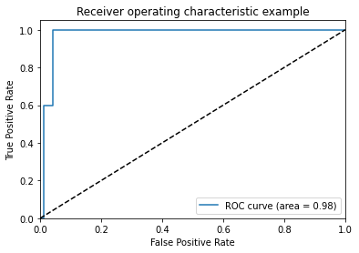


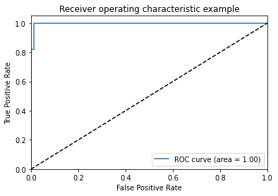


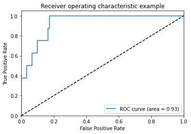


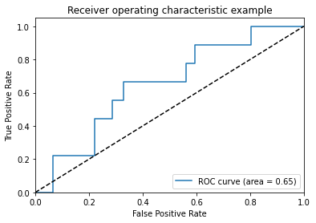


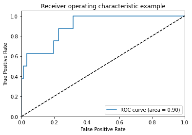


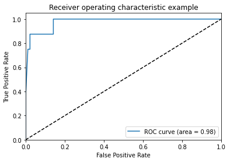


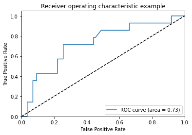


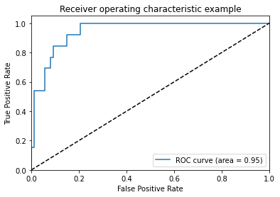


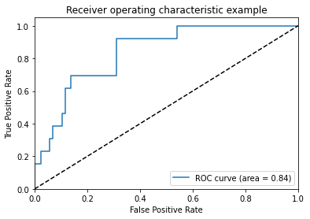


```python

```
