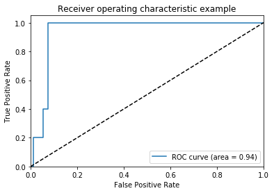
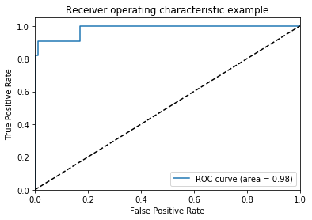
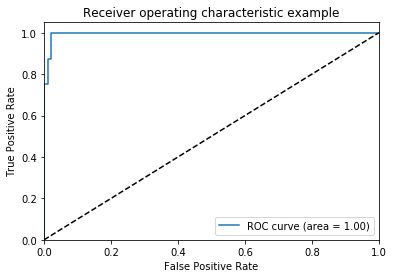
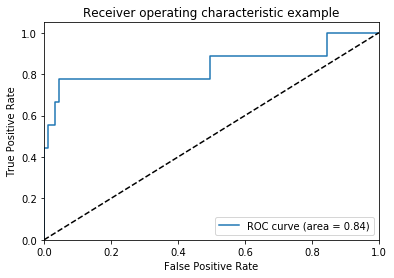
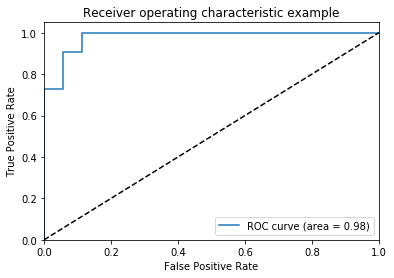
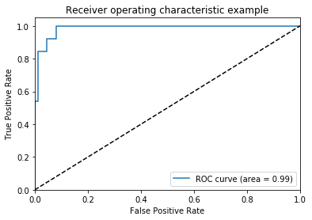

### -*- coding: utf-8 -*-
MusicTaggerCNN model for <font color='red'>Keras</font>.

### Reference:

- [Automatic tagging using deep convolutional neural networks](https://arxiv.org/abs/1606.00298)
- [Music-auto_tagging-keras](https://github.com/keunwoochoi/music-auto_tagging-keras)


```python
from __future__ import print_function
from __future__ import absolute_import

import keras
from keras import backend as K
from keras.layers import Input, Dense
from keras.models import Model
from keras.layers import Dense, Dropout, Flatten
from keras.layers.convolutional import Convolution2D
from keras.layers.convolutional import MaxPooling2D, ZeroPadding2D
from keras.layers.normalization import BatchNormalization
from keras.layers.advanced_activations import ELU
from keras.utils.data_utils import get_file
from keras.layers import Input, Dense
```

    Using Theano backend.
    WARNING (theano.tensor.blas): Using NumPy C-API based implementation for BLAS functions.


```python
TH_WEIGHTS_PATH = 'https://github.com/keunwoochoi/music-auto_tagging-keras/blob/master/data/music_tagger_cnn_weights_theano.h5'
TF_WEIGHTS_PATH = 'https://github.com/keunwoochoi/music-auto_tagging-keras/blob/master/data/music_tagger_cnn_weights_tensorflow.h5'
```

# MusicTaggerCNN

<font size='3pt'>
Instantiate the MusicTaggerCNN architecture,
 optionally loading weights pre-trained
 on Million Song Dataset. Note that when using TensorFlow,
 for best performance you should set
 `image_dim_ordering="tf"` in your Keras config
 at ~/.keras/keras.json.

 The model and the weights are compatible with both
 TensorFlow and Theano. The dimension ordering
 convention used by the model is the one
 specified in your Keras config file.

 For preparing mel-spectrogram input, see
 [audio_conv_utils.py](../music-auto_tagging-keras%20/music-auto_tagging-keras-master/audio_processor.py)
 
 in [applications](https://github.com/fchollet/keras/tree/master/keras/applications).
 You will need to install [Librosa](http://librosa.github.io/librosa/)
 to use it.
</font>

 ## Arguments
 
<font size='3pt'>
    
    weights: one of `None` (random initialization) or "msd" (pre-training on ImageNet).    

    input_tensor: optional Keras tensor (i.e. output of `layers.Input()`) to use as image input for the model.
    
    include_top: whether to include the 1 fully-connected layer (output layer) at the top of the network. If False, the network outputs 256-dim features.
      
</font>
      
 ## Returns
 
 <font size='3pt'>
  A Keras model instance.
    </font>


```python
def MusicTaggerCNN(weights='msd', input_tensor=None,
                   include_top=True):
    '''Instantiate the MusicTaggerCNN architecture,
    optionally loading weights pre-trained
    on Million Song Dataset. Note that when using TensorFlow,
    for best performance you should set
    `image_dim_ordering="tf"` in your Keras config
    at ~/.keras/keras.json.

    The model and the weights are compatible with both
    TensorFlow and Theano. The dimension ordering
    convention used by the model is the one
    specified in your Keras config file.

    For preparing mel-spectrogram input, see
    `audio_conv_utils.py` in [applications](https://github.com/fchollet/keras/tree/master/keras/applications).
    You will need to install [Librosa](http://librosa.github.io/librosa/)
    to use it.

    # Arguments
        weights: one of `None` (random initialization)
            or "msd" (pre-training on ImageNet).
        input_tensor: optional Keras tensor (i.e. output of `layers.Input()`)
            to use as image input for the model.
        include_top: whether to include the 1 fully-connected
            layer (output layer) at the top of the network.
            If False, the network outputs 256-dim features.


    # Returns
        A Keras model instance.
    '''
    if weights not in {'msd', None}:
        raise ValueError('The `weights` argument should be either '
                         '`None` (random initialization) or `msd` '
                         '(pre-training on Million Song Dataset).')

    # Determine proper input shape
    if keras.backend.image_data_format() == 'channels_first':
        input_shape = (1, 96, 1366)
    else:
        input_shape = (96, 1366, 1)

    if input_tensor is None:
        melgram_input = Input(shape=input_shape)
    else:
        if not K.is_keras_tensor(input_tensor):
            melgram_input = Input(tensor=input_tensor, shape=input_shape)
        else:
            melgram_input = input_tensor

    # Determine input axis
    if keras.backend.image_data_format() == 'channels_first':
        channel_axis = 1
        freq_axis = 2
        time_axis = 3
    else:
        channel_axis = 3
        freq_axis = 1
        time_axis = 2

    # Input block
    x = BatchNormalization(axis=freq_axis, name='bn_0_freq')(melgram_input)

    # Conv block 1
    x = Convolution2D(64, 3, 3, border_mode='same', name='conv1')(x)
    x = BatchNormalization(axis=channel_axis, mode=0, name='bn1')(x)
    x = ELU()(x)
    x = MaxPooling2D(pool_size=(2, 4), name='pool1')(x)

    # Conv block 2
    x = Convolution2D(128, 3, 3, border_mode='same', name='conv2')(x)
    x = BatchNormalization(axis=channel_axis, mode=0, name='bn2')(x)
    x = ELU()(x)
    x = MaxPooling2D(pool_size=(2, 4), name='pool2')(x)

    # Conv block 3
    x = Convolution2D(128, 3, 3, border_mode='same', name='conv3')(x)
    x = BatchNormalization(axis=channel_axis, mode=0, name='bn3')(x)
    x = ELU()(x)
    x = MaxPooling2D(pool_size=(2, 4), name='pool3')(x)

    # Conv block 4
    x = Convolution2D(128, 3, 3, border_mode='same', name='conv4')(x)
    x = BatchNormalization(axis=channel_axis, mode=0, name='bn4')(x)
    x = ELU()(x)
    x = MaxPooling2D(pool_size=(3, 5), name='pool4')(x)

    # Conv block 5
    x = Convolution2D(64, 3, 3, border_mode='same', name='conv5')(x)
    x = BatchNormalization(axis=channel_axis, mode=0, name='bn5')(x)
    x = ELU()(x)
    x = MaxPooling2D(pool_size=(4, 4), name='pool5')(x)

    # Output
    x = Flatten()(x)
    if include_top:
        x = Dense(10, activation='sigmoid', name='output')(x)

    # Create model
    model = Model(melgram_input, x)
    if weights is None:
        return model    
    else: 
        # Load input
        if keras.backend.image_data_format() == 'channels_last':
            raise RuntimeError("Please set keras.backend.image_data_format() == 'channels_first'."
                               "You can set it at ~/.keras/keras.json")
        model.load_weights('data/music_tagger_cnn_weights_%s.h5' % K._BACKEND,
                           by_name=True)
        return model

```


```python
from IPython.display import Image
Image(filename='tf_th_keras_v2.png')
```


```python
import keras

if keras.backend.image_data_format() == 'channels_last':
    print("here backend is tensorflow" , keras.backend.image_data_format())
elif keras.backend.image_data_format() == 'channels_first':
    print("here backend is theano" , keras.backend.image_data_format())

#print(K.image_dim_ordering())
```

    here backend is theano channels_first


TRY TO MAKE A MODEL <font color='green'>USER-FRIENDLY</font> IN NEAR FUTURE.


```python
model = MusicTaggerCNN(weights=None)
```

    /home/user/anaconda3/lib/python3.7/site-packages/ipykernel_launcher.py:66: UserWarning: Update your `Conv2D` call to the Keras 2 API: `Conv2D(64, (3, 3), name="conv1", padding="same")`
    /home/user/anaconda3/lib/python3.7/site-packages/ipykernel_launcher.py:67: UserWarning: Update your `BatchNormalization` call to the Keras 2 API: `BatchNormalization(axis=1, name="bn1")`
    /home/user/anaconda3/lib/python3.7/site-packages/ipykernel_launcher.py:72: UserWarning: Update your `Conv2D` call to the Keras 2 API: `Conv2D(128, (3, 3), name="conv2", padding="same")`
    /home/user/anaconda3/lib/python3.7/site-packages/ipykernel_launcher.py:73: UserWarning: Update your `BatchNormalization` call to the Keras 2 API: `BatchNormalization(axis=1, name="bn2")`
    /home/user/anaconda3/lib/python3.7/site-packages/ipykernel_launcher.py:78: UserWarning: Update your `Conv2D` call to the Keras 2 API: `Conv2D(128, (3, 3), name="conv3", padding="same")`
    /home/user/anaconda3/lib/python3.7/site-packages/ipykernel_launcher.py:79: UserWarning: Update your `BatchNormalization` call to the Keras 2 API: `BatchNormalization(axis=1, name="bn3")`
    /home/user/anaconda3/lib/python3.7/site-packages/ipykernel_launcher.py:84: UserWarning: Update your `Conv2D` call to the Keras 2 API: `Conv2D(128, (3, 3), name="conv4", padding="same")`
    /home/user/anaconda3/lib/python3.7/site-packages/ipykernel_launcher.py:85: UserWarning: Update your `BatchNormalization` call to the Keras 2 API: `BatchNormalization(axis=1, name="bn4")`
    /home/user/anaconda3/lib/python3.7/site-packages/ipykernel_launcher.py:90: UserWarning: Update your `Conv2D` call to the Keras 2 API: `Conv2D(64, (3, 3), name="conv5", padding="same")`
    /home/user/anaconda3/lib/python3.7/site-packages/ipykernel_launcher.py:91: UserWarning: Update your `BatchNormalization` call to the Keras 2 API: `BatchNormalization(axis=1, name="bn5")`


```python
model.summary()
```

    _________________________________________________________________
    Layer (type)                 Output Shape              Param #   
    =================================================================
    input_1 (InputLayer)         (None, 1, 96, 1366)       0         
    _________________________________________________________________
    bn_0_freq (BatchNormalizatio (None, 1, 96, 1366)       384       
    _________________________________________________________________
    conv1 (Conv2D)               (None, 64, 96, 1366)      640       
    _________________________________________________________________
    bn1 (BatchNormalization)     (None, 64, 96, 1366)      256       
    _________________________________________________________________
    elu_1 (ELU)                  (None, 64, 96, 1366)      0         
    _________________________________________________________________
    pool1 (MaxPooling2D)         (None, 64, 48, 341)       0         
    _________________________________________________________________
    conv2 (Conv2D)               (None, 128, 48, 341)      73856     
    _________________________________________________________________
    bn2 (BatchNormalization)     (None, 128, 48, 341)      512       
    _________________________________________________________________
    elu_2 (ELU)                  (None, 128, 48, 341)      0         
    _________________________________________________________________
    pool2 (MaxPooling2D)         (None, 128, 24, 85)       0         
    _________________________________________________________________
    conv3 (Conv2D)               (None, 128, 24, 85)       147584    
    _________________________________________________________________
    bn3 (BatchNormalization)     (None, 128, 24, 85)       512       
    _________________________________________________________________
    elu_3 (ELU)                  (None, 128, 24, 85)       0         
    _________________________________________________________________
    pool3 (MaxPooling2D)         (None, 128, 12, 21)       0         
    _________________________________________________________________
    conv4 (Conv2D)               (None, 128, 12, 21)       147584    
    _________________________________________________________________
    bn4 (BatchNormalization)     (None, 128, 12, 21)       512       
    _________________________________________________________________
    elu_4 (ELU)                  (None, 128, 12, 21)       0         
    _________________________________________________________________
    pool4 (MaxPooling2D)         (None, 128, 4, 4)         0         
    _________________________________________________________________
    conv5 (Conv2D)               (None, 64, 4, 4)          73792     
    _________________________________________________________________
    bn5 (BatchNormalization)     (None, 64, 4, 4)          256       
    _________________________________________________________________
    elu_5 (ELU)                  (None, 64, 4, 4)          0         
    _________________________________________________________________
    pool5 (MaxPooling2D)         (None, 64, 1, 1)          0         
    _________________________________________________________________
    flatten_1 (Flatten)          (None, 64)                0         
    _________________________________________________________________
    output (Dense)               (None, 10)                650       
    =================================================================
    Total params: 446,538
    Trainable params: 445,322
    Non-trainable params: 1,216
    _________________________________________________________________


### Compiling the model


```python
#compile model using accuracy to measure model performance
model.compile(optimizer='adam', 
              loss='categorical_crossentropy', 
              metrics=['accuracy'])
```

### Load data


```python
import numpy as np

```


```python
concat_x = np.load('concat_x.npy')
concat_y = np.load('concat_y.npy')
```


```python
print(len(concat_x),'   ',(len(concat_y)) )
```

    1000     1000


```python
train_x = concat_x[0:750]
train_y = concat_y[0:750]
```


```python
valid_x = concat_x[750:900]
valid_y = concat_y[750:900]
```


```python
test_x = concat_x[900:1000]
test_y = concat_y[900:1000]
```

valid_x = concat_x[950:1000]
valid_y = concat_y[950:1000]

### Training the model

#train the model
model.fit(X_train, y_train, validation_data=(X_test, y_test), epochs=1000)


```python
model.fit(train_x, train_y, validation_data=(valid_x, valid_y), epochs=100 )
```

    Train on 750 samples, validate on 150 samples
    Epoch 1/100
    750/750 [==============================] - 995s 1s/step - loss: 2.0471 - acc: 0.2427 - val_loss: 6.2409 - val_acc: 0.0800
    Epoch 2/100
    750/750 [==============================] - 1020s 1s/step - loss: 1.7415 - acc: 0.3920 - val_loss: 3.2841 - val_acc: 0.0800
    Epoch 3/100
    750/750 [==============================] - 1044s 1s/step - loss: 1.4726 - acc: 0.5000 - val_loss: 2.8225 - val_acc: 0.0867
    Epoch 4/100
    750/750 [==============================] - 990s 1s/step - loss: 1.2862 - acc: 0.5747 - val_loss: 2.4492 - val_acc: 0.1133
    Epoch 5/100
    750/750 [==============================] - 1045s 1s/step - loss: 1.1028 - acc: 0.6387 - val_loss: 2.5303 - val_acc: 0.2000
    Epoch 6/100
    750/750 [==============================] - 1057s 1s/step - loss: 0.9437 - acc: 0.6960 - val_loss: 2.2348 - val_acc: 0.1867
    Epoch 7/100
    750/750 [==============================] - 1105s 1s/step - loss: 0.8444 - acc: 0.7320 - val_loss: 2.5405 - val_acc: 0.2133
    Epoch 8/100
    750/750 [==============================] - 1089s 1s/step - loss: 0.7486 - acc: 0.7747 - val_loss: 2.1887 - val_acc: 0.3267
    Epoch 9/100
    750/750 [==============================] - 1018s 1s/step - loss: 0.6255 - acc: 0.8267 - val_loss: 2.3069 - val_acc: 0.3067
    Epoch 10/100
    750/750 [==============================] - 1072s 1s/step - loss: 0.5372 - acc: 0.8587 - val_loss: 2.4036 - val_acc: 0.3133
    Epoch 11/100
    750/750 [==============================] - 1044s 1s/step - loss: 0.4058 - acc: 0.8920 - val_loss: 2.2269 - val_acc: 0.2933
    Epoch 12/100
    750/750 [==============================] - 1088s 1s/step - loss: 0.3480 - acc: 0.9213 - val_loss: 1.9314 - val_acc: 0.4533
    Epoch 13/100
    750/750 [==============================] - 1165s 2s/step - loss: 0.2439 - acc: 0.9653 - val_loss: 1.9448 - val_acc: 0.3533
    Epoch 14/100
    750/750 [==============================] - 1134s 2s/step - loss: 0.1828 - acc: 0.9680 - val_loss: 1.9899 - val_acc: 0.4133
    Epoch 15/100
    750/750 [==============================] - 1116s 1s/step - loss: 0.1580 - acc: 0.9787 - val_loss: 1.7643 - val_acc: 0.4533
    Epoch 16/100
    750/750 [==============================] - 1136s 2s/step - loss: 0.1006 - acc: 0.9947 - val_loss: 1.5306 - val_acc: 0.4533
    Epoch 17/100
    750/750 [==============================] - 1154s 2s/step - loss: 0.0778 - acc: 0.9960 - val_loss: 1.7794 - val_acc: 0.4667
    Epoch 18/100
    750/750 [==============================] - 1116s 1s/step - loss: 0.0781 - acc: 0.9933 - val_loss: 1.7809 - val_acc: 0.4133
    Epoch 19/100
    750/750 [==============================] - 1142s 2s/step - loss: 0.0443 - acc: 0.9973 - val_loss: 1.5796 - val_acc: 0.4600
    Epoch 20/100
    750/750 [==============================] - 1031s 1s/step - loss: 0.0241 - acc: 1.0000 - val_loss: 1.5668 - val_acc: 0.4933
    Epoch 21/100
    750/750 [==============================] - 1007s 1s/step - loss: 0.0205 - acc: 1.0000 - val_loss: 1.3621 - val_acc: 0.5467
    Epoch 22/100
    750/750 [==============================] - 1028s 1s/step - loss: 0.0174 - acc: 0.9987 - val_loss: 1.3006 - val_acc: 0.5667
    Epoch 23/100
    750/750 [==============================] - 1158s 2s/step - loss: 0.0139 - acc: 1.0000 - val_loss: 1.3228 - val_acc: 0.5600
    Epoch 24/100
    750/750 [==============================] - 1181s 2s/step - loss: 0.0117 - acc: 1.0000 - val_loss: 1.1503 - val_acc: 0.6200
    Epoch 25/100
    750/750 [==============================] - 1133s 2s/step - loss: 0.0096 - acc: 1.0000 - val_loss: 1.0276 - val_acc: 0.6467
    Epoch 26/100
    750/750 [==============================] - 1115s 1s/step - loss: 0.0085 - acc: 1.0000 - val_loss: 1.0211 - val_acc: 0.6467
    Epoch 27/100
    750/750 [==============================] - 1171s 2s/step - loss: 0.0078 - acc: 1.0000 - val_loss: 1.0114 - val_acc: 0.6400
    Epoch 28/100
    750/750 [==============================] - 1173s 2s/step - loss: 0.0111 - acc: 1.0000 - val_loss: 0.8836 - val_acc: 0.6867
    Epoch 29/100
    750/750 [==============================] - 1305s 2s/step - loss: 0.0062 - acc: 1.0000 - val_loss: 0.9179 - val_acc: 0.6733
    Epoch 30/100
    750/750 [==============================] - 1123s 1s/step - loss: 0.0054 - acc: 1.0000 - val_loss: 0.9072 - val_acc: 0.6667
    Epoch 31/100
    750/750 [==============================] - 1167s 2s/step - loss: 0.0054 - acc: 1.0000 - val_loss: 0.9316 - val_acc: 0.6667
    Epoch 32/100
    750/750 [==============================] - 1190s 2s/step - loss: 0.0054 - acc: 1.0000 - val_loss: 0.8281 - val_acc: 0.6933
    Epoch 33/100
    750/750 [==============================] - 1103s 1s/step - loss: 0.0042 - acc: 1.0000 - val_loss: 0.8396 - val_acc: 0.7133
    Epoch 34/100
    750/750 [==============================] - 1225s 2s/step - loss: 0.0038 - acc: 1.0000 - val_loss: 0.8034 - val_acc: 0.7133
    Epoch 35/100
    750/750 [==============================] - 1224s 2s/step - loss: 0.0037 - acc: 1.0000 - val_loss: 0.8712 - val_acc: 0.6800
    Epoch 36/100
    750/750 [==============================] - 1115s 1s/step - loss: 0.0039 - acc: 1.0000 - val_loss: 0.7929 - val_acc: 0.6933
    Epoch 37/100
    750/750 [==============================] - 1077s 1s/step - loss: 0.0041 - acc: 1.0000 - val_loss: 0.8960 - val_acc: 0.6867
    Epoch 38/100
    750/750 [==============================] - 1012s 1s/step - loss: 0.0065 - acc: 1.0000 - val_loss: 0.7926 - val_acc: 0.7267
    Epoch 39/100
    750/750 [==============================] - 1049s 1s/step - loss: 0.0041 - acc: 1.0000 - val_loss: 0.8295 - val_acc: 0.7267
    Epoch 40/100
    750/750 [==============================] - 1062s 1s/step - loss: 0.0041 - acc: 1.0000 - val_loss: 0.8670 - val_acc: 0.7000
    Epoch 41/100
    750/750 [==============================] - 1171s 2s/step - loss: 0.0040 - acc: 1.0000 - val_loss: 0.7017 - val_acc: 0.7800
    Epoch 42/100
    750/750 [==============================] - 1102s 1s/step - loss: 0.0028 - acc: 1.0000 - val_loss: 0.7293 - val_acc: 0.7667
    Epoch 43/100
    750/750 [==============================] - 1053s 1s/step - loss: 0.0026 - acc: 1.0000 - val_loss: 0.7755 - val_acc: 0.7533
    Epoch 44/100
    750/750 [==============================] - 1015s 1s/step - loss: 0.0024 - acc: 1.0000 - val_loss: 0.7260 - val_acc: 0.7667
    Epoch 45/100
    750/750 [==============================] - 1061s 1s/step - loss: 0.0020 - acc: 1.0000 - val_loss: 0.7028 - val_acc: 0.7667
    Epoch 46/100
    750/750 [==============================] - 1033s 1s/step - loss: 0.0019 - acc: 1.0000 - val_loss: 0.7842 - val_acc: 0.7267
    Epoch 47/100
    750/750 [==============================] - 1095s 1s/step - loss: 0.0019 - acc: 1.0000 - val_loss: 0.7503 - val_acc: 0.7533
    Epoch 48/100
    750/750 [==============================] - 1056s 1s/step - loss: 0.0022 - acc: 1.0000 - val_loss: 0.7062 - val_acc: 0.7667
    Epoch 49/100
    750/750 [==============================] - 1058s 1s/step - loss: 0.0020 - acc: 1.0000 - val_loss: 0.7846 - val_acc: 0.7400
    Epoch 50/100
    750/750 [==============================] - 1007s 1s/step - loss: 0.0020 - acc: 1.0000 - val_loss: 0.7187 - val_acc: 0.7867
    Epoch 51/100
    750/750 [==============================] - 1062s 1s/step - loss: 0.0022 - acc: 1.0000 - val_loss: 0.7744 - val_acc: 0.7800
    Epoch 52/100
    750/750 [==============================] - 1112s 1s/step - loss: 0.0020 - acc: 1.0000 - val_loss: 0.8249 - val_acc: 0.7333
    Epoch 53/100
    750/750 [==============================] - 1046s 1s/step - loss: 0.0019 - acc: 1.0000 - val_loss: 0.7320 - val_acc: 0.7867
    Epoch 54/100
    750/750 [==============================] - 1041s 1s/step - loss: 0.0016 - acc: 1.0000 - val_loss: 0.7766 - val_acc: 0.7800
    Epoch 55/100
    750/750 [==============================] - 1038s 1s/step - loss: 0.0016 - acc: 1.0000 - val_loss: 0.7798 - val_acc: 0.7733
    Epoch 56/100
    750/750 [==============================] - 1027s 1s/step - loss: 0.0015 - acc: 1.0000 - val_loss: 0.7657 - val_acc: 0.7533
    Epoch 57/100
    750/750 [==============================] - 1013s 1s/step - loss: 0.0013 - acc: 1.0000 - val_loss: 0.7433 - val_acc: 0.7667
    Epoch 58/100
    750/750 [==============================] - 1019s 1s/step - loss: 0.0013 - acc: 1.0000 - val_loss: 0.7474 - val_acc: 0.7333
    Epoch 59/100
    750/750 [==============================] - 1028s 1s/step - loss: 0.0013 - acc: 1.0000 - val_loss: 0.7816 - val_acc: 0.7533
    Epoch 60/100
    750/750 [==============================] - 1056s 1s/step - loss: 0.0011 - acc: 1.0000 - val_loss: 0.7542 - val_acc: 0.7600
    Epoch 61/100
    750/750 [==============================] - 1012s 1s/step - loss: 0.0012 - acc: 1.0000 - val_loss: 0.7395 - val_acc: 0.7667
    Epoch 62/100
    750/750 [==============================] - 1040s 1s/step - loss: 0.0011 - acc: 1.0000 - val_loss: 0.7408 - val_acc: 0.7733
    Epoch 63/100
    750/750 [==============================] - 1069s 1s/step - loss: 0.0011 - acc: 1.0000 - val_loss: 0.7411 - val_acc: 0.7667
    Epoch 64/100
    750/750 [==============================] - 1042s 1s/step - loss: 0.0011 - acc: 1.0000 - val_loss: 0.7441 - val_acc: 0.7600
    Epoch 65/100
    750/750 [==============================] - 1017s 1s/step - loss: 0.0010 - acc: 1.0000 - val_loss: 0.7351 - val_acc: 0.7733
    Epoch 66/100
    750/750 [==============================] - 1046s 1s/step - loss: 9.9118e-04 - acc: 1.0000 - val_loss: 0.7346 - val_acc: 0.7800
    Epoch 67/100
    750/750 [==============================] - 1038s 1s/step - loss: 8.5166e-04 - acc: 1.0000 - val_loss: 0.7378 - val_acc: 0.7733
    Epoch 68/100
    750/750 [==============================] - 1037s 1s/step - loss: 8.0703e-04 - acc: 1.0000 - val_loss: 0.7234 - val_acc: 0.7867
    Epoch 69/100
    750/750 [==============================] - 1042s 1s/step - loss: 0.0011 - acc: 1.0000 - val_loss: 0.8528 - val_acc: 0.7400
    Epoch 70/100
    750/750 [==============================] - 1058s 1s/step - loss: 8.0135e-04 - acc: 1.0000 - val_loss: 0.7686 - val_acc: 0.7800
    Epoch 71/100
    750/750 [==============================] - 1011s 1s/step - loss: 8.1558e-04 - acc: 1.0000 - val_loss: 0.7387 - val_acc: 0.7733
    Epoch 72/100
    750/750 [==============================] - 1016s 1s/step - loss: 9.2960e-04 - acc: 1.0000 - val_loss: 0.7221 - val_acc: 0.7867
    Epoch 73/100
    750/750 [==============================] - 1056s 1s/step - loss: 8.0057e-04 - acc: 1.0000 - val_loss: 0.7374 - val_acc: 0.7933
    Epoch 74/100
    750/750 [==============================] - 1062s 1s/step - loss: 8.0585e-04 - acc: 1.0000 - val_loss: 0.7540 - val_acc: 0.7867
    Epoch 75/100
    750/750 [==============================] - 1030s 1s/step - loss: 7.3209e-04 - acc: 1.0000 - val_loss: 0.7561 - val_acc: 0.7867
    Epoch 76/100
    750/750 [==============================] - 1026s 1s/step - loss: 7.9285e-04 - acc: 1.0000 - val_loss: 0.8021 - val_acc: 0.7867
    Epoch 77/100
    750/750 [==============================] - 1028s 1s/step - loss: 8.0388e-04 - acc: 1.0000 - val_loss: 0.7535 - val_acc: 0.7733
    Epoch 78/100
    750/750 [==============================] - 1023s 1s/step - loss: 7.6867e-04 - acc: 1.0000 - val_loss: 0.7372 - val_acc: 0.7933
    Epoch 79/100
    750/750 [==============================] - 1035s 1s/step - loss: 7.2637e-04 - acc: 1.0000 - val_loss: 0.7762 - val_acc: 0.7733
    Epoch 80/100
    750/750 [==============================] - 1019s 1s/step - loss: 6.3166e-04 - acc: 1.0000 - val_loss: 0.7326 - val_acc: 0.7867
    Epoch 81/100
    750/750 [==============================] - 1166s 2s/step - loss: 6.6593e-04 - acc: 1.0000 - val_loss: 0.7260 - val_acc: 0.7867
    Epoch 82/100
    750/750 [==============================] - 1117s 1s/step - loss: 6.3499e-04 - acc: 1.0000 - val_loss: 0.7486 - val_acc: 0.7800
    Epoch 83/100
    750/750 [==============================] - 1083s 1s/step - loss: 6.5999e-04 - acc: 1.0000 - val_loss: 0.7314 - val_acc: 0.7733
    Epoch 84/100
    750/750 [==============================] - 1043s 1s/step - loss: 6.0356e-04 - acc: 1.0000 - val_loss: 0.7617 - val_acc: 0.7800
    Epoch 85/100
    750/750 [==============================] - 1028s 1s/step - loss: 5.1578e-04 - acc: 1.0000 - val_loss: 0.7467 - val_acc: 0.7600
    Epoch 86/100
    750/750 [==============================] - 1021s 1s/step - loss: 5.5853e-04 - acc: 1.0000 - val_loss: 0.7264 - val_acc: 0.7867
    Epoch 87/100
    750/750 [==============================] - 1043s 1s/step - loss: 4.6947e-04 - acc: 1.0000 - val_loss: 0.7528 - val_acc: 0.7667
    Epoch 88/100
    750/750 [==============================] - 1068s 1s/step - loss: 4.7724e-04 - acc: 1.0000 - val_loss: 0.7560 - val_acc: 0.7800
    Epoch 89/100
    750/750 [==============================] - 1044s 1s/step - loss: 5.3796e-04 - acc: 1.0000 - val_loss: 0.7683 - val_acc: 0.8000
    Epoch 90/100
    750/750 [==============================] - 1202s 2s/step - loss: 5.0489e-04 - acc: 1.0000 - val_loss: 0.7471 - val_acc: 0.7733
    Epoch 91/100
    750/750 [==============================] - 1198s 2s/step - loss: 5.4511e-04 - acc: 1.0000 - val_loss: 0.7501 - val_acc: 0.7867
    Epoch 92/100
    750/750 [==============================] - 1062s 1s/step - loss: 5.9133e-04 - acc: 1.0000 - val_loss: 0.7080 - val_acc: 0.7733
    Epoch 93/100
    750/750 [==============================] - 1037s 1s/step - loss: 4.9024e-04 - acc: 1.0000 - val_loss: 0.7193 - val_acc: 0.7667
    Epoch 94/100
    750/750 [==============================] - 1030s 1s/step - loss: 4.5733e-04 - acc: 1.0000 - val_loss: 0.7206 - val_acc: 0.7867
    Epoch 95/100
    750/750 [==============================] - 1026s 1s/step - loss: 6.5086e-04 - acc: 1.0000 - val_loss: 0.8256 - val_acc: 0.7667
    Epoch 96/100
    750/750 [==============================] - 1069s 1s/step - loss: 9.4112e-04 - acc: 1.0000 - val_loss: 0.8422 - val_acc: 0.7333
    Epoch 97/100
    750/750 [==============================] - 1044s 1s/step - loss: 6.0732e-04 - acc: 1.0000 - val_loss: 0.8376 - val_acc: 0.7667
    Epoch 98/100
    750/750 [==============================] - 1070s 1s/step - loss: 4.4185e-04 - acc: 1.0000 - val_loss: 0.7723 - val_acc: 0.7733
    Epoch 99/100
    750/750 [==============================] - 1084s 1s/step - loss: 5.1442e-04 - acc: 1.0000 - val_loss: 0.7594 - val_acc: 0.7667
    Epoch 100/100
    750/750 [==============================] - 1017s 1s/step - loss: 5.5490e-04 - acc: 1.0000 - val_loss: 0.8221 - val_acc: 0.7400


    <keras.callbacks.History at 0x7ff000529c90>


```python
from keras.models import load_model

model.save('k2c2ep100.h5')  # creates a HDF5 file 'my_model.h5'
del model  # deletes the existing model

# returns a compiled model
# identical to the previous one
model = load_model('k2c2ep100.h5')
```

# Predicting


```python
model = load_model('k2c2ep100.h5')
```


```python
output = model.predict(test_x)
```


```python
output_class = output.argmax(axis=-1)
```


```python
print(output[0])
```

    [5.4896442e-05 1.6811337e-06 1.7211700e-05 1.3431419e-03 2.2334250e-05
     2.0515396e-05 2.5222739e-04 9.3890385e-06 3.1599554e-06 1.6197326e-05]


```python
print(test_y[0])
```

    [0 0 0 0 0 0 0 0 0 1]


```python
print(10000*output[0])
sum = 0
for i in output[0]:
    sum += i
print(sum)
```

    [ 0.54896444  0.01681134  0.172117   13.431419    0.22334251  0.20515396
      2.5222738   0.09389038  0.03159956  0.16197325]
    0.0017407545190053497


```python
test_y_class = test_y.argmax(axis=-1)
```


```python
print(output_class)
```

    [3 5 4 7 7 9 9 1 2 7 7 5 1 9 4 8 8 9 6 7 1 9 6 1 8 9 6 8 2 8 1 7 7 7 4 4 7
     5 4 1 2 9 8 5 1 5 9 3 5 1 5 9 7 5 8 9 9 7 8 6 9 1 0 4 8 9 2 8 2 6 6 0 3 3
     8 8 4 3 2 5 4 6 7 9 1 5 7 8 1 3 2 8 7 9 9 9 9 9 7 7]


```python
print(test_y_class)
```

    [9 0 4 3 7 9 9 1 2 4 7 9 1 9 4 8 0 3 3 7 1 9 6 1 8 6 6 8 2 8 1 7 4 7 4 4 7
     5 4 1 2 6 8 5 1 5 3 3 5 1 5 9 7 5 8 9 7 4 8 6 9 1 1 4 8 7 2 8 9 6 6 0 3 3
     8 8 4 3 2 5 4 6 7 3 1 5 7 8 7 0 2 8 7 2 9 9 9 0 7 2]


```python
print(test_y[-1])
```

    [0 0 1 0 0 0 0 0 0 0]


```python
from sklearn import preprocessing
output_class_bin = preprocessing.label_binarize(output_class, classes=[0, 1, 2, 3,4,5,6,7,8,9])
```


```python
print(output_class_bin)
```

    [[0 0 0 1 0 0 0 0 0 0]
     [0 0 0 0 0 1 0 0 0 0]
     [0 0 0 0 1 0 0 0 0 0]
     [0 0 0 0 0 0 0 1 0 0]
     [0 0 0 0 0 0 0 1 0 0]
     [0 0 0 0 0 0 0 0 0 1]
     [0 0 0 0 0 0 0 0 0 1]
     [0 1 0 0 0 0 0 0 0 0]
     [0 0 1 0 0 0 0 0 0 0]
     [0 0 0 0 0 0 0 1 0 0]
     [0 0 0 0 0 0 0 1 0 0]
     [0 0 0 0 0 1 0 0 0 0]
     [0 1 0 0 0 0 0 0 0 0]
     [0 0 0 0 0 0 0 0 0 1]
     [0 0 0 0 1 0 0 0 0 0]
     [0 0 0 0 0 0 0 0 1 0]
     [0 0 0 0 0 0 0 0 1 0]
     [0 0 0 0 0 0 0 0 0 1]
     [0 0 0 0 0 0 1 0 0 0]
     [0 0 0 0 0 0 0 1 0 0]
     [0 1 0 0 0 0 0 0 0 0]
     [0 0 0 0 0 0 0 0 0 1]
     [0 0 0 0 0 0 1 0 0 0]
     [0 1 0 0 0 0 0 0 0 0]
     [0 0 0 0 0 0 0 0 1 0]
     [0 0 0 0 0 0 0 0 0 1]
     [0 0 0 0 0 0 1 0 0 0]
     [0 0 0 0 0 0 0 0 1 0]
     [0 0 1 0 0 0 0 0 0 0]
     [0 0 0 0 0 0 0 0 1 0]
     [0 1 0 0 0 0 0 0 0 0]
     [0 0 0 0 0 0 0 1 0 0]
     [0 0 0 0 0 0 0 1 0 0]
     [0 0 0 0 0 0 0 1 0 0]
     [0 0 0 0 1 0 0 0 0 0]
     [0 0 0 0 1 0 0 0 0 0]
     [0 0 0 0 0 0 0 1 0 0]
     [0 0 0 0 0 1 0 0 0 0]
     [0 0 0 0 1 0 0 0 0 0]
     [0 1 0 0 0 0 0 0 0 0]
     [0 0 1 0 0 0 0 0 0 0]
     [0 0 0 0 0 0 0 0 0 1]
     [0 0 0 0 0 0 0 0 1 0]
     [0 0 0 0 0 1 0 0 0 0]
     [0 1 0 0 0 0 0 0 0 0]
     [0 0 0 0 0 1 0 0 0 0]
     [0 0 0 0 0 0 0 0 0 1]
     [0 0 0 1 0 0 0 0 0 0]
     [0 0 0 0 0 1 0 0 0 0]
     [0 1 0 0 0 0 0 0 0 0]
     [0 0 0 0 0 1 0 0 0 0]
     [0 0 0 0 0 0 0 0 0 1]
     [0 0 0 0 0 0 0 1 0 0]
     [0 0 0 0 0 1 0 0 0 0]
     [0 0 0 0 0 0 0 0 1 0]
     [0 0 0 0 0 0 0 0 0 1]
     [0 0 0 0 0 0 0 0 0 1]
     [0 0 0 0 0 0 0 1 0 0]
     [0 0 0 0 0 0 0 0 1 0]
     [0 0 0 0 0 0 1 0 0 0]
     [0 0 0 0 0 0 0 0 0 1]
     [0 1 0 0 0 0 0 0 0 0]
     [1 0 0 0 0 0 0 0 0 0]
     [0 0 0 0 1 0 0 0 0 0]
     [0 0 0 0 0 0 0 0 1 0]
     [0 0 0 0 0 0 0 0 0 1]
     [0 0 1 0 0 0 0 0 0 0]
     [0 0 0 0 0 0 0 0 1 0]
     [0 0 1 0 0 0 0 0 0 0]
     [0 0 0 0 0 0 1 0 0 0]
     [0 0 0 0 0 0 1 0 0 0]
     [1 0 0 0 0 0 0 0 0 0]
     [0 0 0 1 0 0 0 0 0 0]
     [0 0 0 1 0 0 0 0 0 0]
     [0 0 0 0 0 0 0 0 1 0]
     [0 0 0 0 0 0 0 0 1 0]
     [0 0 0 0 1 0 0 0 0 0]
     [0 0 0 1 0 0 0 0 0 0]
     [0 0 1 0 0 0 0 0 0 0]
     [0 0 0 0 0 1 0 0 0 0]
     [0 0 0 0 1 0 0 0 0 0]
     [0 0 0 0 0 0 1 0 0 0]
     [0 0 0 0 0 0 0 1 0 0]
     [0 0 0 0 0 0 0 0 0 1]
     [0 1 0 0 0 0 0 0 0 0]
     [0 0 0 0 0 1 0 0 0 0]
     [0 0 0 0 0 0 0 1 0 0]
     [0 0 0 0 0 0 0 0 1 0]
     [0 1 0 0 0 0 0 0 0 0]
     [0 0 0 1 0 0 0 0 0 0]
     [0 0 1 0 0 0 0 0 0 0]
     [0 0 0 0 0 0 0 0 1 0]
     [0 0 0 0 0 0 0 1 0 0]
     [0 0 0 0 0 0 0 0 0 1]
     [0 0 0 0 0 0 0 0 0 1]
     [0 0 0 0 0 0 0 0 0 1]
     [0 0 0 0 0 0 0 0 0 1]
     [0 0 0 0 0 0 0 0 0 1]
     [0 0 0 0 0 0 0 1 0 0]
     [0 0 0 0 0 0 0 1 0 0]]


# auc-roc


```python
model = load_model('k2c2ep100.h5')
```

# Computing AUROC and ROC curve values


```python
from sklearn.metrics import roc_curve, roc_auc_score
```

### **Calculate AUROC**
**ROC** is the receiver operating characteristic
**AUROC** is the area under the ROC curve


```python
k2c2_auc = roc_auc_score(test_y, output)
```


```python
k2c2_auc_bin = roc_auc_score(test_y, output_class_bin)
```

### Print AUROC scores


```python
print('K2C2: AUROC = %.3f' % (k2c2_auc))
```

    K2C2: AUROC = 0.948


```python
print('K2C2: AUROC = %.3f' % (k2c2_auc_bin))
```

    K2C2: AUROC = 0.854


### Calculate ROC curve


```python
print(test_y.shape)
```

    (100, 10)


```python
print(output.shape)
```

    (100, 10)


```python
print(output_class.shape)
```

    (100,)


```python
print( len(np.squeeze(output)))
```

    100


```python
k2c2_fpr, k2c2_tpr, _ = roc_curve(test_y[0], output[0])
```


```python
print(k2c2_fpr,k2c2_tpr)
```

    [0.         0.11111111 0.66666667 0.66666667 1.        ] [0. 0. 0. 1. 1.]


```python
k2c2_fpr = []
k2c2_tpr = []
for i in range(10):
    i_fpr, i_tpr, _ = roc_curve(test_y[:, i], output[:, i])
    k2c2_fpr.append(i_fpr)
    k2c2_tpr.append(i_tpr)
```


```python
from sklearn.metrics import roc_curve, auc
```


```python
n_classes = 10
# Compute ROC curve and ROC area for each class
fpr = dict()
tpr = dict()
roc_auc = dict()
for i in range(n_classes):
    fpr[i], tpr[i], _ = roc_curve(test_y[:, i], output[:, i])
    roc_auc[i] = auc(fpr[i], tpr[i])
```

### Plot the ROC curve


```python
import matplotlib.pyplot as plt
```
plt.plot(np.array(k2c2_fpr), np.array(k2c2_tpr), marker='.', label='K2C2 (AUROC = %0.3f)' % k2c2_auc)

# Title
plt.title('ROC Plot')
# Axis labels
plt.xlabel('False Positive Rate')
plt.ylabel('True Positive Rate')
# Show legend
plt.legend() # 
# Show plot
plt.show()

```python
# Plot of a ROC curve for a specific class
for i in range(n_classes):
    plt.figure()
    plt.plot(fpr[i], tpr[i], label='ROC curve (area = %0.2f)' % roc_auc[i])
    plt.plot([0, 1], [0, 1], 'k--')
    plt.xlim([0.0, 1.0])
    plt.ylim([0.0, 1.05])
    plt.xlabel('False Positive Rate')
    plt.ylabel('True Positive Rate')
    plt.title('Receiver operating characteristic example')
    plt.legend(loc="lower right")
    plt.show()
```




















```python
print(np.squeeze(output))
```

    [[5.48964417e-05 1.68113365e-06 1.72116997e-05 1.34314189e-03
      2.23342504e-05 2.05153956e-05 2.52227386e-04 9.38903850e-06
      3.15995544e-06 1.61973257e-05]
     [7.69250852e-04 7.38138624e-06 2.55624735e-04 2.55907333e-04
      2.98228588e-06 4.63468488e-03 1.01356383e-03 4.50636580e-04
      1.96868714e-05 7.04912309e-05]
     [1.28380793e-06 2.02499137e-07 5.31590629e-08 8.45848917e-05
      3.61633953e-03 7.46679279e-06 1.64985540e-05 4.74959097e-06
      8.98011331e-06 6.10964253e-06]
     [2.95792288e-05 1.97933095e-05 5.12868496e-07 1.25022489e-03
      6.10138872e-04 1.80671323e-05 3.12118791e-04 4.41520382e-03
      1.33006164e-04 6.32390220e-05]
     [1.33879291e-06 2.86761292e-06 5.22390224e-07 2.29400157e-05
      4.38355215e-07 1.09082212e-04 1.26939465e-03 8.73453543e-03
      2.32919065e-05 3.54499859e-03]
     [4.76526038e-05 5.43716829e-04 6.88589702e-04 1.48053747e-04
      3.73339077e-07 3.71259579e-04 9.97489133e-06 7.32176704e-04
      8.15894327e-06 9.41342907e-04]
     [1.55942063e-04 1.27772699e-04 7.16532741e-05 2.79427186e-04
      4.03438719e-07 1.99206588e-05 1.71102590e-06 5.40965266e-06
      5.63827525e-05 2.04028841e-03]
     [1.81960895e-05 9.08043325e-01 2.14677020e-05 2.71208523e-06
      7.01133800e-08 3.52166244e-04 1.72675129e-06 2.03726563e-06
      8.42383633e-06 2.47734370e-05]
     [1.36291515e-03 1.66565385e-07 1.10635795e-02 4.68483350e-08
      7.23699287e-08 1.42932440e-05 2.62239632e-06 2.15809536e-07
      4.06345061e-05 6.53955445e-04]
     [1.20445629e-05 2.42019752e-07 9.94745506e-07 1.59590360e-04
      3.74670752e-04 1.33833455e-05 6.66406297e-04 2.41717510e-03
      8.22419850e-07 1.62917149e-06]
     [3.41026725e-06 7.13254281e-07 2.67788749e-07 2.87725910e-04
      1.22053916e-05 2.81702287e-05 3.17507001e-05 1.03341583e-02
      8.39223794e-05 2.38904977e-04]
     [8.29796263e-05 3.22994379e-06 5.88916824e-04 8.67295330e-06
      2.84890112e-09 5.96967991e-04 3.11580493e-06 2.26519951e-05
      3.01963664e-05 2.03258111e-04]
     [1.73281896e-05 6.10874116e-01 1.06071884e-05 1.68609331e-04
      8.54829268e-05 1.38085976e-04 4.07031948e-05 3.25772307e-05
      7.18775336e-05 1.09432163e-04]
     [2.14948050e-05 3.94751623e-06 1.17761097e-04 3.33902317e-05
      5.03282607e-08 1.91468043e-05 7.60975454e-05 1.03758239e-05
      1.43719740e-06 1.88098417e-03]
     [2.74114586e-06 2.72106195e-06 1.41995383e-06 6.63775863e-05
      2.07257852e-01 3.70615726e-06 1.83079064e-05 7.17567964e-05
      1.22820474e-02 2.06968725e-05]
     [1.72743676e-05 2.63629045e-06 1.00410614e-06 6.66046471e-05
      1.21548865e-05 3.48667585e-04 3.60073273e-07 6.75138435e-05
      2.24142428e-02 3.53312425e-05]
     [1.26676832e-03 4.01443140e-05 1.61550575e-04 4.22860830e-06
      3.25755245e-04 1.26006184e-04 3.46888592e-05 1.66411410e-04
      1.57691608e-03 4.15038317e-04]
     [1.60983152e-04 6.70275767e-06 9.50193906e-04 5.75809827e-06
      3.46243519e-06 9.30594888e-06 4.90980456e-05 1.65354824e-04
      3.45893000e-06 1.11586470e-02]
     [7.72753207e-04 4.49252752e-07 3.84794366e-05 5.71027449e-05
      6.17171736e-06 4.24035788e-05 3.82365705e-03 1.48928200e-04
      1.34992233e-05 7.35823472e-04]
     [1.34618676e-06 4.34728008e-06 6.93954689e-08 5.84571622e-04
      2.76881547e-05 2.97511160e-05 7.05086277e-04 5.44312783e-02
      6.33426339e-07 1.15627963e-05]
     [2.05153956e-05 9.37020421e-01 1.89598504e-05 5.19355199e-05
      3.09392999e-05 1.50236563e-04 2.25835120e-05 1.82796957e-05
      3.68287438e-05 7.08126890e-06]
     [1.88016529e-05 1.11940280e-04 3.45768349e-04 7.01646204e-05
      2.11322799e-07 1.38047303e-03 7.57532951e-04 1.01765466e-03
      7.10163513e-05 5.51242568e-03]
     [4.21487821e-05 1.01683381e-05 6.57793771e-06 7.42948077e-06
      4.73348882e-06 7.41163749e-05 6.90756083e-01 1.08983586e-05
      2.05174069e-06 8.04432275e-05]
     [5.58496640e-06 1.47571877e-01 3.05124704e-05 4.07378320e-05
      6.18396783e-08 7.35361595e-03 3.70621024e-07 5.88841601e-07
      2.70767905e-05 6.14258810e-04]
     [1.36737828e-04 1.47952975e-04 1.92475491e-05 1.05350176e-04
      9.16808531e-08 2.16667308e-03 3.49785012e-07 1.17856962e-06
      5.00682695e-03 1.66158992e-04]
     [4.03553058e-05 2.53886719e-06 8.43611178e-06 3.60049715e-04
      4.27952273e-06 4.03177255e-05 8.90923315e-04 5.00696478e-06
      3.80665847e-06 9.65782627e-03]
     [3.66403128e-06 1.77115578e-06 1.72589553e-05 8.17099681e-06
      6.97137182e-07 2.05760389e-05 1.74110904e-01 4.22835656e-05
      3.81352265e-07 7.04767241e-04]
     [2.57605598e-06 5.82139637e-06 1.61226581e-05 1.25791543e-04
      3.62800602e-05 7.25622931e-06 1.35052017e-06 6.10816983e-07
      4.07114387e-01 1.40999196e-04]
     [2.18248484e-03 1.40049660e-05 1.88767947e-02 8.67082490e-05
      7.88676402e-07 2.47834947e-07 3.36564080e-05 1.81332166e-06
      1.06147607e-04 5.43549191e-03]
     [2.53874514e-05 5.04533000e-06 3.25693458e-04 8.70819349e-06
      2.89955409e-07 9.29229100e-06 5.21399279e-08 5.18776824e-06
      5.92587690e-04 3.61699176e-06]
     [3.66894936e-04 4.52801794e-01 1.98754769e-05 1.34919910e-05
      1.75323785e-05 5.44410104e-05 8.22676975e-06 1.98794387e-05
      1.42188816e-04 1.26487157e-06]
     [4.47986486e-06 4.96977082e-05 6.13698376e-06 1.47307610e-05
      3.69340910e-06 2.47822459e-06 2.78073003e-06 1.36811256e-01
      6.17639216e-06 3.54156189e-04]
     [2.63474226e-06 5.71909413e-06 4.23325844e-07 1.67663282e-04
      6.98241420e-05 1.44666387e-06 4.31769649e-06 1.31939340e-03
      2.58511922e-04 8.17880846e-06]
     [3.27938778e-06 1.26231919e-06 6.59591421e-07 8.45684495e-04
      1.95506664e-06 5.05690441e-05 4.82873111e-05 1.27229961e-02
      3.61079799e-07 3.77775490e-04]
     [1.32669186e-06 3.14216254e-06 4.56969474e-06 2.44277762e-04
      6.80277646e-02 1.26953209e-05 1.55392427e-05 1.03448448e-03
      4.70504980e-04 8.29037526e-06]
     [7.56582585e-06 1.42627296e-05 7.32125159e-07 7.46134101e-05
      1.52284000e-02 7.65168522e-07 2.95673253e-05 1.05771134e-04
      1.56731097e-04 2.96927301e-05]
     [1.32459963e-05 4.29396205e-05 8.27565316e-07 2.04875180e-03
      2.13965468e-04 2.94628444e-05 6.95648851e-05 2.13596108e-03
      2.90123025e-05 1.00926254e-05]
     [3.22594201e-06 3.61689687e-04 4.72854372e-05 1.18942917e-04
      3.00416986e-07 1.58843532e-01 1.58519018e-04 1.07183514e-05
      2.20943784e-05 5.75718295e-04]
     [1.65968549e-06 7.97817120e-06 1.85976134e-07 5.36992957e-05
      2.79534608e-01 9.28253201e-07 3.28922283e-06 2.25533295e-04
      6.10650823e-05 3.82045146e-05]
     [2.50536923e-05 3.75895873e-02 1.03688864e-04 3.24332272e-04
      6.68714665e-06 5.80847438e-04 1.42863764e-05 5.85873931e-06
      1.23379978e-05 1.33863738e-04]
     [6.66365959e-05 1.46575039e-04 6.70191720e-02 7.92174160e-06
      4.13030023e-07 2.88418505e-05 3.16888727e-05 6.17059527e-07
      9.52284245e-06 1.39495940e-04]
     [6.74338662e-05 9.54503685e-06 1.64638361e-04 3.20216059e-05
      5.48664502e-07 4.79464143e-06 2.97483581e-04 7.47358281e-05
      3.22187134e-06 7.08347838e-03]
     [5.50486257e-05 1.63494133e-05 1.71042302e-05 7.87490717e-05
      3.22307596e-06 1.27786971e-05 1.87675866e-07 1.45479180e-05
      1.93460081e-02 5.23968425e-04]
     [3.98175644e-06 4.86616394e-04 5.24131610e-06 1.53143319e-05
      1.85424422e-08 2.21911594e-01 1.63346067e-05 1.94310924e-05
      2.63266003e-07 1.28163137e-07]
     [8.97377846e-04 1.21907955e-02 1.06050447e-05 2.16606604e-05
      1.99305902e-07 3.38810985e-03 3.45056719e-07 1.63880782e-06
      4.16009499e-07 3.36887501e-06]
     [3.42872518e-04 2.98798077e-05 1.90869869e-05 9.02250467e-05
      1.09792347e-06 4.60759178e-02 7.09152489e-04 2.78273888e-04
      2.16686349e-05 7.60859519e-04]
     [2.56932199e-05 3.38375094e-06 2.66080715e-05 2.56370916e-03
      1.22799042e-06 2.08895403e-06 3.30780131e-06 2.31172293e-04
      9.37250661e-06 1.54322432e-02]
     [6.72148735e-06 1.31741999e-05 1.96511392e-05 1.00389399e-01
      7.29108137e-07 2.82536312e-05 2.00073160e-07 2.01537288e-04
      1.39385264e-03 3.66566848e-04]
     [2.00600152e-05 1.36626068e-05 1.05023966e-03 9.43156238e-07
      1.41632772e-09 2.04957679e-01 3.00830902e-06 4.48172796e-06
      6.73893919e-06 7.81543727e-04]
     [1.17717036e-05 4.34000760e-01 8.04256160e-06 4.36429182e-05
      5.27408292e-06 1.99614704e-04 3.24534485e-05 1.30779517e-04
      1.57507911e-05 7.21669494e-07]
     [4.04092207e-05 1.88093818e-05 1.61594180e-05 1.83832053e-05
      1.34020820e-05 2.14451458e-02 8.59883707e-03 7.02594334e-05
      2.03715987e-04 1.05422238e-04]
     [2.71886180e-04 1.30768776e-05 1.35518465e-04 1.88324873e-06
      1.45458785e-07 8.94027653e-06 1.30986464e-05 1.90824653e-06
      9.52760274e-06 4.33421850e-01]
     [4.65051235e-05 2.15046407e-06 3.68967994e-05 6.96544303e-05
      2.79551409e-06 5.18446730e-04 2.72964116e-05 2.65280972e-03
      2.14444808e-04 2.11460720e-04]
     [1.28012687e-06 1.65800047e-05 3.95947563e-06 2.91179367e-06
      1.19070886e-08 4.69524741e-01 1.25754298e-06 9.13578049e-07
      4.56268799e-06 5.30155603e-06]
     [2.47879925e-05 1.32349726e-06 2.07570229e-05 3.62008468e-05
      1.36865883e-05 2.67460109e-05 2.54790484e-06 5.94126650e-05
      5.57357585e-03 2.25495198e-03]
     [2.21520066e-04 3.61876869e-06 3.71720805e-03 4.39851312e-04
      2.18146965e-07 1.08115464e-05 2.67308176e-04 1.20033737e-05
      2.12793657e-05 1.59701928e-02]
     [1.75086348e-06 9.63047296e-06 1.00791048e-07 1.07289598e-04
      5.51327594e-06 1.99719980e-05 4.93933039e-04 1.41519739e-03
      8.86670932e-07 9.16657317e-03]
     [3.73940952e-06 1.11841055e-05 1.44971057e-06 8.01678689e-04
      3.52117553e-04 1.78209211e-05 5.79403459e-05 4.77339840e-03
      3.31471051e-06 5.54405851e-05]
     [2.75361776e-06 4.67349673e-05 4.55445843e-06 8.30758108e-06
      4.61595308e-04 3.71127353e-05 3.54281729e-05 9.89571796e-04
      3.28518078e-02 3.81710815e-05]
     [4.49780487e-07 4.50162497e-06 5.46044589e-07 2.71928752e-06
      1.20150602e-07 2.70136752e-06 6.66723251e-01 5.99862415e-06
      2.19826552e-06 4.71946225e-03]
     [9.19707600e-06 1.93100830e-04 8.48811105e-05 1.50902299e-04
      9.34867148e-06 1.15903866e-04 2.47013988e-04 5.93195946e-05
      3.04042151e-05 1.21462662e-02]
     [2.90783919e-05 7.29846835e-01 1.46107059e-05 3.28273586e-06
      7.07783077e-09 3.89597844e-05 1.48653145e-09 4.65417344e-07
      4.06942218e-06 2.78926436e-05]
     [2.06300174e-03 7.85671727e-05 3.90077003e-05 1.60467380e-06
      7.55172351e-08 1.10275696e-05 3.84911391e-06 1.19963579e-05
      2.01583656e-08 1.56804887e-07]
     [6.54437827e-07 2.40277745e-06 5.59725640e-06 1.82604286e-04
      1.23879097e-01 1.48748650e-05 2.82880592e-05 7.14660273e-05
      1.06279121e-03 1.20757750e-06]
     [6.58233432e-07 1.21436235e-04 1.65592763e-04 1.03884067e-05
      3.44283071e-05 1.23773007e-05 1.86772540e-05 1.05416593e-05
      8.12397674e-02 8.14791492e-05]
     [3.98747170e-06 1.05055040e-06 3.50199980e-06 8.10197744e-05
      1.07964524e-05 6.69837391e-06 7.85546308e-06 6.57785276e-05
      2.03299976e-04 2.65459297e-03]
     [1.07359898e-04 2.69563384e-06 3.14960489e-03 1.80255418e-04
      5.88086266e-07 4.30719319e-06 1.68743281e-05 1.34685679e-05
      8.10253405e-05 3.12046381e-03]
     [1.75465117e-04 1.50399583e-05 6.88484579e-06 1.03773764e-05
      5.74088073e-04 1.56669739e-05 6.19491539e-06 9.95674782e-06
      4.12904359e-02 2.02148767e-05]
     [9.17495618e-06 3.65628875e-06 1.08513830e-03 4.50313033e-04
      3.70140931e-08 1.56798953e-04 6.54276437e-06 5.87694340e-05
      7.62007330e-05 2.59218796e-04]
     [1.60605180e-06 2.20268294e-06 9.05443812e-07 2.03758882e-05
      5.59168711e-06 5.79926518e-06 7.17851520e-01 3.72480354e-05
      9.84012786e-07 1.61831779e-03]
     [3.48686012e-06 6.11822497e-06 1.28922727e-06 1.10335450e-05
      5.01273689e-07 2.89646432e-05 4.73834842e-01 2.11078714e-05
      8.95240703e-07 1.61222953e-04]
     [2.26893532e-03 3.14401404e-04 9.54795396e-05 2.03011109e-06
      3.76515294e-04 1.36822555e-05 8.35114315e-06 1.42321724e-05
      1.40897639e-03 3.92621914e-05]
     [6.49220237e-05 1.47493774e-04 3.07265509e-06 1.47265149e-03
      4.73954651e-06 5.31507976e-05 2.24550575e-04 6.46307162e-05
      2.14284100e-05 3.57185607e-04]
     [8.44473379e-06 1.16619376e-04 9.46233797e-07 5.14560491e-02
      5.73357975e-05 1.18550568e-04 3.17470665e-04 3.29521135e-05
      1.45283821e-05 8.78880965e-05]
     [1.27924839e-04 2.06831805e-06 2.62984122e-05 6.40754588e-05
      1.89881078e-07 5.34813807e-06 7.65134928e-07 1.73654917e-06
      1.88330021e-02 4.86861565e-04]
     [1.37609226e-04 7.69158214e-06 1.51591712e-06 5.35570189e-06
      2.18238824e-06 1.30693917e-03 1.06647155e-06 5.52672318e-05
      1.35503244e-03 1.64431060e-06]
     [1.23250997e-04 2.41600519e-05 1.55965954e-05 6.26444262e-06
      6.41149729e-02 4.33618169e-07 2.55709892e-06 1.80401858e-05
      1.15884445e-03 1.12479631e-06]
     [4.29284009e-05 4.60941519e-05 5.14429485e-05 5.89880794e-02
      1.25108318e-05 1.07636160e-05 2.15036736e-04 9.86886371e-05
      1.43664247e-05 4.27869428e-03]
     [1.62054985e-05 7.37256414e-06 1.31916031e-01 1.82816439e-06
      7.23479872e-08 6.34197786e-05 7.25503878e-06 3.59741057e-06
      1.15184203e-05 5.92560042e-04]
     [3.13029159e-05 1.74825997e-04 3.48060735e-06 9.14820339e-06
      3.69859663e-05 5.49754081e-03 1.26007144e-04 1.35137656e-04
      2.22374161e-04 5.64676520e-06]
     [1.45538424e-05 1.23676582e-04 8.17297987e-05 1.35036549e-04
      3.20250471e-03 6.39014752e-06 1.97474961e-04 3.91649992e-05
      8.65768117e-04 1.63111145e-06]
     [7.74908403e-06 4.46083368e-06 1.20843811e-06 7.82234420e-05
      6.17800761e-05 5.45115518e-06 4.65031594e-01 1.22704096e-05
      1.35903827e-06 4.22786907e-05]
     [6.65573396e-07 1.71044206e-07 2.49392451e-06 2.28135032e-05
      2.03613718e-06 1.58107980e-06 1.82883912e-06 3.01974088e-01
      6.54726318e-05 1.91457963e-04]
     [3.61437924e-05 2.19355534e-05 1.17405816e-05 6.52658241e-03
      1.10646170e-06 8.27847725e-06 3.53501491e-05 2.06893019e-04
      6.25859093e-06 9.44566354e-03]
     [2.76638866e-06 4.58284646e-01 5.18081652e-06 2.70736145e-05
      1.83203554e-06 2.17515379e-04 7.66639096e-06 9.45395550e-06
      2.44503963e-06 1.82337913e-04]
     [2.00399772e-05 1.37340121e-05 1.06042763e-03 9.40562131e-07
      1.41204981e-09 2.06305161e-01 3.01337991e-06 4.50556354e-06
      6.75417459e-06 7.75992754e-04]
     [8.54815607e-06 2.00954651e-06 8.97111079e-08 2.97768038e-05
      6.28397276e-04 1.14389904e-05 8.09623161e-05 1.18357698e-02
      7.10406748e-05 1.08619795e-04]
     [1.07778424e-05 9.15692272e-06 3.57218414e-06 2.99651565e-05
      2.49880424e-04 1.78626753e-04 1.56294595e-06 2.71377561e-04
      5.78046823e-03 4.36134906e-06]
     [3.93303391e-03 2.46957820e-02 2.06755285e-05 3.50007176e-05
      2.36247115e-06 5.84156427e-04 4.95114691e-05 1.06242296e-04
      2.68835811e-06 2.94016354e-06]
     [7.16349110e-04 6.85274912e-08 2.93829682e-04 8.03315896e-04
      4.07975858e-06 6.37355106e-06 1.04383398e-04 1.81328694e-04
      8.30055114e-07 5.45802686e-06]
     [1.37925032e-04 1.14784984e-06 2.35412028e-02 1.51141139e-03
      9.52188020e-06 1.30589308e-06 4.83998971e-04 1.08555560e-06
      6.62589400e-06 2.50565028e-03]
     [2.73767938e-07 3.37205074e-06 3.87788941e-06 3.97369949e-05
      5.65127266e-07 1.26280804e-06 1.33327406e-03 1.39838794e-05
      1.71737967e-03 5.71926648e-05]
     [2.45868632e-05 3.51877446e-07 1.22495055e-06 1.07429732e-05
      3.64707785e-06 3.57807244e-06 4.27101877e-05 4.03505415e-01
      5.41638428e-06 1.56132199e-04]
     [9.01923631e-05 3.49155380e-05 7.54603418e-03 8.24885617e-04
      5.60229418e-09 3.02735552e-05 4.85220471e-06 6.09997805e-05
      3.67920948e-05 1.42822294e-02]
     [9.73773713e-05 6.21127856e-06 4.79566697e-05 2.33677070e-04
      4.35409433e-08 9.34878130e-07 1.65869460e-05 1.45907645e-04
      2.08621236e-06 2.86938660e-02]
     [1.23895825e-05 5.03684589e-07 4.74375083e-05 3.16386227e-04
      7.91041117e-08 8.62703018e-06 1.24575541e-04 5.37554268e-04
      6.06373305e-06 6.10433333e-02]
     [1.18008493e-05 2.11562983e-05 1.04871171e-04 3.62828351e-03
      7.22280262e-08 5.17059780e-05 1.09233981e-04 1.32599540e-04
      9.70567180e-06 4.81252782e-02]
     [6.91171910e-04 7.12265864e-06 4.71028907e-05 4.23090387e-06
      5.23127392e-06 1.65117599e-05 1.68907400e-06 2.16058652e-05
      4.24868398e-04 8.01223447e-04]
     [2.87417066e-07 1.60708951e-05 4.94637652e-06 1.13559980e-03
      7.52807973e-05 6.08925475e-05 4.20194774e-05 7.26171210e-03
      4.18771015e-05 1.44335543e-04]
     [1.41039072e-03 5.82679490e-07 1.06806157e-03 5.88760740e-05
      2.29391787e-07 6.98776916e-04 7.09695742e-05 2.08349130e-03
      4.23401398e-05 5.85422502e-04]]


```python
from sklearn.metrics import roc_curve, auc
from sklearn import datasets
from sklearn.multiclass import OneVsRestClassifier
from sklearn.svm import LinearSVC
from sklearn.preprocessing import label_binarize
from sklearn.cross_validation import train_test_split
import matplotlib.pyplot as plt

iris = datasets.load_iris()
X, y = iris.data, iris.target

y = label_binarize(y, classes=[0,1,2])
n_classes = 3

# shuffle and split training and test sets
X_train, X_test, y_train, y_test =\
    train_test_split(X, y, test_size=0.33, random_state=0)

# classifier
clf = OneVsRestClassifier(LinearSVC(random_state=0))
y_score = clf.fit(X_train, y_train).decision_function(X_test)

# Compute ROC curve and ROC area for each class
fpr = dict()
tpr = dict()
roc_auc = dict()
for i in range(n_classes):
    fpr[i], tpr[i], _ = roc_curve(y_test[:, i], y_score[:, i])
    roc_auc[i] = auc(fpr[i], tpr[i])

# Plot of a ROC curve for a specific class
for i in range(n_classes):
    plt.figure()
    plt.plot(fpr[i], tpr[i], label='ROC curve (area = %0.2f)' % roc_auc[i])
    plt.plot([0, 1], [0, 1], 'k--')
    plt.xlim([0.0, 1.0])
    plt.ylim([0.0, 1.05])
    plt.xlabel('False Positive Rate')
    plt.ylabel('True Positive Rate')
    plt.title('Receiver operating characteristic example')
    plt.legend(loc="lower right")
    plt.show()
```


```python
n_classes = 10
# Compute ROC curve and ROC area for each class
fpr = dict()
tpr = dict()
roc_auc = dict()
for i in range(n_classes):
    fpr[i], tpr[i], _ = roc_curve(test_y_class[:, i], output_class[:, i])
    roc_auc[i] = auc(fpr[i], tpr[i])
```


```python


# Plot of a ROC curve for a specific class
for i in range(n_classes):
    plt.figure()
    plt.plot(fpr[i], tpr[i], label='ROC curve (area = %0.2f)' % roc_auc[i])
    plt.plot([0, 1], [0, 1], 'k--')
    plt.xlim([0.0, 1.0])
    plt.ylim([0.0, 1.05])
    plt.xlabel('False Positive Rate')
    plt.ylabel('True Positive Rate')
    plt.title('Receiver operating characteristic example')
    plt.legend(loc="lower right")
    plt.show()

enter image description here
```


```python

```
